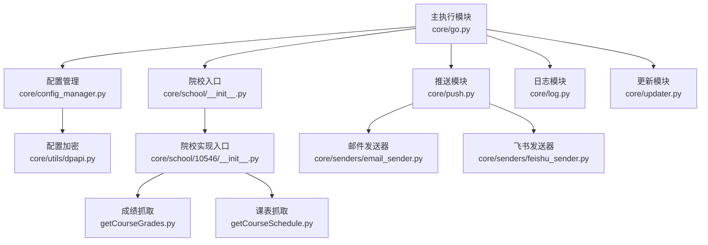
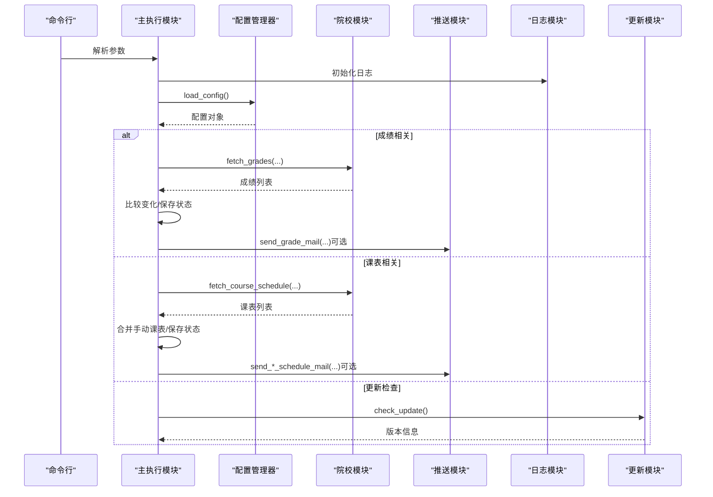
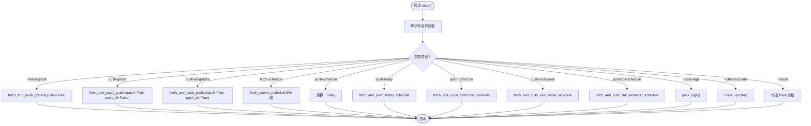
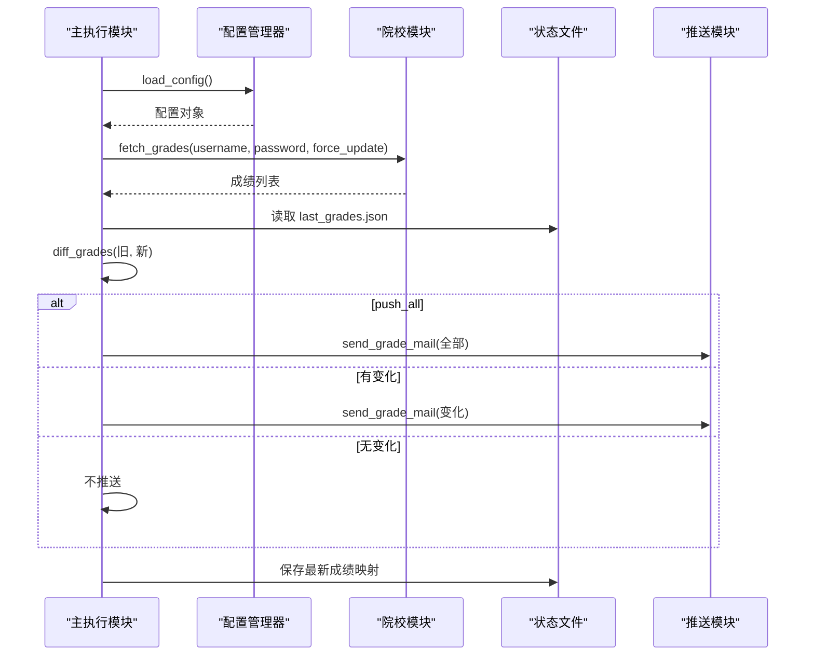
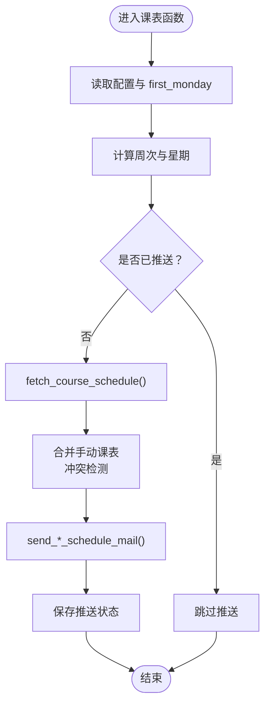
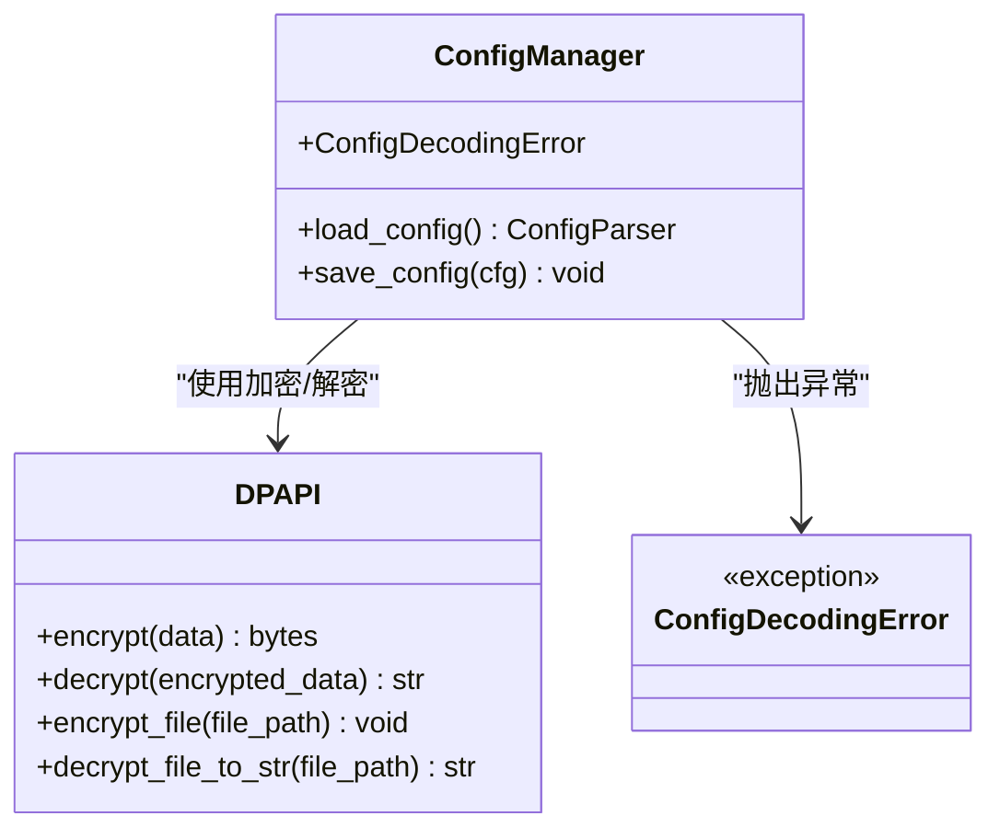
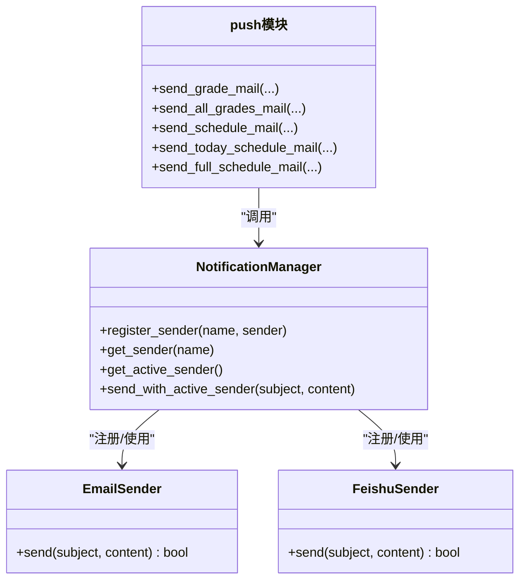
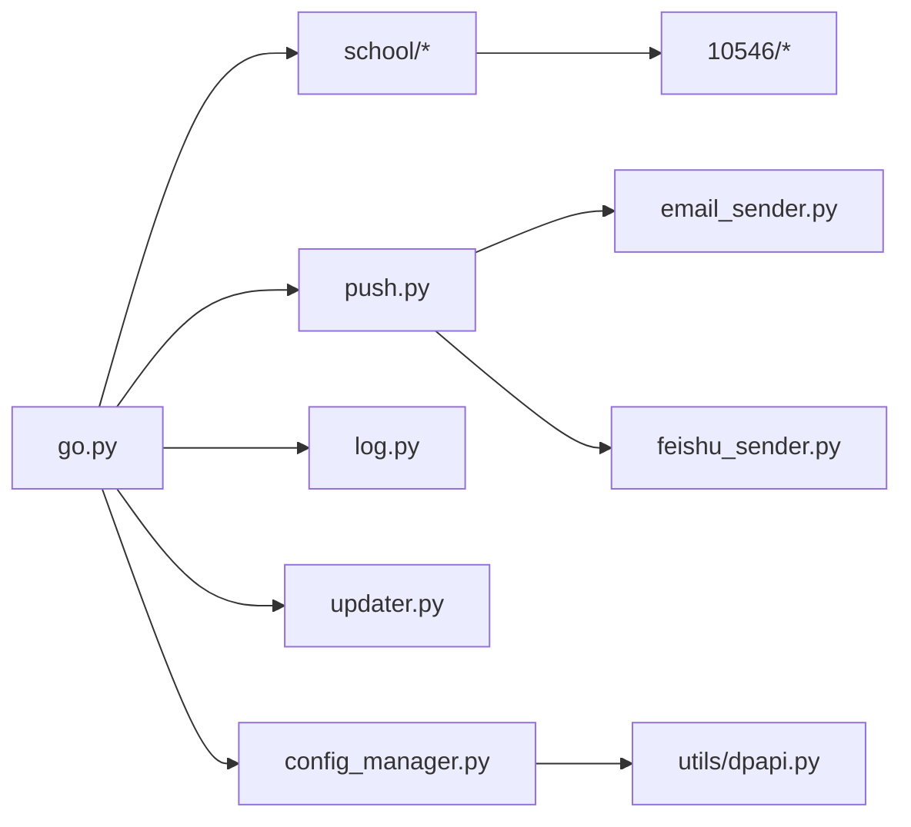

# 主执行模块

<cite>
**本文引用的文件**
- [core/go.py](file://core/go.py)
- [core/config_manager.py](file://core/config_manager.py)
- [core/school/__init__.py](file://core/school/__init__.py)
- [core/school/10546/__init__.py](file://core/school/10546/__init__.py)
- [core/school/10546/getCourseGrades.py](file://core/school/10546/getCourseGrades.py)
- [core/school/10546/getCourseSchedule.py](file://core/school/10546/getCourseSchedule.py)
- [core/push.py](file://core/push.py)
- [core/log.py](file://core/log.py)
- [core/utils/dpapi.py](file://core/utils/dpapi.py)
- [core/senders/email_sender.py](file://core/senders/email_sender.py)
- [core/senders/feishu_sender.py](file://core/senders/feishu_sender.py)
- [core/updater.py](file://core/updater.py)
- [config.ini](file://config.ini)
- [README.md](file://README.md)
</cite>

## 更新摘要
**变更内容**
- 新增配置管理系统集成，提供加密配置文件读写功能
- 改进周末处理逻辑，优化明日课表推送的日期计算
- 统一状态管理机制，使用 AppData 目录进行状态持久化
- 增强配置管理的安全性和可靠性

## 目录
1. [简介](#简介)
2. [项目结构](#项目结构)
3. [核心组件](#核心组件)
4. [架构总览](#架构总览)
5. [详细组件分析](#详细组件分析)
6. [依赖关系分析](#依赖关系分析)
7. [性能考虑](#性能考虑)
8. [故障排除指南](#故障排除指南)
9. [结论](#结论)

## 简介
本文件面向 Capture_Push 的主执行模块（core/go.py），提供深入的技术文档，涵盖命令行参数解析、功能函数组织、模块导入机制、状态管理、成绩与课表获取与推送流程、手动课表合并机制、循环检测与状态持久化机制，以及与院校模块、推送模块、日志模块的交互关系。文档还提供具体函数使用方法与参数配置说明，帮助开发者快速理解并扩展该模块。

**更新** 本版本重点介绍了新的配置管理系统集成、改进的周末处理逻辑和统一的状态管理机制。

## 项目结构
主执行模块位于 core/go.py，围绕其组织了以下关键子系统：
- 院校模块：按学校代码动态加载对应抓取实现（如衡阳师范学院）
- 配置管理：统一的加密配置文件读写系统，支持自动解密和加密
- 推送模块：统一的消息发送管理器，支持邮件与飞书等
- 日志模块：统一的 AppData 目录日志与配置路径管理
- 更新模块：检查 GitHub Releases 并触发安装更新

**图表来源**
- [core/go.py](file://core/go.py#L15-L20)
- [core/config_manager.py](file://core/config_manager.py#L15-L51)
- [core/utils/dpapi.py](file://core/utils/dpapi.py#L12-L77)
- [core/school/__init__.py](file://core/school/__init__.py#L22-L28)
- [core/school/10546/__init__.py](file://core/school/10546/__init__.py#L1-L7)
- [core/school/10546/getCourseGrades.py](file://core/school/10546/getCourseGrades.py#L1-L329)
- [core/school/10546/getCourseSchedule.py](file://core/school/10546/getCourseSchedule.py#L1-L405)
- [core/push.py](file://core/push.py#L1-L319)
- [core/log.py](file://core/log.py#L1-L211)
- [core/senders/email_sender.py](file://core/senders/email_sender.py#L1-L144)
- [core/senders/feishu_sender.py](file://core/senders/feishu_sender.py#L1-L110)
- [core/updater.py](file://core/updater.py#L1-L313)

**章节来源**
- [core/go.py](file://core/go.py#L1-L663)
- [core/config_manager.py](file://core/config_manager.py#L1-L68)
- [README.md](file://README.md#L60-L83)

## 核心组件
- 命令行参数解析：通过 argparse 提供 --fetch-grade、--push-grade、--push-all-grades、--fetch-schedule、--push-schedule、--push-today、--push-tomorrow、--push-next-week、--pack-logs、--check-update、--force 等选项。
- 功能函数组织：围绕"获取并推送"模式组织，包括 fetch_and_push_grades、fetch_and_push_today_schedule、fetch_and_push_tomorrow_schedule、fetch_and_push_next_week_schedule。
- 模块导入机制：动态导入院校模块（按 school_code），统一日志初始化，推送模块注册与选择。
- 配置管理系统：集成新的配置管理器，提供加密配置文件读写，支持自动解密和错误处理。
- 状态管理：使用 AppData 目录下的 state 文件夹持久化成绩与课表状态，避免重复推送；支持手动课表合并与冲突检测。

**更新** 新增配置管理系统集成，提供安全可靠的配置文件管理。

**章节来源**
- [core/go.py](file://core/go.py#L584-L663)
- [core/config_manager.py](file://core/config_manager.py#L15-L68)
- [core/school/__init__.py](file://core/school/__init__.py#L22-L28)
- [core/log.py](file://core/log.py#L60-L82)

## 架构总览
主执行模块采用"命令驱动 + 模块化"的架构：
- 命令入口：main() 解析参数并调用相应功能函数
- 配置管理：通过统一的配置管理器处理加密配置文件
- 院校模块：按配置动态加载，统一接口 fetch_grades/fetch_course_schedule
- 推送模块：统一的通知管理器，按配置选择发送器（邮件/飞书）
- 日志模块：统一 AppData 目录日志与配置路径，支持日志打包
- 更新模块：检查 GitHub Releases 并可触发安装更新

**图表来源**
- [core/go.py](file://core/go.py#L584-L663)
- [core/config_manager.py](file://core/config_manager.py#L15-L51)
- [core/push.py](file://core/push.py#L162-L319)
- [core/updater.py](file://core/updater.py#L42-L76)

## 详细组件分析

### 命令行参数解析与控制流
- 参数定义：支持获取/推送成绩、获取/推送课表、打包日志、检查更新、强制更新等。
- 控制流：根据参数分支调用对应功能函数，打印结果并记录日志。

**图表来源**
- [core/go.py](file://core/go.py#L584-L663)

**章节来源**
- [core/go.py](file://core/go.py#L584-L663)

### 成绩获取与推送流程
- 获取流程：读取配置 -> 获取当前院校模块 -> 调用 fetch_grades -> 解析为字典
- 变化检测：与上次保存的状态对比，生成变化集合
- 推送策略：push_all=True 推送全部；否则仅推送变化；若无变化则不推送
- 状态持久化：保存最新成绩映射到 last_grades.json

**图表来源**
- [core/go.py](file://core/go.py#L77-L138)
- [core/config_manager.py](file://core/config_manager.py#L15-L51)
- [core/school/10546/getCourseGrades.py](file://core/school/10546/getCourseGrades.py#L278-L295)
- [core/push.py](file://core/push.py#L291-L294)

**章节来源**
- [core/go.py](file://core/go.py#L77-L138)
- [core/config_manager.py](file://core/config_manager.py#L15-L51)
- [core/school/10546/getCourseGrades.py](file://core/school/10546/getCourseGrades.py#L278-L295)
- [core/push.py](file://core/push.py#L291-L294)

### 课表获取与推送流程
- 今日/明日/下周课表分别对应不同函数，均包含：
  - 读取配置（账号、first_monday）
  - 计算周次与星期（calc_week_and_weekday）
  - 循环检测（按日期/周次记录状态文件，避免重复推送）
  - 获取课表并合并手动课表（manual_schedule.json）
  - 推送对应课表
- 手动课表合并：以 (星期, 开始小节) 为冲突维度，手动覆盖解析结果中的同位置课程。

**更新** 改进了周末处理逻辑，特别是在明日课表推送中对周末的处理更加准确。

**图表来源**
- [core/go.py](file://core/go.py#L174-L265)
- [core/go.py](file://core/go.py#L266-L364)
- [core/go.py](file://core/go.py#L366-L464)

**章节来源**
- [core/go.py](file://core/go.py#L174-L265)
- [core/go.py](file://core/go.py#L266-L364)
- [core/go.py](file://core/go.py#L366-L464)

### 手动课表合并机制
- 手动数据来源：APPDATA 目录下的 manual_schedule.json
- 合并规则：
  - 先加入手动课程（若星期匹配）
  - 再加入解析课程（若未被手动占用）
  - 冲突检测：遍历手动课程的持续小节，标记占用格点
- 适用范围：今日/明日/下周全周课表推送均采用相同合并逻辑

**章节来源**
- [core/go.py](file://core/go.py#L214-L263)
- [core/go.py](file://core/go.py#L320-L357)
- [core/go.py](file://core/go.py#L407-L459)

### 循环检测与状态持久化机制
- 成绩状态：last_grades.json（课程名->成绩映射）
- 课表状态：
  - last_push_today.txt（按日期）
  - last_push_tomorrow.txt（按目标日期）
  - last_push_next_week.txt（按周次标识）
- 配置开关：loop_getCourseGrades.enabled、loop_getCourseSchedule.enabled
- 时间间隔：loop_getCourseGrades.time、loop_getCourseSchedule.time

**更新** 改进了状态文件的命名和保存机制，明日课表使用目标日期而非实际日期，避免重复推送问题。

**章节来源**
- [core/go.py](file://core/go.py#L37-L39)
- [core/go.py](file://core/go.py#L141-L151)
- [core/go.py](file://core/go.py#L199-L206)
- [core/go.py](file://core/go.py#L304-L312)
- [core/go.py](file://core/go.py#L392-L399)

### 配置管理系统集成
- 配置文件管理：通过 core.config_manager.load_config() 统一读取配置
- 加密机制：使用 Windows DPAPI 对配置文件进行加密存储
- 错误处理：自动处理配置文件解密失败的情况，提供降级方案
- 路径管理：配置文件统一存储在 AppData 目录下

**新增** 配置管理系统提供了安全可靠的配置文件管理，支持自动加密和解密。

**图表来源**
- [core/config_manager.py](file://core/config_manager.py#L15-L68)
- [core/utils/dpapi.py](file://core/utils/dpapi.py#L12-L77)

**章节来源**
- [core/config_manager.py](file://core/config_manager.py#L15-L68)
- [core/utils/dpapi.py](file://core/utils/dpapi.py#L12-L77)

### 与院校模块的交互
- 动态加载：根据配置 school_code，通过 get_school_module 动态导入对应模块
- 统一接口：各院校模块提供 fetch_grades、fetch_course_schedule、parse_grades、parse_schedule 等
- 默认回退：若指定院校模块不存在，回退到默认 10546

**章节来源**
- [core/go.py](file://core/go.py#L43-L51)
- [core/school/__init__.py](file://core/school/__init__.py#L22-L28)
- [core/school/10546/__init__.py](file://core/school/10546/__init__.py#L2-L3)

### 与推送模块的交互
- 推送管理器：NotificationManager 自动注册 EmailSender 与 FeishuSender
- 发送策略：根据配置 push.method 选择活跃发送器
- 便捷函数：send_grade_mail、send_all_grades_mail、send_schedule_mail、send_today_schedule_mail、send_full_schedule_mail

**图表来源**
- [core/push.py](file://core/push.py#L74-L163)
- [core/senders/email_sender.py](file://core/senders/email_sender.py#L47-L144)
- [core/senders/feishu_sender.py](file://core/senders/feishu_sender.py#L42-L110)

**章节来源**
- [core/push.py](file://core/push.py#L74-L163)
- [core/senders/email_sender.py](file://core/senders/email_sender.py#L47-L144)
- [core/senders/feishu_sender.py](file://core/senders/feishu_sender.py#L42-L110)

### 与日志模块的交互
- 统一路径：get_config_path()、get_log_file_path() 固定在 %LOCALAPPDATA%/Capture_Push
- 初始化：init_logger() 设置控制台与文件处理器，支持清理旧日志
- 打包：pack_logs() 将日志目录打包为单文件，便于崩溃上报

**章节来源**
- [core/log.py](file://core/log.py#L60-L82)
- [core/log.py](file://core/log.py#L114-L128)
- [core/log.py](file://core/log.py#L131-L195)
- [core/log.py](file://core/log.py#L18-L57)

### 与更新模块的交互
- 检查更新：调用 Updater.check_update() 获取最新版本信息
- 输出格式：打印 JSON 字符串 UPDATE_INFO，便于 GUI 读取

**章节来源**
- [core/go.py](file://core/go.py#L641-L656)
- [core/updater.py](file://core/updater.py#L42-L76)

## 依赖关系分析
- 模块耦合：
  - go.py 依赖 school、push、log、updater、config_manager
  - school 模块通过动态导入实现低耦合
  - push 模块通过 senders 实现扩展性
  - config_manager 通过 dpapi 实现加密功能
- 外部依赖：
  - requests、BeautifulSoup、configparser、datetime、json、argparse、pathlib、smtplib 等
- 配置依赖：
  - config.ini 的 [account]、[semester]、[loop_*]、[push]、[email]、[feishu] 等节

**图表来源**
- [core/go.py](file://core/go.py#L15-L20)
- [core/config_manager.py](file://core/config_manager.py#L6-L7)
- [core/push.py](file://core/push.py#L11-L21)
- [core/school/__init__.py](file://core/school/__init__.py#L22-L28)

**章节来源**
- [core/go.py](file://core/go.py#L1-L663)
- [core/config_manager.py](file://core/config_manager.py#L1-L68)
- [core/push.py](file://core/push.py#L1-L319)
- [core/school/__init__.py](file://core/school/__init__.py#L1-L28)

## 性能考虑
- 循环检测：通过时间戳与间隔配置减少网络请求频率，降低带宽与服务器压力
- 缓存策略：院校模块在 DEV 模式下可直接读取本地缓存，提升开发效率
- 日志轮转：文件大小限制与自动清理，避免磁盘占用过大
- 推送去重：按日期/周次记录状态文件，避免重复推送
- 配置加密：使用 DPAPI 加密配置文件，提高安全性

**更新** 新增配置加密机制，提升系统安全性。

**章节来源**
- [core/school/10546/getCourseGrades.py](file://core/school/10546/getCourseGrades.py#L117-L156)
- [core/school/10546/getCourseSchedule.py](file://core/school/10546/getCourseSchedule.py#L118-L157)
- [core/log.py](file://core/log.py#L85-L111)
- [core/utils/dpapi.py](file://core/utils/dpapi.py#L12-L45)

## 故障排除指南
- 邮件发送失败（Outlook/Hotmail 基本认证禁用）：检查配置文件中邮箱服务商，改用支持 OAuth2 的邮箱或应用密码
- 配置缺失：确认 [email]/[feishu] 节配置完整，端口与凭据正确
- 院校模块加载失败：检查 school_code 是否存在，必要时回退到默认 10546
- 循环检测无效：确认 loop_* 配置节 enabled/time 正确
- 日志打包失败：确认 LOCALAPPDATA 环境变量与日志目录存在
- 配置文件解密失败：检查配置文件是否被篡改，重新生成配置文件

**更新** 新增配置文件解密失败的故障排除指导。

**章节来源**
- [core/senders/email_sender.py](file://core/senders/email_sender.py#L78-L91)
- [core/go.py](file://core/go.py#L43-L51)
- [core/school/10546/getCourseGrades.py](file://core/school/10546/getCourseGrades.py#L103-L114)
- [core/log.py](file://core/log.py#L18-L57)
- [core/config_manager.py](file://core/config_manager.py#L32-L49)

## 结论
主执行模块通过清晰的命令行接口、模块化的院校与推送体系、完善的日志与状态管理，实现了稳定可靠的成绩与课表追踪推送能力。其设计具备良好的扩展性与可维护性，便于新增院校与推送方式，同时为开发者提供了丰富的调试与排障手段。

**更新** 新版本通过集成配置管理系统、改进周末处理逻辑和统一状态管理机制，进一步提升了系统的安全性、可靠性和用户体验。新的加密配置管理为敏感信息提供了更好的保护，改进的周末处理逻辑确保了课表推送的准确性，统一的状态管理机制简化了部署和维护工作。