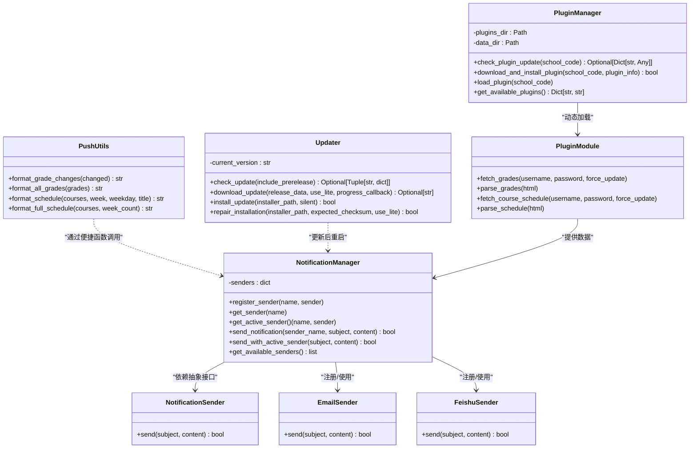
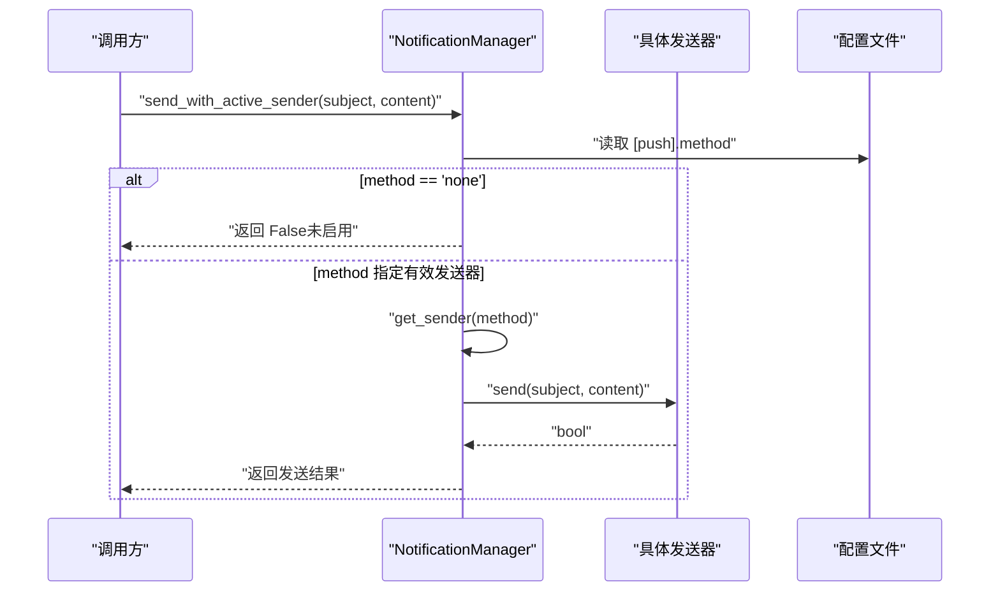
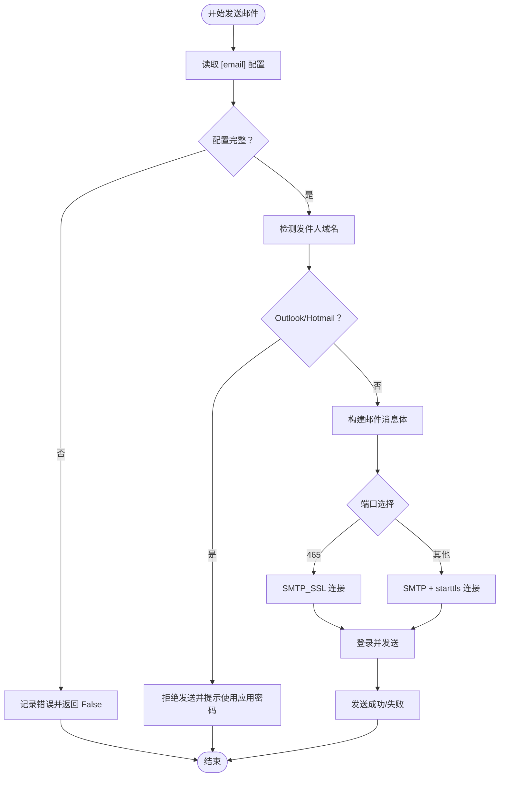
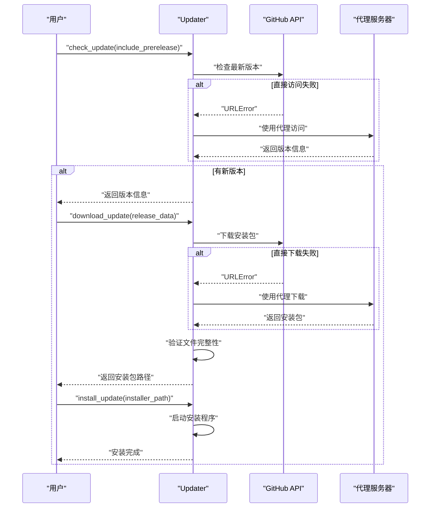
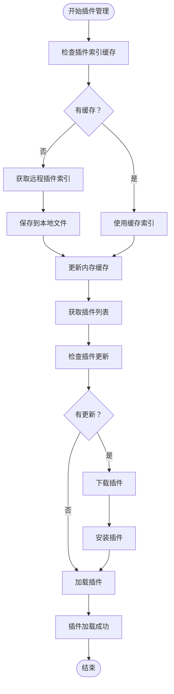
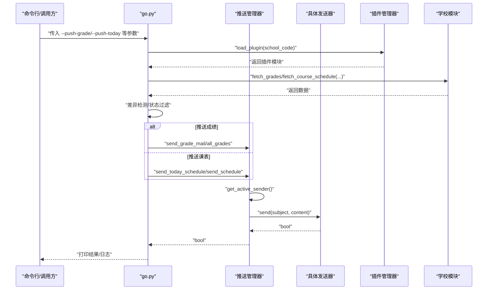
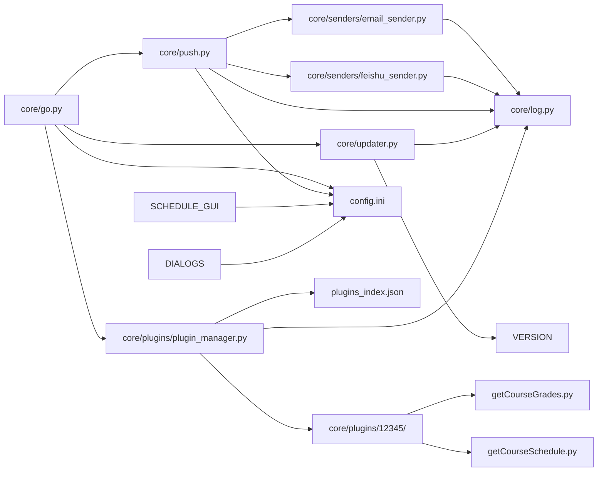

# 推送管理

<cite>
**本文引用的文件**
- [core/push.py](file://core/push.py)
- [core/senders/email_sender.py](file://core/senders/email_sender.py)
- [core/senders/feishu_sender.py](file://core/senders/feishu_sender.py)
- [core/go.py](file://core/go.py)
- [core/log.py](file://core/log.py)
- [core/updater.py](file://core/updater.py)
- [core/plugins/plugin_manager.py](file://core/plugins/plugin_manager.py)
- [core/plugins/12345/__init__.py](file://core/plugins/12345/__init__.py)
- [core/plugins/12345/getCourseGrades.py](file://core/plugins/12345/getCourseGrades.py)
- [core/plugins/12345/getCourseSchedule.py](file://core/plugins/12345/getCourseSchedule.py)
- [plugins_index.json](file://plugins_index.json)
- [VERSION](file://VERSION)
- [config.ini](file://config.ini)
- [config.md](file://config.md)
- [README.md](file://README.md)
- [developer_tools/EXTENSION_GUIDE.md](file://developer_tools/EXTENSION_GUIDE.md)
- [gui/GUI_MODULAR_DESIGN.md](file://gui/GUI_MODULAR_DESIGN.md)
- [gui/schedule_window.py](file://gui/schedule_window.py)
- [gui/dialogs.py](file://gui/dialogs.py)
</cite>

## 更新摘要
**变更内容**
- 新增完整的软件更新机制，支持版本检查、下载、安装和修复功能
- 增强插件系统支持，提供插件管理、下载、安装和动态加载能力
- 更新插件索引机制，支持远程插件索引获取和本地缓存
- 增强版本比较算法，支持预发布版本和语义化版本管理
- 新增插件版本验证和完整性检查机制

## 目录
1. [简介](#简介)
2. [项目结构](#项目结构)
3. [核心组件](#核心组件)
4. [架构总览](#架构总览)
5. [详细组件分析](#详细组件分析)
6. [依赖关系分析](#依赖关系分析)
7. [性能与可靠性考量](#性能与可靠性考量)
8. [故障排查指南](#故障排查指南)
9. [结论](#结论)
10. [附录](#附录)

## 简介
本文件面向 Capture_Push 的推送管理系统，系统性阐述推送管理器的架构设计与实现机制，包括统一的推送接口、多推送方式支持、推送状态管理、消息格式化与模板化、配置与触发策略、以及如何扩展新的推送方式。文档同时给出关键流程图与时序图，帮助开发者快速理解与二次开发。

**更新** 本次更新重点关注推送管理系统的增强，包括新增的软件更新机制和插件支持系统。更新机制提供了完整的版本管理、下载安装和修复功能，而插件系统支持允许用户动态安装和管理不同院校的课程数据获取模块，大大增强了系统的可扩展性和维护性。

## 项目结构
推送相关的代码主要集中在 core/push.py 与 core/senders/ 下，配合核心执行模块 core/go.py、日志模块 core/log.py、更新模块 core/updater.py 以及插件管理模块 core/plugins/。更新模块提供软件版本检查和自动更新功能，插件管理模块支持动态加载不同院校的课程数据获取模块。配置文件 config.ini/config.md 和插件索引文件 plugins_index.json 提供了完整的配置和插件管理支持。

```mermaid
graph TB
subgraph "核心模块"
PUSH["core/push.py<br/>推送管理器与消息格式化"]
EMAIL["core/senders/email_sender.py<br/>邮件发送器"]
FEISHU["core/senders/feishu_sender.py<br/>飞书发送器"]
GO["core/go.py<br/>主执行与触发逻辑"]
LOG["core/log.py<br/>统一日志与配置路径"]
UPDATER["core/updater.py<br/>软件更新管理器"]
PLUGIN_MGR["core/plugins/plugin_manager.py<br/>插件管理器"]
END
subgraph "插件系统"
PLUGIN_12345["core/plugins/12345/<br/>示例插件模块"]
PLUGIN_INIT["core/plugins/12345/__init__.py<br/>插件初始化"]
PLUGIN_GRADES["core/plugins/12345/getCourseGrades.py<br/>成绩获取模块"]
PLUGIN_SCHEDULE["core/plugins/12345/getCourseSchedule.py<br/>课表获取模块"]
PLUGINS_INDEX["plugins_index.json<br/>插件索引文件"]
END
subgraph "配置与文档"
CFG["config.ini<br/>推送与日志配置"]
CFGMD["config.md<br/>配置详解"]
EXT["EXTENSION_GUIDE.md<br/>扩展开发指南"]
GUI["GUI_MODULAR_DESIGN.md<br/>GUI 模块化设计"]
README["README.md<br/>项目总体介绍"]
SCHEDULE_GUI["gui/schedule_window.py<br/>课表查看与编辑"]
DIALOGS["gui/dialogs.py<br/>课程编辑对话框"]
VERSION["VERSION<br/>当前版本号"]
END
GO --> PUSH
PUSH --> EMAIL
PUSH --> FEISHU
PUSH --> LOG
EMAIL --> LOG
FEISHU --> LOG
GO --> CFG
PUSH --> CFG
GO --> UPDATER
GO --> PLUGIN_MGR
PLUGIN_MGR --> PLUGIN_12345
PLUGIN_12345 --> PLUGIN_INIT
PLUGIN_12345 --> PLUGIN_GRADES
PLUGIN_12345 --> PLUGIN_SCHEDULE
PLUGIN_MGR --> PLUGINS_INDEX
UPDATER --> VERSION
SCHOOL --> GO
SCHEDULE_GUI --> CFG
DIALOGS --> CFG
CFG --> CFGMD
EXT --> PUSH
GUI --> CFG
README --> PUSH
```

**图表来源**
- [core/push.py](file://core/push.py#L74-L163)
- [core/senders/email_sender.py](file://core/senders/email_sender.py#L47-L144)
- [core/senders/feishu_sender.py](file://core/senders/feishu_sender.py#L42-L110)
- [core/go.py](file://core/go.py#L15-L15)
- [core/log.py](file://core/log.py#L60-L82)
- [core/updater.py](file://core/updater.py#L108-L130)
- [core/plugins/plugin_manager.py](file://core/plugins/plugin_manager.py#L26-L70)
- [core/plugins/12345/__init__.py](file://core/plugins/12345/__init__.py#L1-L14)
- [plugins_index.json](file://plugins_index.json#L1-L13)
- [VERSION](file://VERSION#L1-L2)

## 核心组件
- 推送管理器（NotificationManager）
  - 负责注册与选择具体发送器，协调发送流程，提供统一的发送接口。
- 抽象发送器（NotificationSender）
  - 定义统一的 send(subject, content) 接口，便于扩展新的推送方式。
- 邮件发送器（EmailSender）
  - 基于 SMTP 实现，支持 SSL/TLS，内置 Outlook/Hotmail 基本认证限制提示。
- 飞书发送器（FeishuSender）
  - 基于 Webhook，支持签名参数，发送纯文本消息。
- 软件更新管理器（Updater）
  - 提供完整的软件更新功能，包括版本检查、下载、安装和修复。
- 插件管理器（PluginManager）
  - 管理插件的下载、安装、版本比较和动态加载。
- 消息格式化工具
  - 提供成绩变化、全部成绩、今日/明日/完整课表等纯文本格式化函数。
- 主执行模块（go.py）
  - 负责从学校模块抓取数据，计算差异，决定是否推送，并调用推送管理器发送通知。
- 插件系统
  - 支持动态加载不同院校的课程数据获取模块，提供统一的接口。
- GUI 课表管理
  - 提供课表查看、编辑和手动添加课程的功能，支持周次范围设置。
- 日志与配置
  - 统一日志初始化与配置路径管理，保证打包后也能正确读取配置与日志。

**章节来源**
- [core/push.py](file://core/push.py#L56-L163)
- [core/senders/email_sender.py](file://core/senders/email_sender.py#L47-L144)
- [core/senders/feishu_sender.py](file://core/senders/feishu_sender.py#L42-L110)
- [core/updater.py](file://core/updater.py#L108-L130)
- [core/plugins/plugin_manager.py](file://core/plugins/plugin_manager.py#L26-L70)
- [core/go.py](file://core/go.py#L83-L144)
- [gui/schedule_window.py](file://gui/schedule_window.py#L83-L96)
- [gui/dialogs.py](file://gui/dialogs.py#L47-L60)

## 架构总览
推送系统采用"管理器 + 多发送器 + 更新机制 + 插件系统"的综合架构：
- NotificationManager 统一注册与选择发送器，依据配置文件中的 method 决定当前活跃发送器。
- EmailSender 与 FeishuSender 分别实现 send(subject, content)。
- Updater 提供完整的软件更新功能，包括版本检查、下载、安装和修复。
- PluginManager 管理插件的生命周期，支持动态加载和版本管理。
- go.py 负责业务触发与差异检测，调用便捷发送函数（如 send_grade_mail、send_schedule_mail 等）。
- 插件系统提供动态加载不同院校的课程数据获取模块。
- 日志模块提供统一日志与配置路径，确保跨平台与打包后的一致性。



**图表来源**
- [core/push.py](file://core/push.py#L56-L163)
- [core/senders/email_sender.py](file://core/senders/email_sender.py#L47-L144)
- [core/senders/feishu_sender.py](file://core/senders/feishu_sender.py#L42-L110)
- [core/updater.py](file://core/updater.py#L108-L130)
- [core/plugins/plugin_manager.py](file://core/plugins/plugin_manager.py#L26-L70)

## 详细组件分析

### 推送管理器（NotificationManager）
- 注册机制
  - 自动注册可用发送器（如 email、feishu、serverchan），失败时记录警告日志。
- 发送选择
  - 通过 get_push_method() 读取配置，若 method 为 none 则跳过发送；否则返回对应发送器实例。
- 统一发送
  - send_notification(sender_name, subject, content)：按名称直接发送。
  - send_with_active_sender(subject, content)：使用当前活跃发送器发送，适合全局推送开关。
- 可用发送器列表
  - get_available_senders() 返回已注册的发送器名称集合。



**图表来源**
- [core/push.py](file://core/push.py#L107-L155)
- [config.ini](file://config.ini#L23-L24)

**章节来源**
- [core/push.py](file://core/push.py#L74-L163)

### 抽象发送器接口（NotificationSender）
- 定义统一的 send(subject, content) 接口，便于扩展新的推送方式（如微信、钉钉、Telegram 等）。
- 该接口在扩展指南中有明确要求。

**章节来源**
- [core/push.py](file://core/push.py#L56-L72)
- [developer_tools/EXTENSION_GUIDE.md](file://developer_tools/EXTENSION_GUIDE.md#L16-L20)

### 邮件发送器（EmailSender）
- 功能要点
  - 从配置文件读取 SMTP、端口、发件人、收件人、授权码。
  - 自动识别 Outlook/Hotmail 并拒绝基本认证，提示使用应用密码。
  - 根据端口选择 SMTP_SSL（465）或 starttls（587/其他）。
  - 发送纯文本邮件，记录详细日志与错误信息。
- 错误处理
  - 认证失败、网络异常、配置缺失等均有明确日志与用户提示。



**图表来源**
- [core/senders/email_sender.py](file://core/senders/email_sender.py#L37-L144)
- [config.ini](file://config.ini#L26-L31)

**章节来源**
- [core/senders/email_sender.py](file://core/senders/email_sender.py#L37-L144)
- [config.ini](file://config.ini#L26-L31)

### 飞书发送器（FeishuSender）
- 功能要点
  - 从配置读取 webhook_url 与可选 secret。
  - 若配置 secret，则生成签名并附加到 URL 查询参数。
  - 发送纯文本消息，校验返回码，记录日志。
- 错误处理
  - 缺少配置节或 URL 为空时直接返回 False；网络异常与接口返回错误均记录日志。

**章节来源**
- [core/senders/feishu_sender.py](file://core/senders/feishu_sender.py#L42-L110)
- [config.ini](file://config.ini#L33-L35)

### 软件更新管理器（Updater）
- 版本检查
  - 支持检查最新稳定版本和预发布版本，包含代理访问机制。
  - 版本比较算法支持语义化版本和后缀版本（Beta、Dev等）。
- 文件下载
  - 提供通用文件下载函数，支持进度回调和完整性验证。
  - 自动使用代理地址下载，提高下载成功率。
- 安装与修复
  - 支持静默安装和普通安装模式。
  - 提供安装包完整性验证和修复安装功能。
- 校验和验证
  - 使用 SHA256 哈希算法验证下载文件的完整性。
  - 支持从发布说明中提取校验和信息。



**图表来源**
- [core/updater.py](file://core/updater.py#L131-L196)
- [core/updater.py](file://core/updater.py#L340-L463)

**章节来源**
- [core/updater.py](file://core/updater.py#L108-L130)
- [core/updater.py](file://core/updater.py#L131-L196)
- [core/updater.py](file://core/updater.py#L340-L463)

### 插件管理器（PluginManager）
- 插件索引管理
  - 支持从远程获取插件索引，包含本地缓存和代理访问机制。
  - 提供插件索引的强制刷新和缓存清除功能。
- 插件下载与安装
  - 支持从发布说明或资产中解析插件信息。
  - 提供插件完整性验证和版本比较功能。
- 插件加载
  - 支持动态加载插件模块，处理相对导入和包结构。
  - 提供插件版本管理和备份机制。
- 插件信息获取
  - 支持获取已安装插件、未安装插件和所有可用插件列表。
  - 提供插件信息的详细查询和版本比较功能。



**图表来源**
- [core/plugins/plugin_manager.py](file://core/plugins/plugin_manager.py#L109-L180)
- [core/plugins/plugin_manager.py](file://core/plugins/plugin_manager.py#L1117-L1186)

**章节来源**
- [core/plugins/plugin_manager.py](file://core/plugins/plugin_manager.py#L26-L70)
- [core/plugins/plugin_manager.py](file://core/plugins/plugin_manager.py#L109-L180)
- [core/plugins/plugin_manager.py](file://core/plugins/plugin_manager.py#L1117-L1186)

### 消息格式化与模板化
- 成绩变化格式化：format_grade_changes(changed)
- 全部成绩格式化：format_all_grades(grades)
- 今日/明日/完整课表格式化：format_schedule/courses, week, weekday, title/format_full_schedule(courses, week_count)
- 特点
  - 输出纯文本，便于不同推送平台统一呈现。
  - 每个格式化函数均记录日志，便于调试与审计。

**章节来源**
- [core/push.py](file://core/push.py#L184-L392)

### 主执行模块与触发策略（go.py）
- 成绩推送
  - 从学校模块获取成绩，与上次状态对比，计算变化集。
  - 根据 push_all 参数决定推送全部或仅变化；调用 send_grade_mail。
- 今日/明日/下周课表推送
  - 计算周次与星期，过滤手动覆盖课程，去重后调用对应便捷发送函数。
  - 使用状态文件避免重复推送（按日期/周次记录）。
- 完整学期课表推送
  - 支持按周和天分组，处理跨年情况，过滤空周。
  - 支持手动课程与自动解析课程的冲突检测。
- 插件系统集成
  - 通过 PluginManager 动态加载指定院校的插件模块。
  - 支持插件版本回退和错误处理。
- CLI 参数
  - 支持 --push-grade、--push-all-grades、--push-today、--push-tomorrow、--push-next-week、--push-full-schedule 等。



**图表来源**
- [core/go.py](file://core/go.py#L43-L56)
- [core/go.py](file://core/go.py#L83-L144)
- [core/go.py](file://core/go.py#L180-L271)
- [core/go.py](file://core/go.py#L272-L458)

**章节来源**
- [core/go.py](file://core/go.py#L43-L56)
- [core/go.py](file://core/go.py#L83-L144)
- [core/go.py](file://core/go.py#L180-L271)
- [core/go.py](file://core/go.py#L272-L458)

### 插件系统与动态加载
- 插件结构
  - 每个插件包含 __init__.py、getCourseGrades.py、getCourseSchedule.py 等模块。
  - 插件通过 SCHOOL_NAME 和 PLUGIN_VERSION 常量标识基本信息。
- 动态加载
  - 支持从插件目录和内置目录加载插件模块。
  - 处理相对导入和包结构，确保插件正常运行。
- 版本管理
  - 每个插件维护独立的版本信息和更新机制。
  - 支持插件备份和回滚功能。
- 插件索引
  - 通过 plugins_index.json 提供插件元数据和下载信息。
  - 支持远程索引获取和本地缓存。

**章节来源**
- [core/plugins/12345/__init__.py](file://core/plugins/12345/__init__.py#L1-L14)
- [core/plugins/12345/getCourseGrades.py](file://core/plugins/12345/getCourseGrades.py#L1-L327)
- [core/plugins/12345/getCourseSchedule.py](file://core/plugins/12345/getCourseSchedule.py#L1-L417)
- [plugins_index.json](file://plugins_index.json#L1-L13)

### GUI 课表管理
- 课表查看窗口
  - 提供色块展示的课表视图，支持周次切换。
  - 自动计算当前周次，限制在合理范围内。
  - 支持双击单元格进行手动编辑。
- 课程编辑对话框
  - 支持设置课程名称、教师、教室、上课周次和持续节数。
  - 提供周次范围输入的智能解析，支持连续周次和单周周次。
  - 默认周次范围为 1-20，提供清晰的输入提示。

**章节来源**
- [gui/schedule_window.py](file://gui/schedule_window.py#L83-L96)
- [gui/dialogs.py](file://gui/dialogs.py#L47-L60)

### 配置与推送策略
- 推送方式选择
  - [push].method：none、email、feishu、serverchan 等。
- 邮件配置
  - [email]：smtp、port、sender、receiver、auth。
- 飞书配置
  - [feishu]：webhook_url、secret（可选）。
- Server酱配置
  - [serverchan]：sendkey（可选）。
- 课表推送配置
  - [schedule_push]：today_8am、tomorrow_9pm、next_week_sunday。
- 学校时间配置
  - [school_time]：morning_count、afternoon_count、evening_count、class_duration、first_class_start、class_times。
- 日志级别
  - [logging]：DEBUG/INFO/WARNING/ERROR/CRITICAL。
- 插件配置
  - [plugins]：repository_url、plugins_index_url。
- GUI 与配置界面
  - GUI 模块化设计，配置窗口负责加载与保存所有配置项。

**章节来源**
- [config.ini](file://config.ini#L23-L39)
- [config.md](file://config.md#L19-L114)
- [gui/GUI_MODULAR_DESIGN.md](file://gui/GUI_MODULAR_DESIGN.md#L15-L18)

### 扩展新的推送方式
- 开发步骤
  - 在 core/senders/ 下创建新发送器文件，实现 send(subject, content)。
  - 在 NotificationManager._register_available_senders() 中注册新发送器。
  - 在 config.ini 中添加对应配置节，并在 GUI 中添加 UI 选项。
- 接口约定
  - 必须实现 send(subject, content)，遵循统一日志与配置路径读取方式。

**章节来源**
- [developer_tools/EXTENSION_GUIDE.md](file://developer_tools/EXTENSION_GUIDE.md#L7-L56)
- [core/push.py](file://core/push.py#L83-L96)

### 扩展新的插件
- 插件开发步骤
  - 在 core/plugins/ 下创建新插件目录，包含 __init__.py 和数据获取模块。
  - 实现 fetch_grades、parse_grades、fetch_course_schedule、parse_schedule 函数。
  - 在 __init__.py 中设置 SCHOOL_NAME 和 PLUGIN_VERSION 常量。
- 插件发布
  - 在 GitHub Releases 中发布插件 ZIP 包。
  - 在 plugins_index.json 中添加插件元数据和校验和信息。
  - 提供插件版本比较和下载链接。

**章节来源**
- [core/plugins/12345/__init__.py](file://core/plugins/12345/__init__.py#L1-L14)
- [core/plugins/12345/getCourseGrades.py](file://core/plugins/12345/getCourseGrades.py#L1-L327)
- [core/plugins/12345/getCourseSchedule.py](file://core/plugins/12345/getCourseSchedule.py#L1-L417)

## 依赖关系分析
- 模块耦合
  - core/push.py 与 core/senders/* 通过抽象接口解耦，新增发送器无需修改管理器核心。
  - core/go.py 仅依赖推送管理器提供的便捷发送函数，业务逻辑与推送解耦。
  - core/updater.py 与 core/plugins/plugin_manager.py 通过统一的日志接口解耦。
  - 插件系统通过 PluginManager 与主程序解耦，支持动态加载。
- 外部依赖
  - 邮件：smtplib、email.mime.*。
  - 飞书：requests、hmac、hashlib、base64、time。
  - 更新：urllib.request、json、hashlib、subprocess。
  - 插件：importlib.util、zipfile、shutil。
  - 日志与配置：core/log.py 提供统一路径与日志初始化。
- 配置依赖
  - 所有发送器均通过 core/log.get_config_path() 读取配置文件，确保打包后可用。



**图表来源**
- [core/go.py](file://core/go.py#L15-L15)
- [core/push.py](file://core/push.py#L11-L23)
- [core/senders/email_sender.py](file://core/senders/email_sender.py#L11-L15)
- [core/senders/feishu_sender.py](file://core/senders/feishu_sender.py#L11-L14)
- [core/updater.py](file://core/updater.py#L16-L20)
- [core/plugins/plugin_manager.py](file://core/plugins/plugin_manager.py#L20-L23)

**章节来源**
- [core/go.py](file://core/go.py#L15-L29)
- [core/push.py](file://core/push.py#L11-L23)

## 性能与可靠性考量
- 发送器并发与阻塞
  - 当前实现为同步发送，单次发送阻塞直至完成。若需高吞吐，可考虑异步队列或线程池。
- 频率控制
  - go.py 中通过状态文件避免重复推送，减少无效调用；可结合配置节 [loop_getCourseGrades]/[loop_getCourseSchedule] 控制循环检测频率。
- 错误恢复
  - 发送器内部捕获异常并记录日志，调用方可基于返回值进行重试或降级。
- 更新机制可靠性
  - Updater 提供代理访问和完整性验证，确保更新过程的可靠性。
  - 支持静默安装和修复安装，提高用户体验。
- 插件系统稳定性
  - PluginManager 提供插件备份和版本管理，支持插件回滚。
  - 动态加载机制避免插件故障影响主程序运行。
- 日志与诊断
  - 统一日志级别与路径，便于定位问题；崩溃报告打包工具可用于问题收集。

**章节来源**
- [core/go.py](file://core/go.py#L205-L212)
- [core/log.py](file://core/log.py#L131-L195)
- [core/updater.py](file://core/updater.py#L23-L87)
- [core/plugins/plugin_manager.py](file://core/plugins/plugin_manager.py#L1164-L1186)

## 故障排查指南
- 邮件发送失败
  - 检查 [email] 配置是否完整；Outlook/Hotmail 基本认证被拒时需使用应用密码。
  - 端口 465 使用 SSL，其他端口使用 starttls；确认防火墙与安全策略。
- 飞书发送失败
  - 确认 [feishu].webhook_url 有效；若配置 secret，需确保签名参数拼接正确。
- 推送未触发
  - 检查 [push].method 是否为 none；确认 go.py 的触发参数与状态文件是否阻止重复推送。
- 更新失败
  - 检查网络连接和代理设置；确认 GitHub API 可访问性。
  - 验证下载文件的 SHA256 校验和是否匹配。
- 插件加载失败
  - 检查插件目录权限和文件完整性；确认插件模块的相对导入配置。
  - 查看插件版本是否与主程序兼容。
- 课表解析失败
  - 检查 [semester].first_monday 配置是否正确；确认学校模块版本兼容性。
  - 查看课表解析日志，确认周次格式是否符合预期。
- 课程冲突问题
  - 检查手动添加的课程是否与自动解析的课程存在时间冲突。
  - 确认周次范围设置是否正确，避免不必要的冲突。
- 日志定位
  - 使用 core/log.pack_logs() 打包日志，查看对应模块日志文件。

**章节来源**
- [core/senders/email_sender.py](file://core/senders/email_sender.py#L78-L91)
- [core/senders/email_sender.py](file://core/senders/email_sender.py#L127-L143)
- [core/senders/feishu_sender.py](file://core/senders/feishu_sender.py#L52-L61)
- [core/senders/feishu_sender.py](file://core/senders/feishu_sender.py#L107-L109)
- [core/updater.py](file://core/updater.py#L23-L87)
- [core/plugins/plugin_manager.py](file://core/plugins/plugin_manager.py#L1164-L1186)
- [core/go.py](file://core/go.py#L205-L212)
- [core/log.py](file://core/log.py#L18-L57)

## 结论
推送管理系统以 NotificationManager 为核心，通过抽象接口与多发送器实现解耦，具备良好的扩展性与可维护性。邮件与飞书两大发送器分别满足常见推送场景，消息格式化工具提供一致的文本输出。结合 go.py 的触发策略与状态文件，系统实现了高效、可控的推送流程。

**更新** 本次更新显著增强了系统的可维护性和可扩展性。新增的软件更新机制提供了完整的版本管理功能，包括版本检查、下载、安装和修复，确保用户始终使用最新版本。插件系统支持动态加载不同院校的课程数据获取模块，通过 PluginManager 实现了插件的生命周期管理，包括下载、安装、版本比较和动态加载。这些增强使得系统能够更好地适应不断变化的需求，提供更加灵活和强大的功能。

通过扩展指南，开发者可快速接入新的推送方式和插件模块，满足多样化的业务需求。GUI 模块提供了直观的课表管理界面，支持手动编辑和智能解析，提升了用户体验。

## 附录
- 配置文件详解与示例
  - [config.md](file://config.md#L1-L114)
- 扩展开发指南
  - [developer_tools/EXTENSION_GUIDE.md](file://developer_tools/EXTENSION_GUIDE.md#L1-L102)
- GUI 模块化设计
  - [gui/GUI_MODULAR_DESIGN.md](file://gui/GUI_MODULAR_DESIGN.md#L1-L52)
- 更新与打包
  - [core/updater.py](file://core/updater.py#L1-L856)
- 插件管理
  - [core/plugins/plugin_manager.py](file://core/plugins/plugin_manager.py#L1-L1245)
- 插件示例
  - [core/plugins/12345/__init__.py](file://core/plugins/12345/__init__.py#L1-L14)
  - [core/plugins/12345/getCourseGrades.py](file://core/plugins/12345/getCourseGrades.py#L1-L327)
  - [core/plugins/12345/getCourseSchedule.py](file://core/plugins/12345/getCourseSchedule.py#L1-L417)
- 插件索引
  - [plugins_index.json](file://plugins_index.json#L1-L13)
- 当前版本
  - [VERSION](file://VERSION#L1-L2)
- 课表管理 GUI
  - [gui/schedule_window.py](file://gui/schedule_window.py#L83-L96)
  - [gui/dialogs.py](file://gui/dialogs.py#L47-L60)