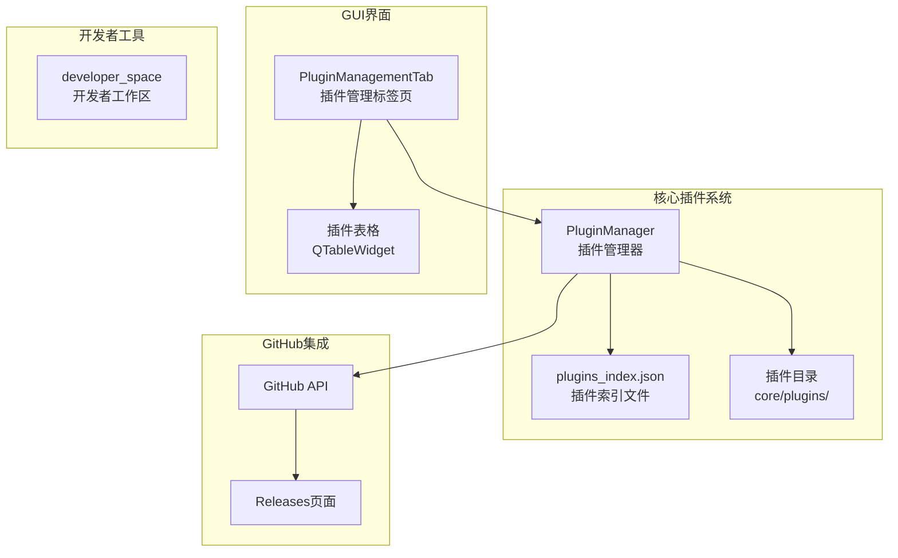
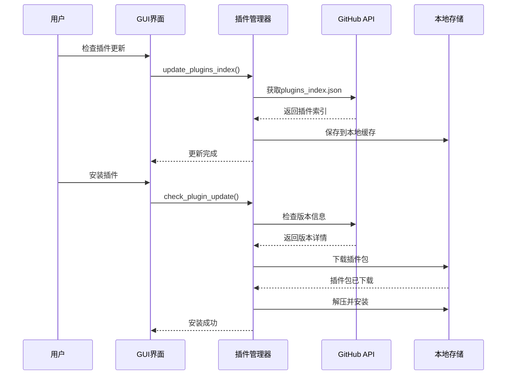
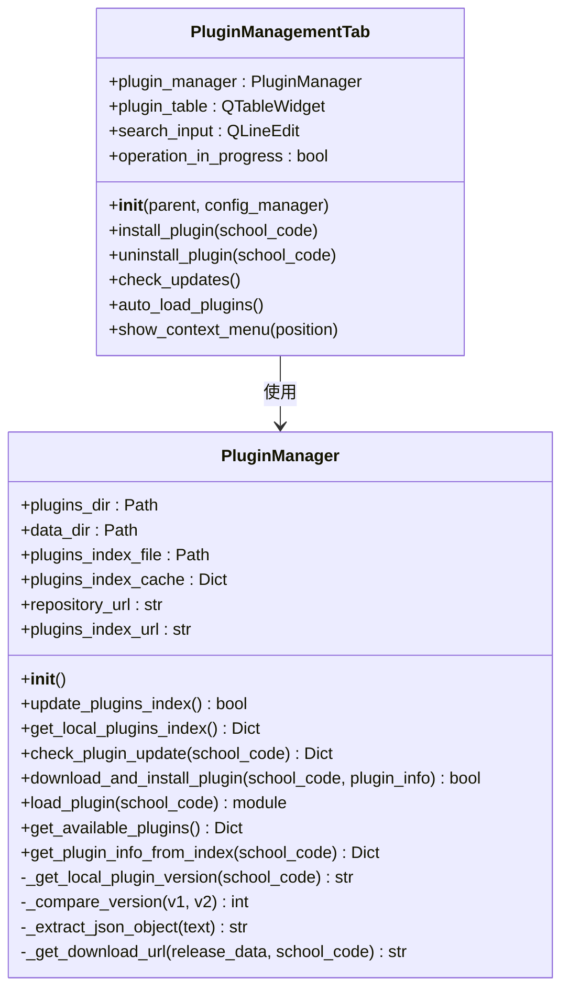
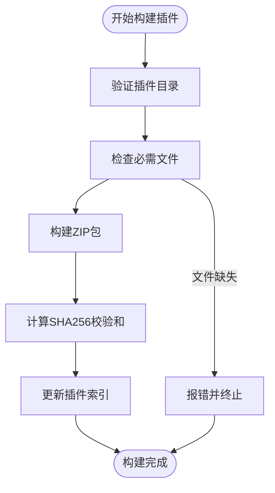
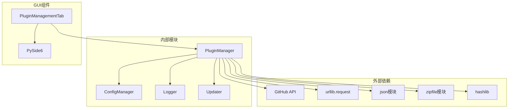

# 插件管理系统

<cite>
**本文档引用的文件**
- [core/plugins/plugin_manager.py](file://core/plugins/plugin_manager.py)
- [gui/tabs/plugin_management_tab.py](file://gui/tabs/plugin_management_tab.py)
- [core/plugins/12345/__init__.py](file://core/plugins/12345/__init__.py)
- [core/plugins/12345/getCourseGrades.py](file://core/plugins/12345/getCourseGrades.py)
- [core/plugins/12345/getCourseSchedule.py](file://core/plugins/12345/getCourseSchedule.py)
- [README.md](file://README.md)
- [开发者工具/扩展开发指南](file://.wiki/zh/content/开发者工具/扩展开发指南/扩展开发指南.md)
- [core/config_manager.py](file://core/config_manager.py)
- [core/updater.py](file://core/updater.py)
</cite>

## 目录
1. [简介](#简介)
2. [项目结构](#项目结构)
3. [核心组件](#核心组件)
4. [架构概览](#架构概览)
5. [详细组件分析](#详细组件分析)
6. [依赖关系分析](#依赖关系分析)
7. [性能考虑](#性能考虑)
8. [故障排除指南](#故障排除指南)
9. [结论](#结论)

## 简介

Capture_Push 是一个课程成绩和课表自动追踪推送系统，其核心特色之一是强大的插件管理系统。该系统支持多院校模块化扩展，通过 GitHub API 实现插件的自动下载、更新和管理。插件系统采用模块化设计，每个院校的抓取逻辑独立封装，支持动态加载和统一接口标准。

系统的核心功能包括：
- **多院校支持**：通过插件化架构支持不同院校的教务系统
- **自动更新**：集成的插件管理器支持从 GitHub 自动下载和更新
- **版本控制**：每个插件包含版本信息，支持智能版本比较
- **安全验证**：插件下载时进行 SHA256 校验和验证
- **离线缓存**：插件索引文件本地缓存，提高加载速度

## 项目结构



**图表来源**
- [core/plugins/plugin_manager.py](file://core/plugins/plugin_manager.py#L26-L70)
- [gui/tabs/plugin_management_tab.py](file://gui/tabs/plugin_management_tab.py#L17-L26)
- [developer_tools/build_plugin.py](file://developer_tools/build_plugin.py#L1-L50)

**章节来源**
- [core/plugins/plugin_manager.py](file://core/plugins/plugin_manager.py#L1-L80)
- [gui/tabs/plugin_management_tab.py](file://gui/tabs/plugin_management_tab.py#L1-L80)

## 核心组件

### 插件管理器 (PluginManager)

插件管理器是整个插件系统的核心组件，负责管理所有院校插件的生命周期。主要功能包括：

- **插件索引管理**：维护和更新插件索引文件
- **插件下载安装**：从 GitHub 下载并安装插件包
- **版本比较**：智能比较本地和远程插件版本
- **安全验证**：验证插件下载的完整性
- **动态加载**：动态加载已安装的插件模块

### 插件索引系统

插件索引系统通过 `plugins_index.json` 文件管理所有可用插件的信息，包括：
- 院校代码和名称
- 插件版本信息
- SHA256 校验和
- 下载 URL
- 贡献者信息
- 最后更新时间

### GUI 插件管理界面

提供用户友好的图形界面来管理插件，包括：
- 插件列表展示
- 搜索和过滤功能
- 安装、卸载和更新操作
- 版本信息显示
- 批量操作支持

**章节来源**
- [core/plugins/plugin_manager.py](file://core/plugins/plugin_manager.py#L26-L1245)
- [gui/tabs/plugin_management_tab.py](file://gui/tabs/plugin_management_tab.py#L17-L646)

## 架构概览



**图表来源**
- [core/plugins/plugin_manager.py](file://core/plugins/plugin_manager.py#L109-L180)
- [gui/tabs/plugin_management_tab.py](file://gui/tabs/plugin_management_tab.py#L383-L472)

系统采用分层架构设计，各层职责明确：

1. **表示层**：GUI 界面负责用户交互
2. **业务逻辑层**：插件管理器处理插件相关的业务逻辑
3. **数据访问层**：负责与 GitHub API 和本地文件系统的交互
4. **配置管理层**：管理插件相关的配置信息

## 详细组件分析

### 插件管理器类分析



**图表来源**
- [core/plugins/plugin_manager.py](file://core/plugins/plugin_manager.py#L26-L1245)
- [gui/tabs/plugin_management_tab.py](file://gui/tabs/plugin_management_tab.py#L17-L120)

#### 插件管理器核心方法

**版本比较方法** (`_compare_version`)
- 支持语义化版本号比较
- 处理版本号格式差异
- 返回版本比较结果（1: 远程更新, 0: 相同, -1: 本地更新）

**插件下载安装方法** (`download_and_install_plugin`)
- 下载插件包到临时目录
- 验证 SHA256 校验和
- 备份现有插件
- 解压并安装到目标目录
- 写入版本信息文件

**章节来源**
- [core/plugins/plugin_manager.py](file://core/plugins/plugin_manager.py#L1079-L1186)

### 插件构建工具分析

开发者工具提供了完整的插件构建和发布流程：



**图表来源**
- [developer_tools/build_plugin.py](file://developer_tools/build_plugin.py#L27-L81)

**章节来源**
- [developer_tools/build_plugin.py](file://developer_tools/build_plugin.py#L1-L174)

### 插件结构规范

每个插件必须遵循标准化的结构：

**插件目录结构**：
```
school_[code]/
├── __init__.py              # 插件入口文件
├── getCourseGrades.py       # 成绩获取模块
├── getCourseSchedule.py     # 课表获取模块
└── version.txt              # 插件版本文件
```

**插件元数据要求**：
- `SCHOOL_NAME`: 院校中文名称
- `SCHOOL_CODE`: 院校代码
- `PLUGIN_VERSION`: 插件版本号
- 导出函数：`fetch_grades`, `parse_grades`, `fetch_course_schedule`, `parse_schedule`

**章节来源**
- [developer_tools/EXTENSION_GUIDE.md](file://developer_tools/EXTENSION_GUIDE.md#L122-L155)

## 依赖关系分析



**图表来源**
- [core/plugins/plugin_manager.py](file://core/plugins/plugin_manager.py#L7-L16)
- [gui/tabs/plugin_management_tab.py](file://gui/tabs/plugin_management_tab.py#L5-L12)

系统的主要依赖关系：
- **GitHub API**：用于获取插件索引和下载插件包
- **Python 标准库**：使用 urllib、json、zipfile、hashlib 等模块
- **配置管理**：依赖统一的配置管理系统
- **日志系统**：使用统一的日志管理模块
- **GUI 框架**：基于 PySide6 构建用户界面

**章节来源**
- [core/plugins/plugin_manager.py](file://core/plugins/plugin_manager.py#L1-L25)
- [core/config_manager.py](file://core/config_manager.py#L1-L15)

## 性能考虑

### 缓存策略

插件管理系统实现了多层次的缓存机制：

1. **内存缓存**：插件索引在内存中缓存，减少重复网络请求
2. **文件缓存**：插件索引文件保存在本地，支持离线使用
3. **版本缓存**：本地插件版本信息缓存，避免重复读取

### 网络优化

- **代理支持**：自动尝试使用代理服务器访问 GitHub
- **超时控制**：网络请求设置合理的超时时间
- **重试机制**：网络失败时自动重试

### 并发处理

GUI 界面支持并发操作：
- 插件更新使用独立的工作线程
- 避免阻塞用户界面
- 提供进度反馈

## 故障排除指南

### 常见问题及解决方案

**问题1：无法连接到 GitHub**
- 检查网络连接
- 验证代理设置
- 尝试使用代理 URL

**问题2：插件下载失败**
- 验证 SHA256 校验和
- 检查磁盘空间
- 确认下载权限

**问题3：插件安装失败**
- 检查插件完整性
- 验证版本兼容性
- 查看日志文件

**问题4：GUI 界面无响应**
- 检查操作状态标志
- 验证线程安全
- 查看错误对话框

### 调试技巧

1. **启用详细日志**：在配置文件中设置日志级别为 DEBUG
2. **检查网络请求**：使用浏览器开发者工具查看 API 请求
3. **验证文件完整性**：使用校验和工具验证文件
4. **查看系统事件**：检查 Windows 事件查看器

**章节来源**
- [core/plugins/plugin_manager.py](file://core/plugins/plugin_manager.py#L141-L180)
- [gui/tabs/plugin_management_tab.py](file://gui/tabs/plugin_management_tab.py#L170-L175)

## 结论

Capture_Push 的插件管理系统是一个设计精良、功能完善的模块化架构。系统通过以下特点实现了高效的插件管理：

1. **模块化设计**：每个院校插件独立封装，支持动态加载
2. **自动化管理**：通过 GitHub API 实现插件的自动下载和更新
3. **安全性保障**：完整的校验和验证和安全的下载机制
4. **用户友好**：提供直观的图形界面和丰富的管理功能
5. **扩展性强**：支持新院校模块的快速开发和部署

该系统为教育技术应用提供了可靠的插件管理基础设施，支持多院校场景下的灵活扩展和维护。通过标准化的插件接口和完善的开发工具，开发者可以快速为新的院校创建和发布插件模块。