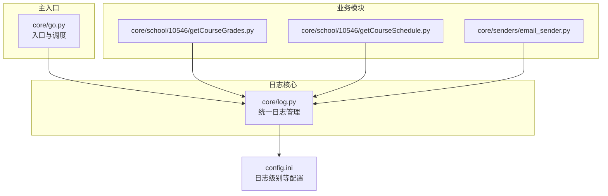
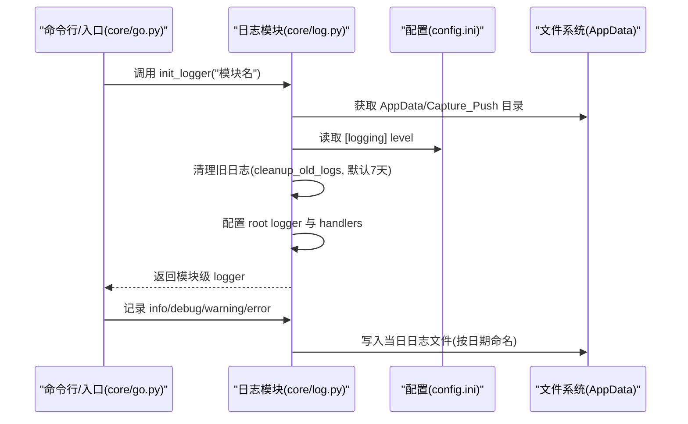
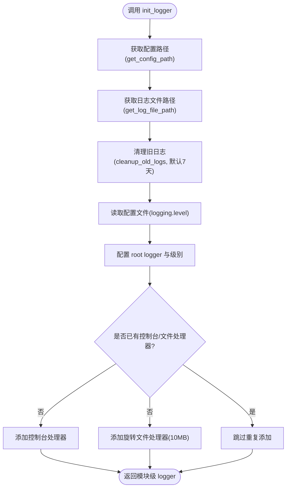
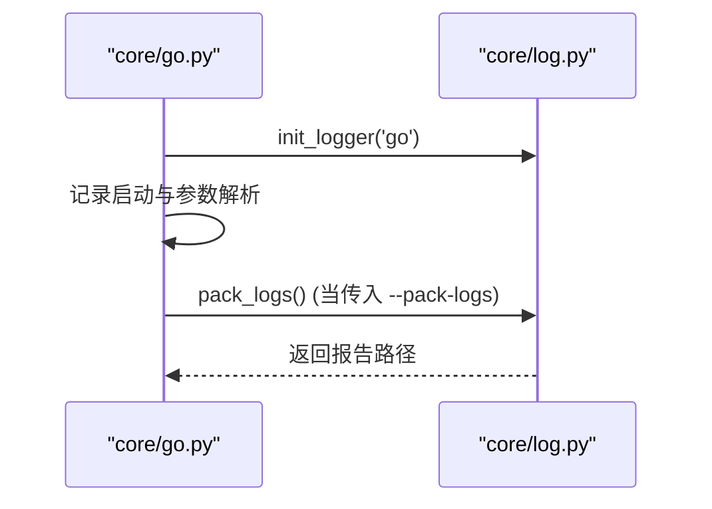
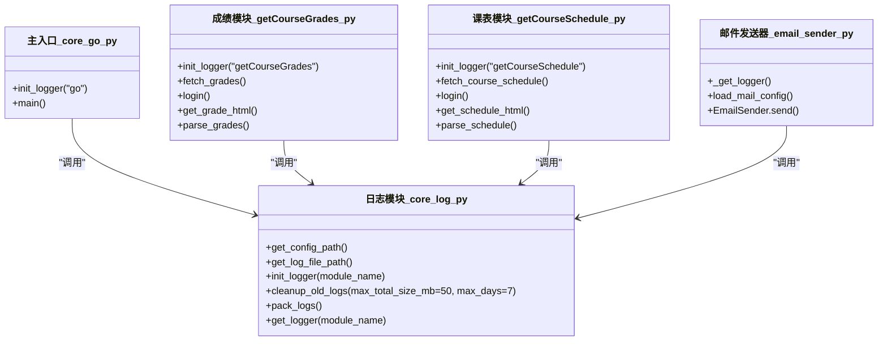
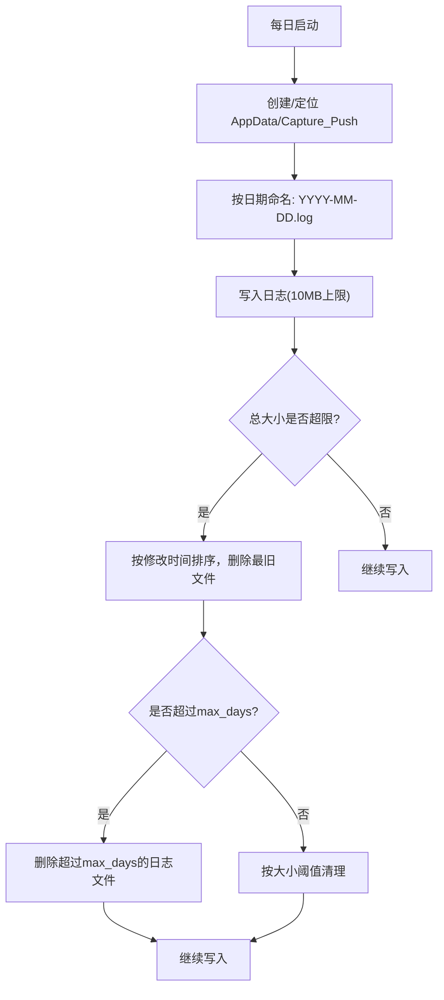
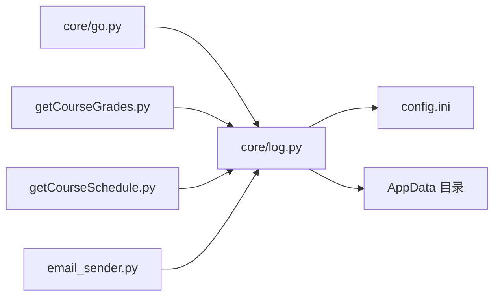

# 日志系统

<cite>
**本文引用的文件**
- [core/log.py](file://core/log.py)
- [core/go.py](file://core/go.py)
- [config.ini](file://config.ini)
- [core/school/10546/getCourseGrades.py](file://core/school/10546/getCourseGrades.py)
- [core/school/10546/getCourseSchedule.py](file://core/school/10546/getCourseSchedule.py)
- [core/senders/email_sender.py](file://core/senders/email_sender.py)
- [generate_config.py](file://generate_config.py)
</cite>

## 更新摘要
**变更内容**
- 扩展 cleanup_old_logs 函数以支持时间和大小双重清理策略
- 新增 max_days 参数（默认7天），实现两层清理策略
- 更新日志清理机制说明，包含时间阈值和大小阈值的双重控制

## 目录
1. [简介](#简介)
2. [项目结构与日志相关模块](#项目结构与日志相关模块)
3. [核心组件](#核心组件)
4. [架构总览](#架构总览)
5. [详细组件分析](#详细组件分析)
6. [依赖关系分析](#依赖关系分析)
7. [性能与容量规划](#性能与容量规划)
8. [故障排查与最佳实践](#故障排查与最佳实践)
9. [结论](#结论)

## 简介
本文件面向 Capture_Push 的日志系统，提供从架构设计到实现细节的完整技术文档。重点涵盖：
- 日志初始化与配置路径管理
- AppData 目录下的统一配置与日志文件组织
- 日志文件命名规则、存储位置与生命周期管理
- 日志级别控制与格式化策略
- 在各模块中的使用方式与最佳实践
- 日志打包与问题排查流程
- 基于日志的系统监控与故障诊断建议

## 项目结构与日志相关模块
日志系统围绕统一的模块化设计展开，核心位于 core/log.py，并在主入口 core/go.py 与各业务模块中广泛使用。配置文件 config.ini 提供日志级别等关键参数；部分模块（如 getCourseGrades、getCourseSchedule、email_sender）在自身文件内也实现了延迟初始化与模块级日志记录。

**图表来源**
- [core/log.py](file://core/log.py#L1-L244)
- [core/go.py](file://core/go.py#L1-L655)
- [core/school/10546/getCourseGrades.py](file://core/school/10546/getCourseGrades.py#L1-L329)
- [core/school/10546/getCourseSchedule.py](file://core/school/10546/getCourseSchedule.py#L1-L405)
- [core/senders/email_sender.py](file://core/senders/email_sender.py#L1-L144)
- [config.ini](file://config.ini#L1-L39)

**章节来源**
- [core/log.py](file://core/log.py#L1-L244)
- [core/go.py](file://core/go.py#L1-L655)

## 核心组件
- 统一日志初始化与配置路径管理：提供 get_config_path、get_log_file_path、init_logger、cleanup_old_logs、pack_logs、get_logger 等函数，统一在 AppData 目录下进行配置与日志文件管理。
- 日志级别与格式：从配置文件读取日志级别，统一格式化输出包含时间、模块名、级别、函数名与消息。
- 生命周期与滚动：单文件上限 10MB，结合双重清理策略控制总占用不超过固定阈值。
- 模块化使用：主入口与各业务模块均通过 init_logger 获取模块级日志器，保证日志可追踪性与一致性。

**章节来源**
- [core/log.py](file://core/log.py#L60-L244)
- [config.ini](file://config.ini#L1-L39)

## 架构总览
日志系统采用"统一入口 + 模块化记录"的架构：
- 统一入口负责配置读取、日志文件定位、处理器装配与清理。
- 各模块通过模块名获取子日志器，记录各自业务行为。
- CLI 提供打包日志能力，便于问题排查。

**图表来源**
- [core/log.py](file://core/log.py#L164-L228)
- [core/go.py](file://core/go.py#L18-L30)
- [config.ini](file://config.ini#L1-L3)

## 详细组件分析

### 组件一：配置路径管理与日志初始化
- get_config_path：在 AppData 下定位 config.ini，若不存在则抛出异常，确保配置可用性。
- get_log_file_path：在 AppData/Capture_Push 下按"YYYY-MM-DD.log"命名，统一日期命名策略。
- init_logger：
  - 读取配置文件日志级别，设置 root logger。
  - 避免重复添加处理器，确保同一进程内多次初始化不会产生重复输出。
  - 统一格式化器，包含模块名、时间、级别、函数名与消息。
  - 使用旋转文件处理器，单文件上限 10MB，保留多个备份。
  - 自动清理旧日志，控制总大小不超过阈值。
- cleanup_old_logs：按修改时间从旧到新排序，逐个删除直至总大小达标。**新增** 支持 max_days 参数，默认7天，实现两层清理策略。
- pack_logs：将 AppData/Capture_Push 下所有 .log 文件打包为单一文本文件，便于问题上报。
- get_logger：按模块名获取日志器，支持直接获取 root logger。

**图表来源**
- [core/log.py](file://core/log.py#L164-L228)
- [core/log.py](file://core/log.py#L60-L82)
- [core/log.py](file://core/log.py#L147-L161)

**章节来源**
- [core/log.py](file://core/log.py#L60-L244)

### 组件二：主入口中的日志使用
- core/go.py 在启动时调用 init_logger('go')，随后记录启动信息、路径信息与参数解析过程。
- CLI 参数中包含 --pack-logs，调用 pack_logs 生成崩溃报告，便于问题排查。

**图表来源**
- [core/go.py](file://core/go.py#L18-L30)
- [core/go.py](file://core/go.py#L507-L513)
- [core/log.py](file://core/log.py#L18-L58)

**章节来源**
- [core/go.py](file://core/go.py#L18-L30)
- [core/go.py](file://core/go.py#L460-L532)

### 组件三：业务模块中的日志使用
- 成绩模块与课表模块均在文件顶部调用 init_logger('模块名')，并在关键流程中记录 info/debug/warning/error。
- 邮件发送器采用延迟初始化策略，首次使用时才初始化日志器与配置路径，减少不必要的开销。

**图表来源**
- [core/log.py](file://core/log.py#L60-L244)
- [core/go.py](file://core/go.py#L18-L25)
- [core/school/10546/getCourseGrades.py](file://core/school/10546/getCourseGrades.py#L18-L25)
- [core/school/10546/getCourseSchedule.py](file://core/school/10546/getCourseSchedule.py#L19-L29)
- [core/senders/email_sender.py](file://core/senders/email_sender.py#L21-L27)

**章节来源**
- [core/school/10546/getCourseGrades.py](file://core/school/10546/getCourseGrades.py#L18-L25)
- [core/school/10546/getCourseSchedule.py](file://core/school/10546/getCourseSchedule.py#L19-L29)
- [core/senders/email_sender.py](file://core/senders/email_sender.py#L21-L27)

### 组件四：日志文件命名、存储与生命周期
- 命名规则：按"YYYY-MM-DD.log"命名，每日一个文件，便于按天检索。
- 存储位置：AppData/Capture_Push，确保用户权限下可写且集中管理。
- 生命周期：
  - 单文件上限 10MB，超出后滚动。
  - **更新** 总大小 50MB 阈值，按修改时间从旧到新删除，直到总大小达标。
  - **新增** 时间阈值：默认7天，超过此期限的日志文件会被优先删除。
  - **新增** 双重清理策略：首先删除超过指定天数的日志，然后对剩余文件按大小进行清理。
- 打包：pack_logs 将所有 .log 文件内容合并为单一文本文件，包含文件名与分隔线，便于问题上报。

**图表来源**
- [core/log.py](file://core/log.py#L147-L161)
- [core/log.py](file://core/log.py#L178-L179)
- [core/log.py](file://core/log.py#L85-L144)

**章节来源**
- [core/log.py](file://core/log.py#L85-L161)
- [core/log.py](file://core/log.py#L178-L179)

## 依赖关系分析
- 统一依赖：主入口与各业务模块均依赖 core/log.py 的统一接口。
- 配置依赖：日志级别来自 config.ini 的 [logging] 节，确保全局一致。
- 文件系统依赖：严格依赖 LOCALAPPDATA 环境变量，不存在时抛出异常，保障健壮性。
- 外部库依赖：logging、logging.handlers.RotatingFileHandler、configparser、pathlib、datetime、shutil 等。

**图表来源**
- [core/go.py](file://core/go.py#L18-L25)
- [core/school/10546/getCourseGrades.py](file://core/school/10546/getCourseGrades.py#L18-L25)
- [core/school/10546/getCourseSchedule.py](file://core/school/10546/getCourseSchedule.py#L19-L29)
- [core/senders/email_sender.py](file://core/senders/email_sender.py#L12-L15)
- [core/log.py](file://core/log.py#L174-L185)

**章节来源**
- [core/log.py](file://core/log.py#L174-L185)
- [config.ini](file://config.ini#L1-L3)

## 性能与容量规划
- 单文件 10MB 上限，配合滚动策略，避免单文件过大影响读取与传输。
- **更新** 总大小 50MB 阈值，按旧到新删除，平衡磁盘占用与历史可追溯性。
- **新增** 时间阈值：默认7天，确保长期运行时不会产生过多历史日志。
- **新增** 双重清理策略：时间优先的清理机制，确保过期日志及时释放空间。
- 日志级别通过配置控制，生产环境建议使用 INFO 或更高，减少冗余输出。
- 建议在高并发或高频日志场景下，适当提高清理阈值或缩短日志保留周期，避免磁盘压力。

## 故障排查与最佳实践

### 如何正确使用日志系统
- 在每个模块顶部调用 init_logger('模块名')，确保模块级日志器可用。
- 使用 logger.info 记录正常流程与关键节点；使用 logger.debug 记录调试细节；使用 logger.warning 记录潜在风险；使用 logger.error 记录错误并附带 exc_info=True。
- 在 CLI 中使用 --pack-logs 一键打包日志，便于问题上报。

**章节来源**
- [core/go.py](file://core/go.py#L460-L532)
- [core/log.py](file://core/log.py#L164-L228)

### 日志打包与问题排查
- pack_logs 会遍历 AppData/Capture_Push 下所有 .log 文件，写入单一文本文件，包含文件名与分隔线，便于定位问题。
- 建议在复现问题后立即执行打包，确保日志完整性。

**章节来源**
- [core/log.py](file://core/log.py#L18-L58)

### 日志级别控制与配置
- 日志级别来自 config.ini 的 [logging] level，默认 DEBUG；生产环境建议改为 INFO。
- 若需要临时提升调试级别，可在配置中调整 level 并重启应用。

**章节来源**
- [config.ini](file://config.ini#L1-L3)
- [core/log.py](file://core/log.py#L182-L185)

### AppData 目录下的统一配置管理
- get_config_path 与 get_log_file_path 统一在 AppData/Capture_Push 下工作，确保跨模块一致性。
- 若 LOCALAPPDATA 环境变量缺失，将抛出异常，便于早期发现环境问题。

**章节来源**
- [core/log.py](file://core/log.py#L60-L82)
- [core/log.py](file://core/log.py#L147-L161)

### 在不同模块中使用日志的最佳实践
- 主入口：记录启动、参数解析、关键调度步骤。
- 业务模块：记录登录、网络请求、解析过程、状态变更与异常。
- 发送器：记录配置加载、连接建立、发送过程与错误类型。
- 延迟初始化：对于非核心模块（如邮件发送器），采用延迟初始化，减少启动开销。

**章节来源**
- [core/go.py](file://core/go.py#L460-L532)
- [core/school/10546/getCourseGrades.py](file://core/school/10546/getCourseGrades.py#L278-L296)
- [core/school/10546/getCourseSchedule.py](file://core/school/10546/getCourseSchedule.py#L354-L372)
- [core/senders/email_sender.py](file://core/senders/email_sender.py#L21-L27)

### 通过日志进行系统监控与故障诊断
- 监控指标建议：每日日志文件数量、总大小、错误率、异常堆栈出现频率。
- 诊断流程：定位问题时间段 → 查看对应日期日志 → 按模块过滤 → 结合错误码与异常堆栈定位根因 → 通过 --pack-logs 提交报告。

### **新增** 双重清理策略的使用指南
- **默认行为**：cleanup_old_logs(appdata_dir) 使用默认参数，max_total_size_mb=50，max_days=7。
- **自定义配置**：可根据需要调用 cleanup_old_logs(appdata_dir, max_total_size_mb=100, max_days=14)。
- **时间优先策略**：超过 max_days 的日志文件会被优先删除，确保长期运行时的空间控制。
- **大小补充策略**：在时间清理后，对剩余文件按大小进行补充清理，确保总大小不超过阈值。

**章节来源**
- [core/log.py](file://core/log.py#L85-L144)

## 结论
Capture_Push 的日志系统通过统一的模块化设计，实现了在 AppData 目录下的集中配置与日志管理。其核心特性包括：
- 统一的配置与日志路径管理
- 按日期命名、10MB 单文件上限与总大小控制的滚动策略
- **新增** 时间与大小双重清理策略，确保日志文件的及时清理与空间控制
- 模块级日志器与一致的格式化输出
- CLI 支持一键打包日志，便于问题排查

**更新** 最新的双重清理策略通过 max_days 参数实现了更精细的空间管理，能够在保证历史日志可追溯性的同时有效控制磁盘占用。该设计既满足了开发调试需求，又兼顾了生产环境的稳定性与可维护性。建议在实际部署中结合业务负载合理调整日志级别与清理阈值，并在问题排查时充分利用打包功能与模块化日志定位根因。