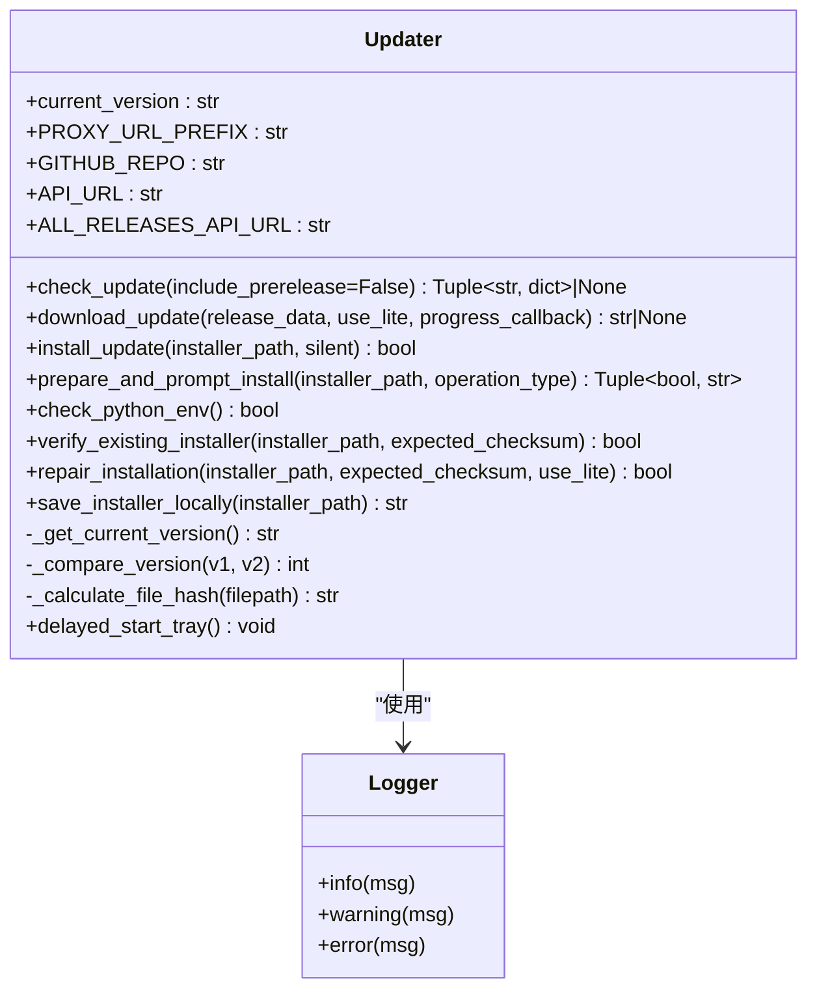
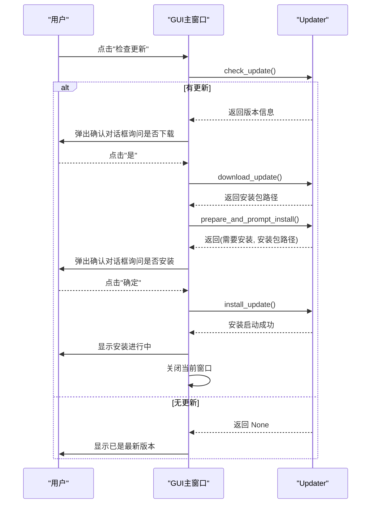
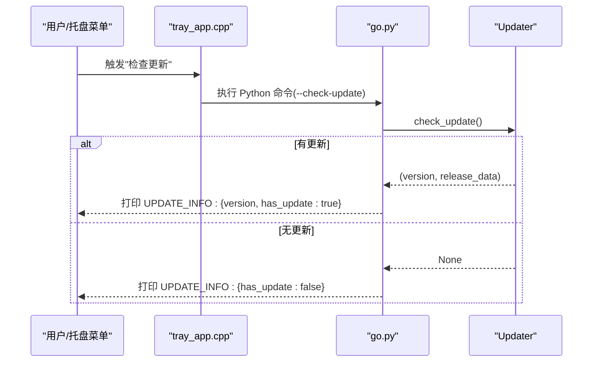
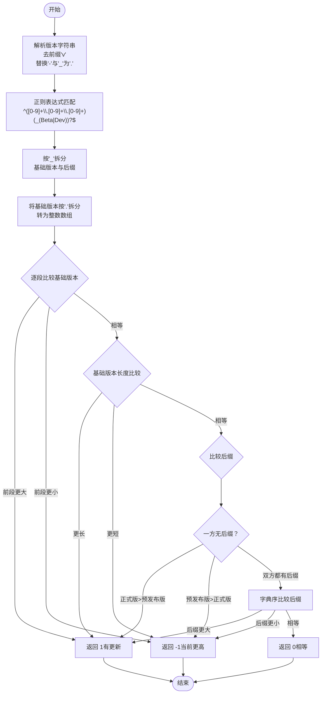
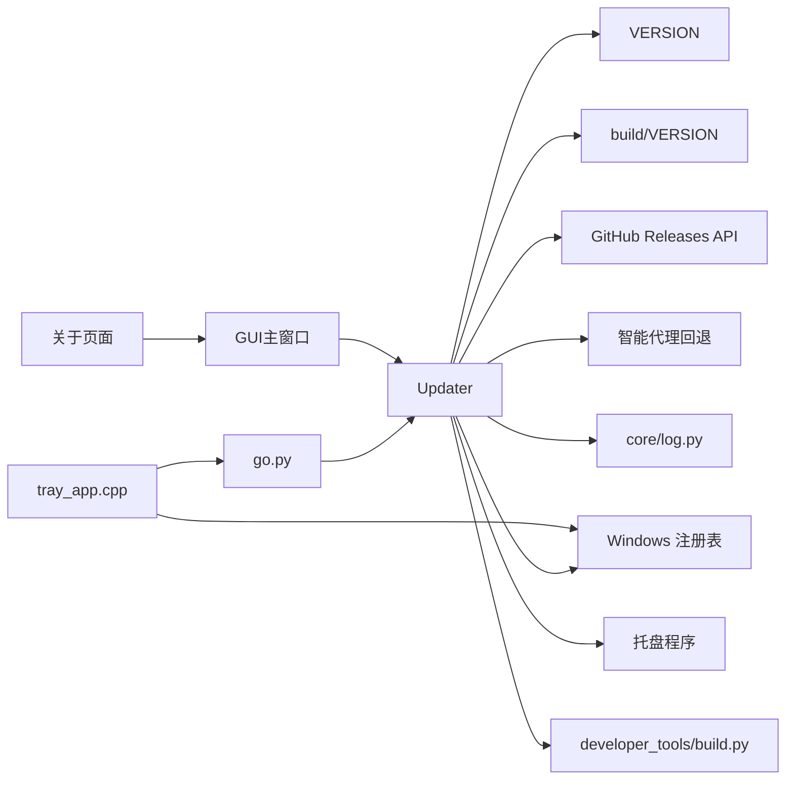

# 更新机制

<cite>
**本文引用的文件**
- [core/updater.py](file://core/updater.py)
- [core/go.py](file://core/go.py)
- [core/log.py](file://core/log.py)
- [README.md](file://README.md)
- [config.ini](file://config.ini)
- [VERSION](file://VERSION)
- [build/VERSION](file://build/VERSION)
- [tray/tray_app.cpp](file://tray/tray_app.cpp)
- [Capture_Push_Setup.iss](file://Capture_Push_Setup.iss)
- [Capture_Push_Lite_Setup.iss](file://Capture_Push_Lite_Setup.iss)
- [developer_tools/build.py](file://developer_tools/build.py)
- [gui/config_window.py](file://gui/config_window.py)
- [gui/tabs/about_tab.py](file://gui/tabs/about_tab.py)
</cite>

## 更新摘要
**变更内容**
- 新增 `prepare_and_prompt_install` 方法，改进用户确认流程，解决应用可能无法完全退出的问题
- GUI组件更新实现两步确认流程：先准备安装包，再提示用户确认安装
- 增强了安装包准备和用户交互的可靠性
- 改进了应用退出机制，确保程序能够完全退出

## 目录
1. [简介](#简介)
2. [项目结构](#项目结构)
3. [核心组件](#核心组件)
4. [架构总览](#架构总览)
5. [组件详解](#组件详解)
6. [依赖关系分析](#依赖关系分析)
7. [性能考量](#性能考量)
8. [故障排查指南](#故障排查指南)
9. [结论](#结论)
10. [附录](#附录)

## 简介
本文件面向 Capture_Push 的更新机制，系统性阐述自动更新系统的设计与实现，包括版本检查、更新下载、安装流程与回滚策略；深入解析 Updater 类的核心能力（如 check_update 的工作流程、版本比较算法与更新包管理）；说明更新机制与主执行模块的集成方式（命令行参数 --check-update 的处理逻辑与更新信息返回格式）；并提供更新配置说明（更新服务器配置、更新策略与用户交互设计），最后给出集成示例与异常处理建议。

**更新** 本次更新重点增强了更新系统的用户交互体验，新增了 `prepare_and_prompt_install` 方法，实现了更可靠的两步确认流程，解决了应用可能无法完全退出的问题。

## 项目结构
更新机制涉及的关键文件与职责如下：
- core/updater.py：自动更新模块，负责版本检查、下载与安装，现已增强预发布版本支持、智能代理回退功能和安装包完整性校验，新增 `prepare_and_prompt_install` 方法。
- core/go.py：主执行模块，集成命令行参数 --check-update 并与 Updater 协作。
- core/log.py：统一日志管理，为更新流程提供日志记录。
- config.ini：应用配置文件，影响运行行为（例如日志级别等）。
- VERSION / build/VERSION：版本号来源，Updater 通过读取 VERSION 获取当前版本。
- tray/tray_app.cpp：C++ 托盘程序，负责循环检测与执行 Python 命令，间接参与更新触发场景。
- Capture_Push_Setup.iss / Capture_Push_Lite_Setup.iss：安装脚本，配置托盘程序的安装与启动。
- developer_tools/build.py：构建工具，包含文件哈希计算功能，与更新机制的完整性校验相呼应。
- gui/config_window.py：GUI主窗口，实现两步确认流程，集成 `prepare_and_prompt_install` 方法。
- gui/tabs/about_tab.py：关于页面，提供检查更新按钮与修复安装功能。

```mermaid
graph TB
subgraph "核心模块"
U["Updater<br/>版本检查/下载/安装<br/>预发布版本支持<br/>智能代理回退<br/>安装包完整性校验<br/>修复安装功能<br/>静默安装后自动启动托盘<br/>prepare_and_prompt_install"]
GO["go.py<br/>命令行入口"]
LOG["log.py<br/>日志系统"]
CFG["config.ini<br/>应用配置"]
VER["VERSION<br/>当前版本"]
BVER["build/VERSION<br/>构建版本"]
BUILD["developer_tools/build.py<br/>哈希计算工具"]
GUI["GUI主窗口<br/>两步确认流程<br/>prepare_and_prompt_install集成"]
ABOUT["关于页面<br/>检查更新按钮"]
END
subgraph "外部依赖"
GH["GitHub Releases API"]
PROXY["智能代理回退<br/>ghfast.top"]
REG["Windows 注册表"]
PY["Python 进程"]
TRAY["托盘程序<br/>Capture_Push_tray.exe"]
END
GO --> U
U --> LOG
U --> VER
U --> BVER
U --> GH
U --> PROXY
U --> REG
U --> TRAY
U --> BUILD
GO --> CFG
GO --> PY
GUI --> U
ABOUT --> GUI
```

**图表来源**
- [core/updater.py](file://core/updater.py#L20-L887)
- [core/go.py](file://core/go.py#L630-L663)
- [core/log.py](file://core/log.py#L131-L211)
- [config.ini](file://config.ini#L1-L39)
- [VERSION](file://VERSION#L1-L2)
- [build/VERSION](file://build/VERSION#L1-L1)
- [developer_tools/build.py](file://developer_tools/build.py#L34-L42)
- [gui/config_window.py](file://gui/config_window.py#L219-L286)
- [gui/tabs/about_tab.py](file://gui/tabs/about_tab.py#L103-L111)

**章节来源**
- [core/updater.py](file://core/updater.py#L1-L887)
- [core/go.py](file://core/go.py#L630-L663)
- [core/log.py](file://core/log.py#L1-L211)
- [config.ini](file://config.ini#L1-L39)
- [VERSION](file://VERSION#L1-L2)
- [build/VERSION](file://build/VERSION#L1-L1)

## 核心组件
- Updater 类：封装版本检查、下载与安装全流程，提供 CLI 与非 CLI 两种使用方式，现已增强预发布版本支持、智能代理回退、安装包完整性校验和修复安装功能，新增 `prepare_and_prompt_install` 方法用于改进用户确认流程。
- 主执行模块 go.py：解析命令行参数，当传入 --check-update 时调用 Updater 并以特定格式输出更新信息。
- 日志系统 log.py：统一日志输出，便于追踪更新过程。
- 版本来源：通过读取仓库根目录 VERSION 文件获取当前版本号；构建产物可能使用 build/VERSION 作为构建标识。
- 配置文件 config.ini：提供日志级别等运行期配置，影响日志输出行为。
- 托盘程序 tray_app.cpp：在静默安装完成后自动启动，提供用户界面和循环检测功能。
- 构建工具 developer_tools/build.py：提供文件哈希计算功能，与更新机制的完整性校验相呼应。
- GUI主窗口 config_window.py：实现两步确认流程，集成 `prepare_and_prompt_install` 方法，提供更友好的用户交互体验。
- 关于页面 about_tab.py：提供检查更新按钮，连接到主窗口的更新检查功能。

**更新** 新增了 `prepare_and_prompt_install` 方法和GUI两步确认流程，显著增强了更新系统的用户交互体验和可靠性。

**章节来源**
- [core/updater.py](file://core/updater.py#L108-L887)
- [core/go.py](file://core/go.py#L630-L663)
- [core/log.py](file://core/log.py#L131-L211)
- [config.ini](file://config.ini#L1-L39)
- [VERSION](file://VERSION#L1-L2)
- [build/VERSION](file://build/VERSION#L1-L1)
- [gui/config_window.py](file://gui/config_window.py#L219-L286)
- [gui/tabs/about_tab.py](file://gui/tabs/about_tab.py#L103-L111)

## 架构总览
更新机制采用"检查-下载-安装"的三段式流程，结合 GitHub Releases API 获取最新版本信息，依据版本比较规则决定是否更新，并根据运行环境选择合适的安装包（完整版或轻量版）。安装过程通过启动安装程序实现，支持静默安装以提升用户体验。**新增** `prepare_and_prompt_install` 方法实现了两步确认流程，先准备安装包，再提示用户确认安装，解决应用可能无法完全退出的问题；**新增** GUI组件集成该方法，提供更友好的用户交互体验。

```mermaid
sequenceDiagram
participant GUI as "GUI主窗口"
participant ABOUT as "关于页面"
participant UP as "Updater"
participant GH as "GitHub Releases API"
participant PROXY as "智能代理回退"
participant FS as "文件系统"
participant INST as "安装程序"
participant REG as "Windows 注册表"
participant TRAY as "托盘程序"
GUI->>ABOUT : 用户点击"检查更新"
ABOUT->>GUI : 触发检查更新
GUI->>UP : check_update(include_prerelease=False)
UP->>GH : 请求最新稳定版本
alt 预发布版本检查
UP->>PROXY : 尝试代理访问API
PROXY-->>UP : 返回代理API响应
end
GH-->>UP : 返回最新版本与资产信息
UP->>UP : 版本比较当前 vs 最新
alt 有更新
UP-->>GUI : 返回(版本号, 资产信息)
GUI->>UP : download_update(资产信息, use_lite)
UP->>FS : 下载安装包至临时目录
UP->>UP : 验证SHA256校验和
alt 校验和匹配
FS-->>UP : 返回安装包路径
GUI->>UP : prepare_and_prompt_install(安装包路径, "更新")
UP->>UP : 保存安装包到程序目录
UP-->>GUI : 返回(需要安装, 安装包路径)
alt 用户确认
GUI->>UP : install_update(安装包路径)
UP->>INST : 启动安装程序静默/普通
alt 静默安装
INST-->>UP : 安装进行中
UP->>REG : 从注册表获取安装路径
REG-->>UP : 返回安装路径
UP->>TRAY : 启动托盘程序
TRAY-->>UP : 托盘程序已启动
end
UP-->>GUI : 安装启动成功
else 校验和不匹配
UP-->>GUI : 删除损坏文件并返回失败
end
else 无更新
UP-->>GUI : 返回 None
GUI-->>ABOUT : 显示已是最新版本
end
```

**图表来源**
- [core/updater.py](file://core/updater.py#L131-L266)
- [core/updater.py](file://core/updater.py#L340-L464)
- [core/updater.py](file://core/updater.py#L551-L581)
- [core/updater.py](file://core/updater.py#L482-L550)
- [gui/config_window.py](file://gui/config_window.py#L220-L286)

## 组件详解

### Updater 类：版本检查、下载与安装
- 版本来源与当前版本获取
  - Updater 在初始化时读取仓库根目录 VERSION 文件作为当前版本号；若文件缺失或读取失败，默认返回 0.0.0。
  - 构建产物可能使用 build/VERSION 作为构建标识，但 Updater 默认读取 VERSION。
- 版本检查流程（check_update）
  - 通过 GitHub Releases API 获取最新发布信息。
  - 支持 `include_prerelease` 参数，允许用户选择是否包含预发布版本。
  - 解析 tag_name，去除前缀"v"，并将连字符与下划线替换为点号，形成可比较的版本字符串。
  - 调用内部版本比较方法 _compare_version，决定是否返回更新结果。
  - **新增** 智能代理回退功能：当直接访问 GitHub API 失败时，自动尝试通过 ghfast.top 代理访问。
- 版本比较算法（_compare_version）
  - 支持基础版本号（x.y.z）逐段比较。
  - 使用正则表达式精确匹配版本格式：`^([0-9]+\.[0-9]+\.[0-9]+)(_(Beta|Dev))?$`
  - 支持后缀比较（如 Beta、Dev 等），规则为：正式版 > 预发布版（Beta > Dev）。
  - 若基础版本相同，比较后缀字符串；若均无后缀则视为相等。
  - 异常情况下返回 0，避免误判。
- 更新包下载（download_update）
  - 优先选择轻量版安装包（Capture_Push_Lite_Setup.exe），若不存在则回退到完整版（Capture_Push_Setup.exe）。
  - 使用带进度回调的下载方式，进度通过回调函数传递。
  - 下载到临时目录，完成后返回安装包绝对路径。
  - **新增** 安装包完整性校验：从发布说明中提取SHA256校验和，下载完成后计算文件哈希并与期望值对比。
  - **新增** 智能代理回退功能：当直接下载失败时，自动尝试通过 ghfast.top 代理下载。
- 安装流程（install_update）
  - 校验安装包存在性，不存在则记录错误并返回失败。
  - 根据安装包类型（轻量版或完整版）与 silent 参数决定是否启用静默安装。
  - 通过子进程方式启动安装程序，不等待其结束，以便当前程序能正常退出。
  - **新增** 静默安装时，启动后台线程等待安装完成，从Windows注册表获取安装路径，自动启动托盘程序。
- **新增** 安装包准备与用户确认（prepare_and_prompt_install）
  - 检查安装包文件是否存在，不存在则记录错误并返回失败。
  - 将安装包保存到程序目录，确保后续操作的可靠性。
  - 返回元组 (是否需要安装, 安装包路径)，供调用方进行用户确认。
  - **新增** 两步确认流程：先准备安装包，再提示用户确认安装，解决应用可能无法完全退出的问题。
- Python 环境检测（check_python_env）
  - 通过读取注册表项 SOFTWARE\Capture_Push 获取安装路径，再判断 .venv/python.exe 是否存在，用于判断是否应优先下载轻量版安装包。
- CLI 检查更新（check_for_updates_cli）
  - 提供命令行交互式检查更新流程：打印更新信息、询问是否下载、下载进度反馈、询问是否安装、静默安装等。
  - **新增** 询问用户是否检查预发布版本，支持 include_prerelease 参数。
- 安装包完整性验证（verify_existing_installer）
  - **新增** 验证已存在安装包的完整性，支持SHA256校验和验证。
  - 计算文件的SHA256哈希值并与期望值对比，确保文件未被篡改。
- 修复安装功能（repair_installation）
  - **新增** 重新校验和安装功能，支持从程序目录获取安装包或重新下载。
  - 自动验证安装包完整性，然后执行静默安装。
- 本地安装包保存（save_installer_locally）
  - **新增** 将安装包保存到程序目录，便于后续修复使用。

**更新** 新增了 `prepare_and_prompt_install` 方法和GUI两步确认流程，显著增强了更新系统的用户交互体验和可靠性。



**图表来源**
- [core/updater.py](file://core/updater.py#L108-L887)
- [core/log.py](file://core/log.py#L131-L211)

**章节来源**
- [core/updater.py](file://core/updater.py#L115-L130)
- [core/updater.py](file://core/updater.py#L131-L266)
- [core/updater.py](file://core/updater.py#L268-L339)
- [core/updater.py](file://core/updater.py#L340-L464)
- [core/updater.py](file://core/updater.py#L482-L550)
- [core/updater.py](file://core/updater.py#L551-L581)
- [core/updater.py](file://core/updater.py#L582-L617)
- [core/updater.py](file://core/updater.py#L618-L649)
- [core/updater.py](file://core/updater.py#L650-L704)
- [core/updater.py](file://core/updater.py#L705-L832)

### GUI两步确认流程：改进用户交互体验
- **新增** 两步确认流程实现
  - 第一步：准备安装包，调用 `prepare_and_prompt_install` 方法。
  - 第二步：用户确认安装，调用 `install_update` 方法。
  - 通过分离准备和确认两个步骤，确保应用能够完全退出后再启动安装程序。
- **新增** GUI主窗口集成
  - 在 `check_for_updates` 方法中实现完整的两步确认流程。
  - 先检查更新，再下载安装包，然后准备安装包并提示用户确认。
  - 用户确认后启动安装程序并关闭当前窗口。
- **新增** 用户交互设计
  - 发现新版本时弹出确认对话框询问是否下载。
  - 下载完成后弹出确认对话框显示安装包路径并询问是否继续。
  - 提供取消选项，允许用户稍后手动运行安装程序。
- **新增** 错误处理机制
  - 检查更新失败时显示错误信息。
  - 下载失败时显示错误信息并提供替代方案。
  - 安装启动失败时显示错误信息并记录日志。



**图表来源**
- [gui/config_window.py](file://gui/config_window.py#L220-L286)
- [core/updater.py](file://core/updater.py#L551-L581)
- [core/updater.py](file://core/updater.py#L482-L550)

**章节来源**
- [gui/config_window.py](file://gui/config_window.py#L220-L286)
- [gui/tabs/about_tab.py](file://gui/tabs/about_tab.py#L103-L111)

### 主执行模块集成：命令行参数 --check-update
- 命令行参数定义
  - go.py 中定义了 --check-update 参数，用于触发更新检查。
- 执行流程
  - 当传入 --check-update 时，go.py 导入 Updater，调用 check_update。
  - 若有更新，打印"发现新版本"与"当前版本"，并以 JSON 格式输出 UPDATE_INFO，包含版本号与 has_update 字段。
  - 若无更新，打印"当前已是最新版本"，同样输出 has_update=false 的 JSON。
- 返回格式
  - UPDATE_INFO:<JSON字符串>，其中 JSON 包含 version（若有更新）与 has_update 字段。
- 与托盘程序的关系
  - 托盘程序通过执行 Python 命令触发 go.py 的相应参数，从而间接触发更新检查逻辑。



**图表来源**
- [core/go.py](file://core/go.py#L641-L656)
- [tray/tray_app.cpp](file://tray/tray_app.cpp#L717-L720)

**章节来源**
- [core/go.py](file://core/go.py#L641-L656)
- [tray/tray_app.cpp](file://tray/tray_app.cpp#L717-L720)

### 版本比较算法细节
- 输入处理
  - 去除 tag_name 前缀"v"，并将"-"与"_"替换为"."，得到标准化版本字符串。
  - 使用正则表达式 `^([0-9]+\.[0-9]+\.[0-9]+)(_(Beta|Dev))?$` 精确匹配版本格式。
  - 将版本字符串按"_"拆分为基础版本与后缀部分。
- 基础版本比较
  - 将基础版本按"."拆分为数字段，逐段比较大小；长度不同则更长者更大。
- 后缀比较规则
  - 若一方无后缀（正式版），另一方有后缀（预发布版），正式版更大。
  - 若双方均有后缀，按字典序比较后缀字符串（Beta > Dev）。
- 异常处理
  - 比较过程中出现异常，返回 0，避免误判导致不必要的更新。



**图表来源**
- [core/updater.py](file://core/updater.py#L268-L339)

**章节来源**
- [core/updater.py](file://core/updater.py#L268-L339)

### 安装包完整性校验与修复功能
- 安装包完整性校验（download_update）
  - **新增** 从GitHub发布说明中提取SHA256校验和，支持多个校验和的匹配。
  - 下载完成后计算文件的SHA256哈希值并与期望值进行严格比较。
  - 校验失败时自动删除可能被篡改的文件，确保系统安全。
  - **新增** 文件大小验证：如果没有提供校验和，至少验证文件大小是否匹配。
- 已存在安装包验证（verify_existing_installer）
  - **新增** 验证已存在安装包的完整性，支持SHA256校验和验证。
  - 计算文件的SHA256哈希值并与期望值对比，确保文件未被篡改。
  - 支持仅输出校验和供参考，不强制要求匹配。
- 修复安装功能（repair_installation）
  - **新增** 重新校验和安装功能，支持从程序目录获取安装包或重新下载。
  - 自动验证安装包完整性，然后执行静默安装。
  - 支持指定期望的校验和，确保安装包的真实性。
- 本地安装包保存（save_installer_locally）
  - **新增** 将安装包保存到程序目录，便于后续修复使用。
  - 如果无法获取安装目录，保存到当前目录作为后备方案。
- 校验和计算（_calculate_file_hash）
  - **新增** 使用SHA256算法计算文件哈希值。
  - 采用分块读取方式，避免大文件占用过多内存。
  - 支持任意大小的文件完整性验证。

**更新** 新增了完整的安装包完整性校验体系，包括下载时校验、已存在文件验证、修复安装和本地保存功能。

**章节来源**
- [core/updater.py](file://core/updater.py#L380-L464)
- [core/updater.py](file://core/updater.py#L618-L649)
- [core/updater.py](file://core/updater.py#L650-L704)
- [core/updater.py](file://core/updater.py#L705-L832)

### 更新包管理与安装策略
- 安装包选择
  - 优先选择轻量版安装包（Lite_Setup），若不存在则回退到完整版（Setup）。
  - 通过检查资产名称匹配实现。
- 下载策略
  - 下载到临时目录，使用进度回调实时反馈下载进度。
  - 下载完成后返回安装包绝对路径。
  - **新增** 安装包完整性校验：从发布说明中提取SHA256校验和，下载完成后计算文件哈希并与期望值对比。
  - **新增** 智能代理回退功能：当直接下载失败时，自动尝试通过 ghfast.top 代理下载。
- 安装策略
  - 轻量版安装包默认启用静默安装（/VERYSILENT /NORESTART）。
  - 完整版安装包根据 silent 参数决定是否静默。
  - 通过子进程启动安装程序，不等待其结束，保证当前程序能正常退出。
  - **新增** 静默安装时，启动后台线程等待安装完成，从Windows注册表获取安装路径，自动启动托盘程序。
  - **新增** 两步确认流程：先准备安装包，再提示用户确认安装，解决应用可能无法完全退出的问题。
- Python 环境检测
  - 通过读取注册表项 SOFTWARE\Capture_Push 获取安装路径，判断 .venv/python.exe 是否存在，用于决定是否优先下载轻量版安装包。

**更新** 新增了 `prepare_and_prompt_install` 方法和GUI两步确认流程，显著提升了更新系统的用户交互体验和可靠性。

**章节来源**
- [core/updater.py](file://core/updater.py#L340-L464)
- [core/updater.py](file://core/updater.py#L482-L550)
- [core/updater.py](file://core/updater.py#L551-L581)
- [core/updater.py](file://core/updater.py#L582-L617)

### 更新配置与用户交互
- 更新服务器配置
  - Updater 使用固定仓库地址与 Releases API 获取最新版本信息。
  - API 请求头包含自定义 User-Agent，便于服务端识别来源。
  - **新增** 智能代理回退功能：使用 ghfast.top 作为代理前缀，提高在中国大陆地区的访问稳定性。
- 更新策略设置
  - 版本比较策略：正式版优先于预发布版；预发布版按后缀字典序比较。
  - 安装包选择策略：优先轻量版，不存在时回退完整版。
  - 安装策略：轻量版默认静默安装，完整版可按需静默。
  - **新增** 预发布版本支持：通过 include_prerelease 参数控制是否包含预发布版本。
  - **新增** 静默安装后自动启动托盘程序策略。
  - **新增** 安装包完整性校验策略：支持SHA256校验和验证。
  - **新增** 两步确认流程策略：先准备安装包，再提示用户确认安装。
- 用户交互设计
  - CLI 模式：交互式提示下载与安装，支持进度反馈。
  - 非 CLI 模式：通过 JSON 格式输出更新信息，便于 GUI 或其他调用方消费。
  - **新增** CLI 模式下询问用户是否检查预发布版本。
  - **新增** GUI两步确认流程：先准备安装包，再提示用户确认安装。
  - **新增** 错误处理与用户反馈：提供详细的错误信息和替代方案。

**更新** 新增了预发布版本支持、智能代理回退功能、安装包完整性校验、修复安装策略和两步确认流程。

**章节来源**
- [core/updater.py](file://core/updater.py#L18-L28)
- [core/updater.py](file://core/updater.py#L131-L266)
- [core/updater.py](file://core/updater.py#L340-L464)
- [core/updater.py](file://core/updater.py#L482-L550)
- [core/updater.py](file://core/updater.py#L551-L581)
- [core/updater.py](file://core/updater.py#L618-L649)
- [core/updater.py](file://core/updater.py#L650-L704)
- [core/updater.py](file://core/updater.py#L705-L832)

## 依赖关系分析
- Updater 依赖
  - 版本来源：VERSION 文件（当前版本）、构建产物 build/VERSION（构建标识）。
  - 外部依赖：GitHub Releases API、智能代理回退（ghfast.top）、Windows 注册表、urllib、subprocess、tempfile、pathlib、hashlib 等。
  - 日志依赖：core/log.py 提供统一日志记录。
  - **新增** 托盘程序依赖：Capture_Push_tray.exe，通过注册表获取安装路径。
  - **新增** 构建工具依赖：developer_tools/build.py 提供哈希计算功能。
  - **新增** GUI依赖：PySide6，用于实现两步确认流程。
- 主执行模块依赖
  - go.py 通过命令行参数 --check-update 触发 Updater，并以 JSON 格式输出更新信息。
- 托盘程序依赖
  - tray_app.cpp 通过执行 Python 命令触发 go.py 的相应参数，间接触发更新检查。
  - **新增** 通过注册表 SOFTWARE\Capture_Push 获取安装路径，启动托盘程序。
- GUI组件依赖
  - gui/config_window.py 通过 PySide6 实现两步确认流程。
  - gui/tabs/about_tab.py 提供检查更新按钮与修复安装功能。



**图表来源**
- [core/updater.py](file://core/updater.py#L115-L130)
- [core/updater.py](file://core/updater.py#L18-L28)
- [core/updater.py](file://core/updater.py#L518-L550)
- [core/log.py](file://core/log.py#L131-L211)
- [core/go.py](file://core/go.py#L641-L656)
- [tray/tray_app.cpp](file://tray/tray_app.cpp#L127-L159)
- [gui/config_window.py](file://gui/config_window.py#L220-L286)
- [gui/tabs/about_tab.py](file://gui/tabs/about_tab.py#L103-L111)

**章节来源**
- [core/updater.py](file://core/updater.py#L115-L130)
- [core/updater.py](file://core/updater.py#L18-L28)
- [core/updater.py](file://core/updater.py#L518-L550)
- [core/log.py](file://core/log.py#L131-L211)
- [core/go.py](file://core/go.py#L641-L656)
- [tray/tray_app.cpp](file://tray/tray_app.cpp#L127-L159)
- [gui/config_window.py](file://gui/config_window.py#L220-L286)
- [gui/tabs/about_tab.py](file://gui/tabs/about_tab.py#L103-L111)

## 性能考量
- 网络请求超时控制：版本检查与下载均设置了超时，避免长时间阻塞。
- **新增** 智能代理回退：当直接访问失败时自动尝试代理访问，提高成功率。
- 下载进度回调：提供实时进度反馈，改善用户体验。
- 日志分级：通过 config.ini 的 logging.level 控制日志输出级别，减少不必要的 IO。
- 安装程序异步启动：安装程序通过子进程启动，不等待其结束，降低对当前进程的影响。
- **新增** 后台线程优化：静默安装后的托盘程序启动通过后台线程实现，不影响主程序退出。
- **新增** 注册表访问优化：通过缓存注册表值和适当的错误处理，减少注册表访问开销。
- **新增** 预发布版本过滤：在不包含预发布版本的情况下，自动跳过预发布版本，提高效率。
- **新增** 分块哈希计算：使用分块读取方式计算SHA256哈希，避免大文件占用过多内存。
- **新增** 校验和提取优化：从发布说明中智能提取SHA256校验和，支持多个校验和的匹配。
- **新增** 两步确认流程优化：分离准备和确认两个步骤，确保应用能够完全退出后再启动安装程序。
- **新增** GUI响应优化：两步确认流程避免了长时间阻塞GUI线程，提升用户体验。

**更新** 新增了智能代理回退、后台线程、注册表访问、分块哈希计算、校验和提取、两步确认流程和GUI响应优化的性能考量。

**章节来源**
- [core/updater.py](file://core/updater.py#L45-L58)
- [core/updater.py](file://core/updater.py#L142-L197)
- [core/updater.py](file://core/updater.py#L415-L464)
- [core/updater.py](file://core/updater.py#L518-L550)
- [core/updater.py](file://core/updater.py#L551-L581)
- [core/updater.py](file://core/updater.py#L474-L481)
- [gui/config_window.py](file://gui/config_window.py#L220-L286)

## 故障排查指南
- 版本文件缺失
  - 现象：当前版本读取失败，返回 0.0.0。
  - 处理：确认 VERSION 文件存在且可读。
- 网络请求失败
  - 现象：检查更新返回 None。
  - 处理：检查网络连接与代理设置，重试或稍后再试。
  - **新增** 智能代理回退：如果直接访问失败，系统会自动尝试代理访问。
- 安装包不存在
  - 现象：安装启动失败。
  - 处理：确认下载路径有效，检查磁盘空间与权限。
- Python 环境检测失败
  - 现象：无法判断是否应下载轻量版。
  - 处理：检查注册表项 SOFTWARE\Capture_Push 是否正确，确认 .venv/python.exe 存在。
- **新增** 注册表访问失败
  - 现象：静默安装后无法启动托盘程序。
  - 处理：检查注册表项 SOFTWARE\Capture_Push 是否存在，确认 InstallPath 值正确。
- **新增** 托盘程序启动失败
  - 现象：安装完成后托盘程序未启动。
  - 处理：检查 Capture_Push_tray.exe 是否存在于安装目录，确认文件完整性。
- **新增** 预发布版本检查失败
  - 现象：包含预发布版本的检查返回 None。
  - 处理：确认 GitHub Releases API 可访问，检查网络连接。
- **新增** 安装包完整性验证失败
  - 现象：下载的安装包被删除或安装失败。
  - 处理：检查发布说明中的SHA256校验和格式，确认网络连接稳定。
- **新增** 校验和提取失败
  - 现象：无法从发布说明中提取SHA256校验和。
  - 处理：检查发布说明格式，确认包含正确的校验和信息。
- **新增** 修复安装失败
  - 现象：修复安装功能无法正常工作。
  - 处理：检查程序目录中的安装包，确认文件存在且可读。
- **新增** 两步确认流程失败
  - 现象：应用无法完全退出或安装程序启动失败。
  - 处理：检查 `prepare_and_prompt_install` 方法的执行结果，确认安装包路径有效。
- **新增** GUI两步确认流程异常
  - 现象：GUI界面无响应或对话框无法显示。
  - 处理：检查 PySide6 库的可用性，确认 GUI 线程未被阻塞。
- 日志定位问题
  - 使用 core/log.py 提供的日志路径与打包功能，收集日志并分析错误原因。

**更新** 新增了智能代理回退、预发布版本检查、安装包完整性验证、校验和提取、修复安装、两步确认流程和GUI两步确认流程相关的故障排查指南。

**章节来源**
- [core/updater.py](file://core/updater.py#L115-L130)
- [core/updater.py](file://core/updater.py#L198-L266)
- [core/updater.py](file://core/updater.py#L373-L464)
- [core/updater.py](file://core/updater.py#L618-L649)
- [core/updater.py](file://core/updater.py#L705-L832)
- [core/updater.py](file://core/updater.py#L551-L581)
- [gui/config_window.py](file://gui/config_window.py#L220-L286)
- [core/log.py](file://core/log.py#L18-L57)

## 结论
Capture_Push 的更新机制以 Updater 为核心，结合 GitHub Releases API 实现自动化版本检查与安装。通过清晰的版本比较规则、灵活的安装包选择与静默安装策略，以及完善的日志与异常处理，实现了稳定可靠的更新体验。**新增** `prepare_and_prompt_install` 方法和GUI两步确认流程显著增强了更新系统的用户交互体验，通过分离准备和确认两个步骤，确保应用能够完全退出后再启动安装程序，解决了应用可能无法完全退出的问题。**新增** 安装包完整性校验、修复安装功能和校验和验证机制显著增强了更新系统的安全性和可靠性，通过SHA256哈希值确保下载文件的完整性和真实性。预发布版本支持、智能代理回退功能和静默安装后的托盘程序自动启动功能进一步提升了用户体验，实现了无缝更新流程。主执行模块与托盘程序通过命令行参数与 JSON 输出，将更新能力无缝集成到 CLI 与 GUI 场景中。

**更新** 新增了 `prepare_and_prompt_install` 方法、GUI两步确认流程、安装包完整性校验、修复安装功能和校验和验证机制，显著提升了更新系统的用户交互体验和可靠性。

## 附录

### 更新配置说明
- 更新服务器配置
  - 仓库与 API：Updater 使用固定仓库地址与 Releases API 获取最新版本信息。
  - 请求头：包含自定义 User-Agent，便于识别来源。
  - **新增** 智能代理回退：使用 ghfast.top 作为代理前缀，提高在中国大陆地区的访问稳定性。
- 更新策略设置
  - 版本比较：正式版优先于预发布版；预发布版按后缀字典序比较。
  - 安装包选择：优先轻量版，不存在时回退完整版。
  - 安装策略：轻量版默认静默安装，完整版可按需静默。
  - **新增** 预发布版本支持：通过 include_prerelease 参数控制是否包含预发布版本。
  - **新增** 静默安装后自动启动托盘程序策略。
  - **新增** 安装包完整性校验策略：支持SHA256校验和验证。
  - **新增** 两步确认流程策略：先准备安装包，再提示用户确认安装。
- 用户交互设计
  - CLI：交互式提示下载与安装，支持进度反馈。
  - 非 CLI：以 JSON 格式输出更新信息，便于 GUI 或其他调用方消费。
  - **新增** GUI两步确认流程：提供更友好的用户交互体验。

**更新** 新增了预发布版本支持、智能代理回退功能、安装包完整性校验、修复安装策略、两步确认流程和GUI两步确认流程配置。

**章节来源**
- [core/updater.py](file://core/updater.py#L18-L28)
- [core/updater.py](file://core/updater.py#L131-L266)
- [core/updater.py](file://core/updater.py#L340-L464)
- [core/updater.py](file://core/updater.py#L482-L550)
- [core/updater.py](file://core/updater.py#L551-L581)
- [core/updater.py](file://core/updater.py#L618-L649)
- [core/updater.py](file://core/updater.py#L650-L704)
- [core/updater.py](file://core/updater.py#L705-L832)

### 集成示例与异常处理建议
- 集成步骤
  - 在主执行模块中添加 --check-update 参数并调用 Updater.check_update。
  - 将返回结果以 UPDATE_INFO:<JSON> 形式输出，供 GUI 或其他调用方解析。
  - 在需要时调用 download_update 与 install_update，结合进度回调与静默安装策略。
  - **新增** 预发布版本支持：通过 include_prerelease 参数控制是否包含预发布版本。
  - **新增** 静默安装后通过后台线程自动启动托盘程序。
  - **新增** 安装包完整性校验：在下载完成后自动验证SHA256校验和。
  - **新增** 修复安装功能：在安装包损坏时自动重新下载和安装。
  - **新增** 两步确认流程：先调用 prepare_and_prompt_install 准备安装包，再提示用户确认安装。
  - **新增** GUI集成：在 GUI 中实现两步确认流程，提供更友好的用户交互体验。
- 异常处理
  - 版本文件缺失：降级为 0.0.0 并记录警告。
  - 网络请求失败：捕获 URLError 并返回 None。
  - **新增** 智能代理回退：当直接访问失败时，自动尝试代理访问。
  - 安装包不存在：记录错误并返回 False。
  - Python 环境检测失败：默认返回 False，避免误判。
  - **新增** 注册表访问失败：记录错误并跳过托盘程序启动。
  - **新增** 托盘程序启动失败：记录错误并继续程序执行。
  - **新增** 预发布版本检查失败：记录错误并继续检查稳定版本。
  - **新增** 安装包完整性验证失败：删除损坏文件并返回 None。
  - **新增** 校验和提取失败：记录警告并继续下载流程。
  - **新增** 修复安装失败：记录错误并提供替代方案。
  - **新增** 两步确认流程失败：检查 prepare_and_prompt_install 的返回值，确保安装包路径有效。
  - **新增** GUI两步确认流程异常：检查 PySide6 库的可用性，避免阻塞GUI线程。
  - 日志记录：使用统一日志系统，便于问题定位与分析。

**更新** 新增了预发布版本支持、智能代理回退、安装包完整性验证、校验和提取、修复安装、两步确认流程、GUI两步确认流程和相关异常处理建议。

**章节来源**
- [core/go.py](file://core/go.py#L641-L656)
- [core/updater.py](file://core/updater.py#L115-L130)
- [core/updater.py](file://core/updater.py#L198-L266)
- [core/updater.py](file://core/updater.py#L373-L464)
- [core/updater.py](file://core/updater.py#L618-L649)
- [core/updater.py](file://core/updater.py#L705-L832)
- [core/updater.py](file://core/updater.py#L551-L581)
- [gui/config_window.py](file://gui/config_window.py#L220-L286)
- [core/log.py](file://core/log.py#L131-L211)

### 安装包完整性校验机制
- SHA256校验和提取
  - **新增** 从GitHub发布说明中提取SHA256校验和，支持多个校验和的匹配。
  - 使用正则表达式 `[a-fA-F0-9]{64}` 精确匹配64位十六进制校验和。
  - 支持根据文件名匹配正确的校验和，或在只有一个校验和时自动使用。
- 文件完整性验证
  - **新增** 下载完成后计算文件的SHA256哈希值并与期望值进行严格比较。
  - 校验失败时自动删除可能被篡改的文件，确保系统安全。
  - **新增** 文件大小验证：如果没有提供校验和，至少验证文件大小是否匹配。
- 校验和计算实现
  - **新增** 使用 hashlib.sha256 算法计算文件哈希值。
  - 采用分块读取方式（每块4096字节），避免大文件占用过多内存。
  - 支持任意大小的文件完整性验证。
- 错误处理
  - 校验和提取失败：记录警告并继续下载流程。
  - 校验和不匹配：删除损坏文件并返回 None。
  - 文件大小不匹配：删除损坏文件并返回 None。

**新增** 详细说明了安装包完整性校验机制的实现。

**章节来源**
- [core/updater.py](file://core/updater.py#L380-L464)
- [core/updater.py](file://core/updater.py#L465-L481)

### 修复安装功能
- 修复安装流程
  - **新增** 自动检测并获取本地保存的安装包。
  - **新增** 如果本地没有安装包，自动重新下载最新版本。
  - **新增** 验证安装包完整性后执行静默安装。
- 本地安装包管理
  - **新增** 将安装包保存到程序目录，便于后续修复使用。
  - **新增** 如果无法获取安装目录，保存到当前目录作为后备方案。
- 错误处理
  - 本地安装包不存在：自动重新下载。
  - 安装包完整性验证失败：拒绝安装并返回 False。
  - 安装程序启动失败：记录错误并返回 False。

**新增** 详细说明了修复安装功能的实现。

**章节来源**
- [core/updater.py](file://core/updater.py#L705-L832)

### 预发布版本支持与智能代理回退机制
- 预发布版本支持
  - 通过 `include_prerelease` 参数控制是否包含预发布版本。
  - 当包含预发布版本时，检查所有发布版本，包括预发布版本。
  - 当不包含预发布版本时，自动跳过预发布版本，只检查稳定版本。
- 智能代理回退功能
  - 使用 `PROXY_URL_PREFIX = "https://ghfast.top/"` 作为代理前缀。
  - 当直接访问 GitHub API 失败时，自动尝试通过代理访问。
  - 支持稳定版本和预发布版本的代理访问。
- 错误处理
  - 直接访问失败：记录警告并尝试代理访问。
  - 代理访问失败：记录错误并返回 None。
  - 预发布版本检查失败：记录错误并继续检查稳定版本。

**新增** 详细说明了预发布版本支持与智能代理回退机制的实现。

**章节来源**
- [core/updater.py](file://core/updater.py#L142-L266)
- [core/updater.py](file://core/updater.py#L198-L266)

### 两步确认流程与GUI集成
- 两步确认流程实现
  - **新增** `prepare_and_prompt_install` 方法：准备安装包并返回需要用户确认的状态。
  - **新增** GUI集成：在 `check_for_updates` 方法中实现完整的两步确认流程。
  - **新增** 用户交互：先准备安装包，再提示用户确认安装，解决应用可能无法完全退出的问题。
- GUI两步确认流程
  - 发现新版本时弹出确认对话框询问是否下载。
  - 下载完成后弹出确认对话框显示安装包路径并询问是否继续。
  - 用户确认后启动安装程序并关闭当前窗口。
  - 提供取消选项，允许用户稍后手动运行安装程序。
- 错误处理
  - 检查更新失败：显示错误信息并记录日志。
  - 下载失败：显示错误信息并提供替代方案。
  - 安装启动失败：显示错误信息并记录日志。
  - 用户取消：显示友好提示并保存安装包路径。
- 性能优化
  - 分离准备和确认两个步骤，避免长时间阻塞GUI线程。
  - 使用异步操作确保GUI响应性。
  - 提供进度反馈和状态更新。

**新增** 详细说明了两步确认流程与GUI集成的实现。

**章节来源**
- [core/updater.py](file://core/updater.py#L551-L581)
- [gui/config_window.py](file://gui/config_window.py#L220-L286)
- [gui/tabs/about_tab.py](file://gui/tabs/about_tab.py#L103-L111)

### 静默安装后托盘程序自动启动机制
- 后台线程实现
  - 安装完成后启动独立的后台线程，避免阻塞主程序退出。
  - 线程设置为守护线程，确保主程序退出时线程自动终止。
- 注册表路径获取
  - 从 HKEY_LOCAL_MACHINE\SOFTWARE\Capture_Push 读取 InstallPath 值。
  - 支持 WOW64_64KEY 标志，确保在 64 位系统上正确读取。
- 托盘程序启动
  - 构造 Capture_Push_tray.exe 完整路径并验证文件存在性。
  - 通过 subprocess.Popen 启动托盘程序，不等待其结束。
- 错误处理
  - 注册表访问失败时记录错误并跳过托盘程序启动。
  - 托盘程序不存在时记录警告并继续执行。
  - 启动失败时记录错误并继续程序执行。

**新增** 详细说明了静默安装后的托盘程序自动启动机制实现。

**章节来源**
- [core/updater.py](file://core/updater.py#L518-L550)
- [tray/tray_app.cpp](file://tray/tray_app.cpp#L127-L159)