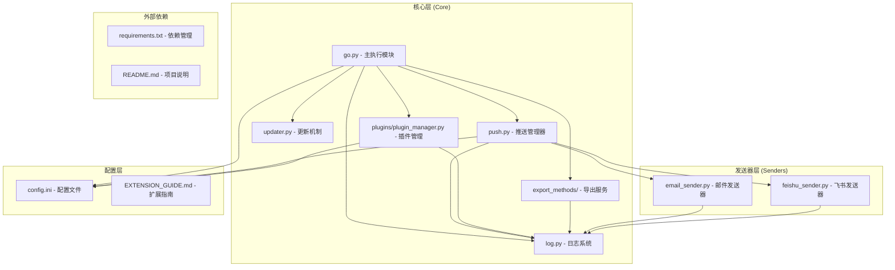
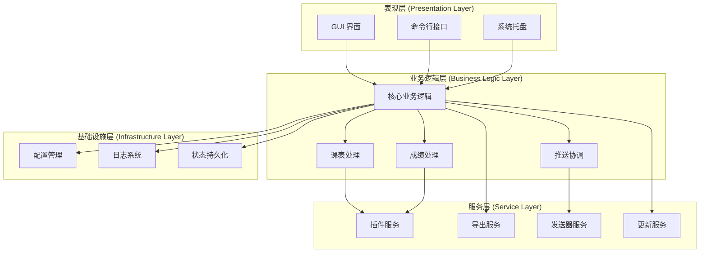
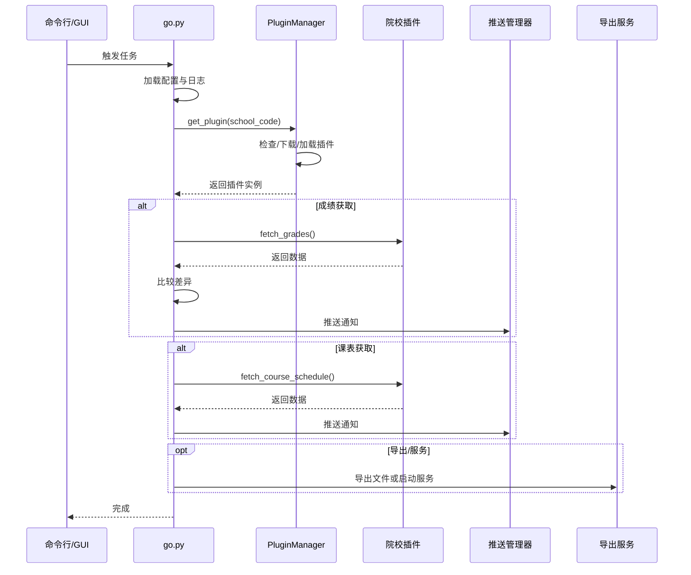
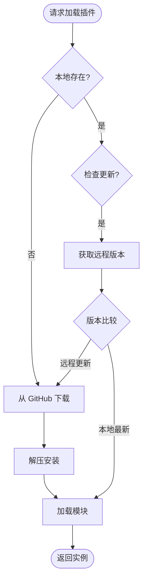
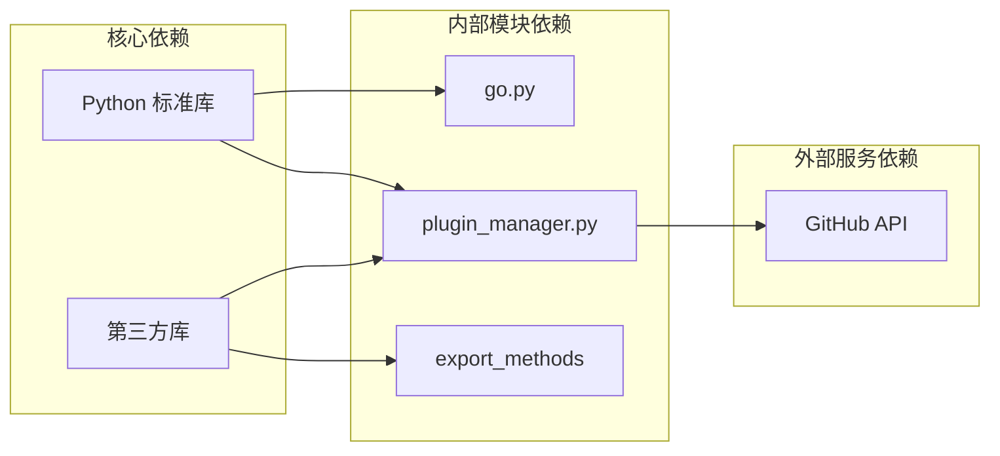

# 核心架构设计

<cite>
**本文档引用的文件**
- [core/go.py](file://core/go.py)
- [core/push.py](file://core/push.py)
- [core/log.py](file://core/log.py)
- [core/updater.py](file://core/updater.py)
- [core/plugins/plugin_manager.py](file://core/plugins/plugin_manager.py)
- [core/export_methods/file_exporter.py](file://core/export_methods/file_exporter.py)
- [core/senders/email_sender.py](file://core/senders/email_sender.py)
- [core/senders/feishu_sender.py](file://core/senders/feishu_sender.py)
- [config.ini](file://config.ini)
- [README.md](file://README.md)
- [扩展开发指南](file://.wiki/zh/content/开发者工具/扩展开发指南/扩展开发指南.md)
</cite>

## 目录
1. [简介](#简介)
2. [项目结构](#项目结构)
3. [核心组件](#核心组件)
4. [架构概览](#架构概览)
5. [详细组件分析](#详细组件分析)
6. [依赖关系分析](#依赖关系分析)
7. [性能考量](#性能考量)
8. [故障排除指南](#故障排除指南)
9. [结论](#结论)

## 简介

Capture_Push 是一个课程成绩和课表自动追踪推送系统，能够自动获取学生课程成绩和课表信息，并通过邮件等方式推送更新通知。该系统采用模块化与插件化设计，支持动态加载院校模块、多种推送方式以及多样化的数据导出服务，具有极高的可扩展性和维护性。

## 项目结构

系统采用清晰的模块化组织原则，按照功能职责进行分层设计：

**图表来源**
- [core/go.py](file://core/go.py)
- [core/push.py](file://core/push.py)
- [core/plugins/plugin_manager.py](file://core/plugins/plugin_manager.py)

## 核心组件

### 主执行模块 (go.py)

主执行模块是整个系统的核心协调器，负责：
- 配置文件管理和路径解析
- 调用插件管理器加载院校模块
- 成绩和课表数据获取
- 推送逻辑协调
- 导出服务调用
- 状态持久化管理

### 插件管理器 (plugins/plugin_manager.py)

负责院校适配模块的生命周期管理：
- **动态加载**：根据配置的院校代码加载对应插件
- **版本控制**：检查本地插件版本与远程版本
- **自动更新**：从 GitHub Release 下载并安装最新插件
- **依赖隔离**：确保插件独立运行不影响核心逻辑

### 导出服务 (export_methods/)

提供数据的多元化输出能力：
- **文件导出**：支持 Excel, ICS, JSON 等格式
- **HTTP 服务**：启动轻量级 API 服务供外部调用
- **二维码生成**：便于移动端快速获取服务地址或数据

### 推送管理器 (push.py)

推送管理器采用策略模式设计，支持多种推送方式：
- **抽象接口**：定义统一的发送器接口
- **动态注册**：自动发现和注册可用的发送器
- **配置驱动**：通过配置文件选择当前使用的推送方式

### 日志系统 (log.py)

统一的日志管理模块，提供：
- **AppData 路径管理**：所有日志和配置统一存储在用户目录
- **自动清理**：智能清理过期日志文件
- **多处理器支持**：同时输出到控制台和文件

### 更新机制 (updater.py)

自动更新模块，支持：
- **GitHub Releases 检查**：获取最新核心程序版本
- **静默/普通安装**：支持不同的安装策略

## 架构概览

系统采用分层架构设计，各层职责明确，耦合度低：

## 详细组件分析

### 主执行模块工作流程

### 插件管理器工作原理

## 依赖关系分析

系统采用松耦合的设计原则，通过接口和配置实现模块间的解耦：

## 性能考量

系统在设计时充分考虑了性能优化：

### 内存管理
- **延迟初始化**：日志和配置在首次使用时才初始化
- **按需加载**：插件仅在需要时加载，不使用的插件不占用内存

### 网络优化
- **插件缓存**：下载后的插件本地缓存，非必要不联网下载
- **超时控制**：所有网络请求设置合理超时时间

## 故障排除指南

### 常见问题诊断

**插件加载失败**
- 检查网络连接（GitHub 访问）
- 检查 `config.ini` 中的 `school_code` 是否正确
- 查看日志中关于 PluginManager 的报错信息

**导出服务异常**
- 检查端口是否被占用（默认端口）
- 检查文件写入权限

## 结论

Capture_Push 系统展现了优秀的软件架构设计，通过模块化、插件化和策略模式实现了高度的可扩展性和可维护性。其核心优势在于将变动频繁的院校适配逻辑剥离为可动态更新的插件，大大降低了维护成本并提高了系统的灵活性。
