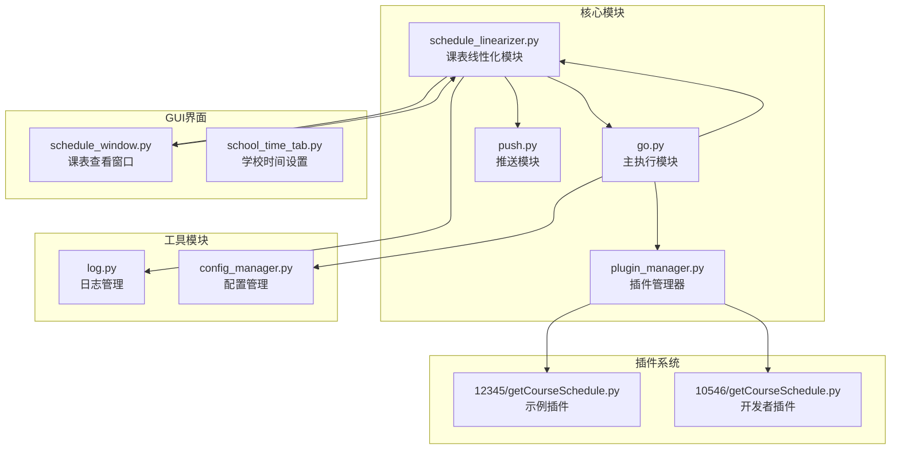
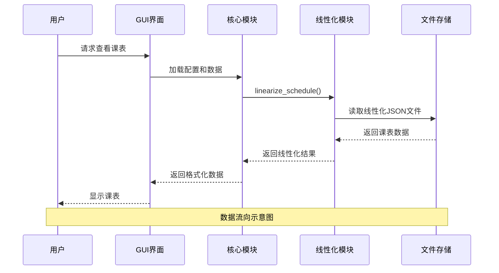
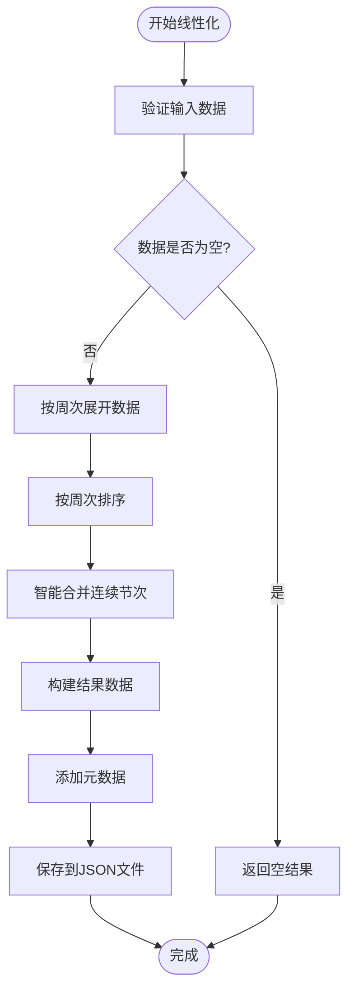
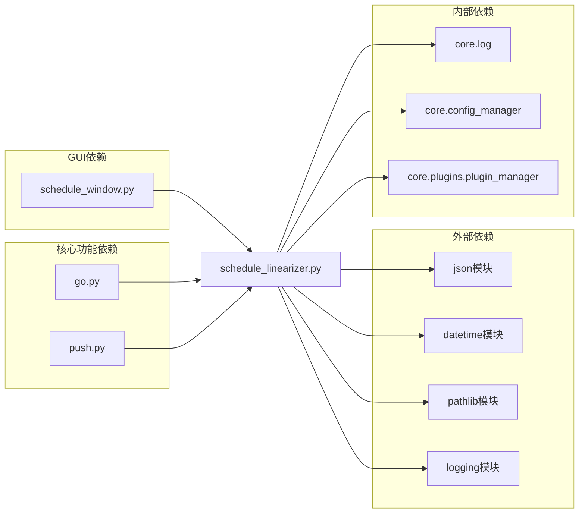

# 课表线性化模块

<cite>
**本文档引用的文件**
- [schedule_linearizer.py](file://core/schedule_linearizer.py)
- [go.py](file://core/go.py)
- [push.py](file://core/push.py)
- [schedule_window.py](file://gui/schedule_window.py)
- [school_time_tab.py](file://gui/tabs/school_time_tab.py)
- [plugin_manager.py](file://core/plugins/plugin_manager.py)
- [log.py](file://core/log.py)
- [config_manager.py](file://core/config_manager.py)
- [getCourseSchedule.py](file://core/plugins/12345/getCourseSchedule.py)
- [getCourseSchedule.py](file://developer_space/10546/getCourseSchedule.py)
- [README.md](file://README.md)
</cite>

## 目录
1. [简介](#简介)
2. [项目结构](#项目结构)
3. [核心组件](#核心组件)
4. [架构概览](#架构概览)
5. [详细组件分析](#详细组件分析)
6. [依赖关系分析](#依赖关系分析)
7. [性能考虑](#性能考虑)
8. [故障排除指南](#故障排除指南)
9. [结论](#结论)

## 简介

课表线性化模块是 Capture_Push 项目中的核心功能组件，负责将传统的课表数据重排为线性模式，按周次组织课程数据，并智能合并连续节次。该模块为整个系统的课表管理提供了基础支撑，确保用户能够以更加直观和高效的方式查看和管理个人课表。

该模块的主要特点包括：
- **线性化处理**：将二维的课表结构转换为按周次组织的一维数据结构
- **智能合并**：自动识别并合并同一课程的连续节次
- **日期计算**：根据学期开始日期计算具体的上课日期
- **文件管理**：提供完整的 JSON 文件读写功能
- **格式化显示**：支持多种格式的课表数据展示

## 项目结构

Capture_Push 项目采用模块化设计，课表线性化模块位于核心功能区域，与 GUI 界面、推送系统、插件管理等模块协同工作。



**图表来源**
- [schedule_linearizer.py](file://core/schedule_linearizer.py#L1-L283)
- [go.py](file://core/go.py#L1-L877)
- [schedule_window.py](file://gui/schedule_window.py#L1-L732)

**章节来源**
- [README.md](file://README.md#L83-L156)

## 核心组件

课表线性化模块包含以下核心组件：

### 主要功能函数

1. **linearize_schedule()** - 主要的线性化处理函数
2. **save_linear_schedule()** - 保存线性化数据到文件
3. **load_linear_schedule()** - 从文件加载线性化数据
4. **format_linear_schedule_for_display()** - 格式化显示课表数据

### 辅助功能

1. **calculate_date_from_week()** - 根据周次计算具体日期
2. **get_appdata_dir()** - 获取应用数据目录
3. **demo_linearization()** - 演示函数

**章节来源**
- [schedule_linearizer.py](file://core/schedule_linearizer.py#L48-L131)

## 架构概览

课表线性化模块在整个系统中的位置和交互关系如下：



**图表来源**
- [schedule_window.py](file://gui/schedule_window.py#L655-L732)
- [go.py](file://core/go.py#L815-L833)

**章节来源**
- [schedule_window.py](file://gui/schedule_window.py#L655-L732)
- [go.py](file://core/go.py#L815-L833)

## 详细组件分析

### 线性化处理算法

线性化模块的核心算法包含两个主要步骤：

#### 步骤1：按周次展开
将原始课表数据按照周次进行展开，确保每个课程在对应的周次都有独立的条目。

#### 步骤2：智能合并连续节次
对同一周内相同课程的连续节次进行智能合并，提高数据展示效率。



**图表来源**
- [schedule_linearizer.py](file://core/schedule_linearizer.py#L63-L131)

**章节来源**
- [schedule_linearizer.py](file://core/schedule_linearizer.py#L48-L131)

### 数据结构设计

线性化模块采用标准化的数据结构：

#### 原始数据格式
```json
{
    "星期": 1,
    "开始小节": 1,
    "结束小节": 2,
    "课程名称": "高等数学",
    "教师": "张教授",
    "教室": "A101",
    "周次列表": [1, 2, 3, 4, 5]
}
```

#### 线性化结果格式
```json
{
    "metadata": {
        "生成时间": "2024-01-01 12:00:00",
        "总课程数": 10,
        "数据格式": "线性周次模式"
    },
    "data": {
        "第1周": {
            "周次": 1,
            "课程数量": 5,
            "课程列表": [...]
        }
    }
}
```

**章节来源**
- [schedule_linearizer.py](file://core/schedule_linearizer.py#L117-L124)

### 文件管理机制

线性化模块提供完整的文件管理功能：

#### 文件存储位置
- **路径**：`%LOCALAPPDATA%\Capture_Push\linear_schedule.json`
- **格式**：JSON 格式
- **编码**：UTF-8

#### 文件操作
1. **保存操作**：将线性化数据保存到文件系统
2. **加载操作**：从文件系统读取线性化数据
3. **错误处理**：完善的异常处理和日志记录

**章节来源**
- [schedule_linearizer.py](file://core/schedule_linearizer.py#L133-L185)

### 日期计算功能

模块提供灵活的日期计算功能：

#### 计算规则
- **输入**：周次（1-20）、星期（1-7）、学期开始日期
- **输出**：具体的上课日期（YYYY-MM-DD）
- **算法**：基于学期开始日期计算目标周次的具体日期

#### 使用场景
- 课表显示时的日期标注
- 推送通知时的日期计算
- 用户界面的时间显示

**章节来源**
- [schedule_linearizer.py](file://core/schedule_linearizer.py#L27-L46)

## 依赖关系分析

课表线性化模块与其他模块的依赖关系如下：



**图表来源**
- [schedule_linearizer.py](file://core/schedule_linearizer.py#L7-L18)
- [schedule_window.py](file://gui/schedule_window.py#L18-L48)

**章节来源**
- [schedule_linearizer.py](file://core/schedule_linearizer.py#L7-L20)
- [schedule_window.py](file://gui/schedule_window.py#L18-L48)

## 性能考虑

课表线性化模块在设计时充分考虑了性能优化：

### 时间复杂度分析
- **线性化处理**：O(n*m)，其中 n 为课程数量，m 为平均周次数
- **智能合并**：O(k)，其中 k 为同一周内相同课程的数量
- **文件操作**：O(p)，其中 p 为 JSON 文件大小

### 内存优化策略
- **延迟加载**：仅在需要时加载线性化文件
- **增量处理**：避免一次性处理大量数据
- **缓存机制**：GUI 界面中缓存已加载的周次数据

### I/O 优化
- **文件复用**：避免频繁的文件读写操作
- **批量处理**：减少系统调用次数
- **错误恢复**：完善的异常处理机制

## 故障排除指南

### 常见问题及解决方案

#### 1. 线性化文件加载失败
**症状**：GUI 界面无法显示课表数据
**原因**：线性化 JSON 文件不存在或格式错误
**解决方法**：
- 检查文件是否存在：`%LOCALAPPDATA%\Capture_Push\linear_schedule.json`
- 验证文件格式是否正确
- 重新执行课表获取和线性化处理

#### 2. 日期计算错误
**症状**：课表日期显示不正确
**原因**：学期开始日期配置错误
**解决方法**：
- 检查配置文件中的 `first_monday` 设置
- 验证日期格式是否为 `YYYY-MM-DD`
- 重新计算并更新学期开始日期

#### 3. 数据合并异常
**症状**：连续节次未正确合并
**原因**：课程标识不一致或数据格式错误
**解决方法**：
- 检查课程名称是否完全一致
- 验证教师和教室信息是否匹配
- 确认周次列表格式正确

**章节来源**
- [schedule_window.py](file://gui/schedule_window.py#L687-L704)
- [schedule_linearizer.py](file://core/schedule_linearizer.py#L180-L185)

## 结论

课表线性化模块作为 Capture_Push 项目的核心组件，通过其精心设计的算法和架构，为用户提供了高效、准确的课表管理功能。模块的主要优势包括：

1. **算法优化**：智能的线性化处理和连续节次合并算法
2. **数据完整性**：完整的数据结构设计和错误处理机制
3. **用户友好**：直观的文件管理和格式化显示功能
4. **系统集成**：与整个项目的无缝集成和协作

该模块的成功实施为后续的功能扩展奠定了坚实的基础，包括更复杂的课表分析、智能推荐等功能的实现都建立在此模块之上。通过持续的优化和完善，课表线性化模块将继续为用户提供优质的课表管理体验。