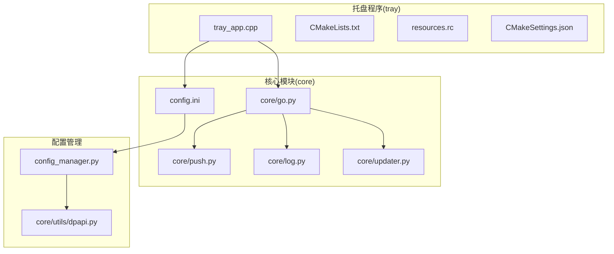
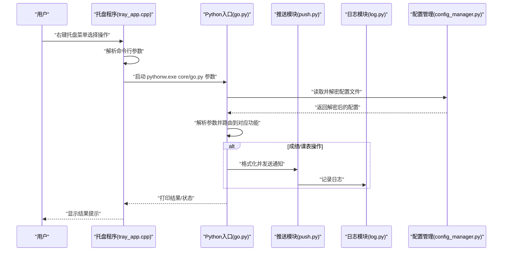
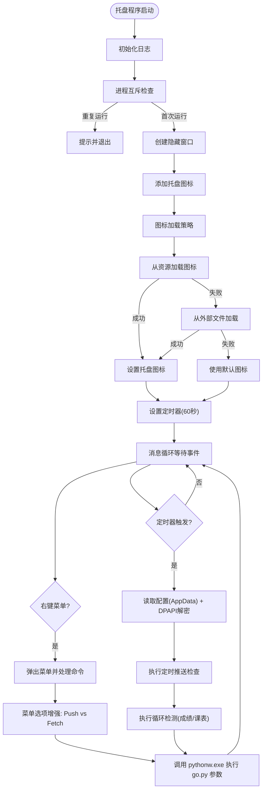
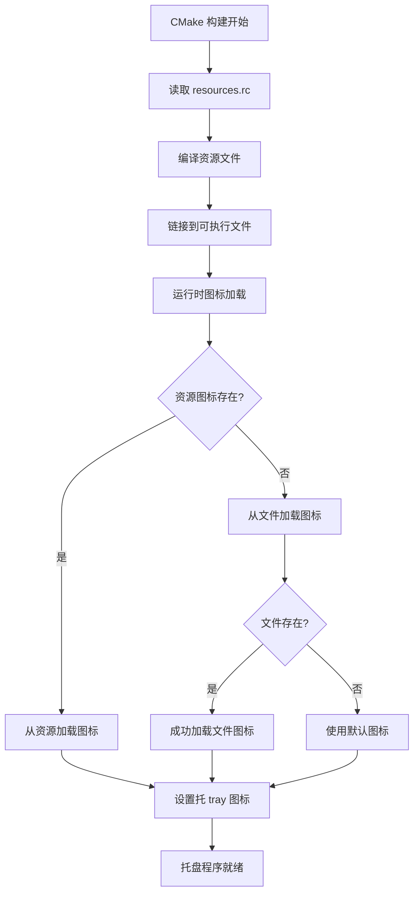
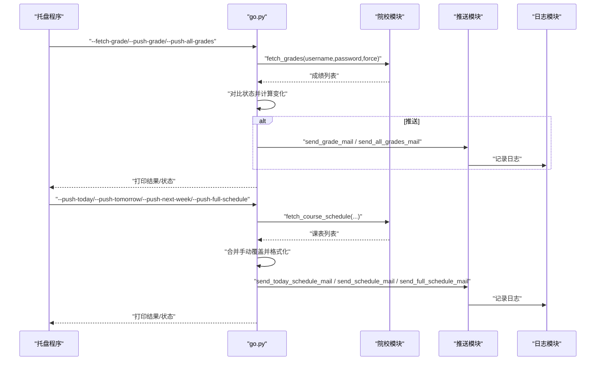
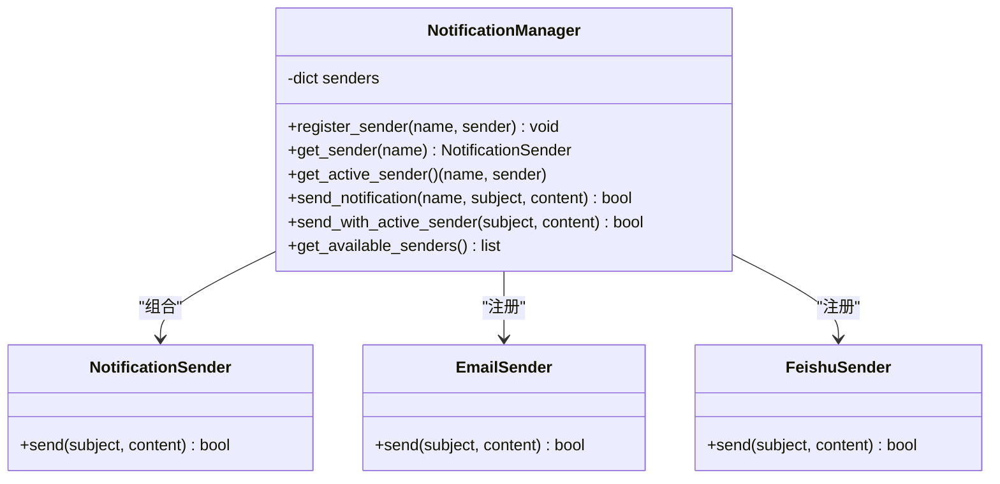
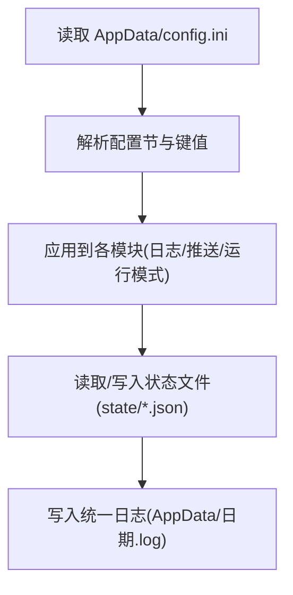
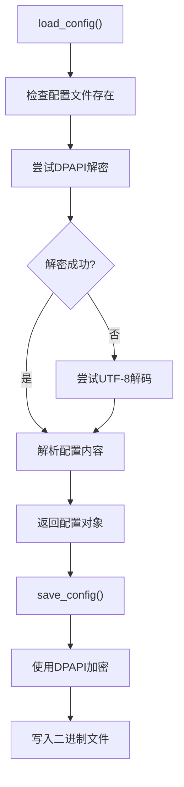
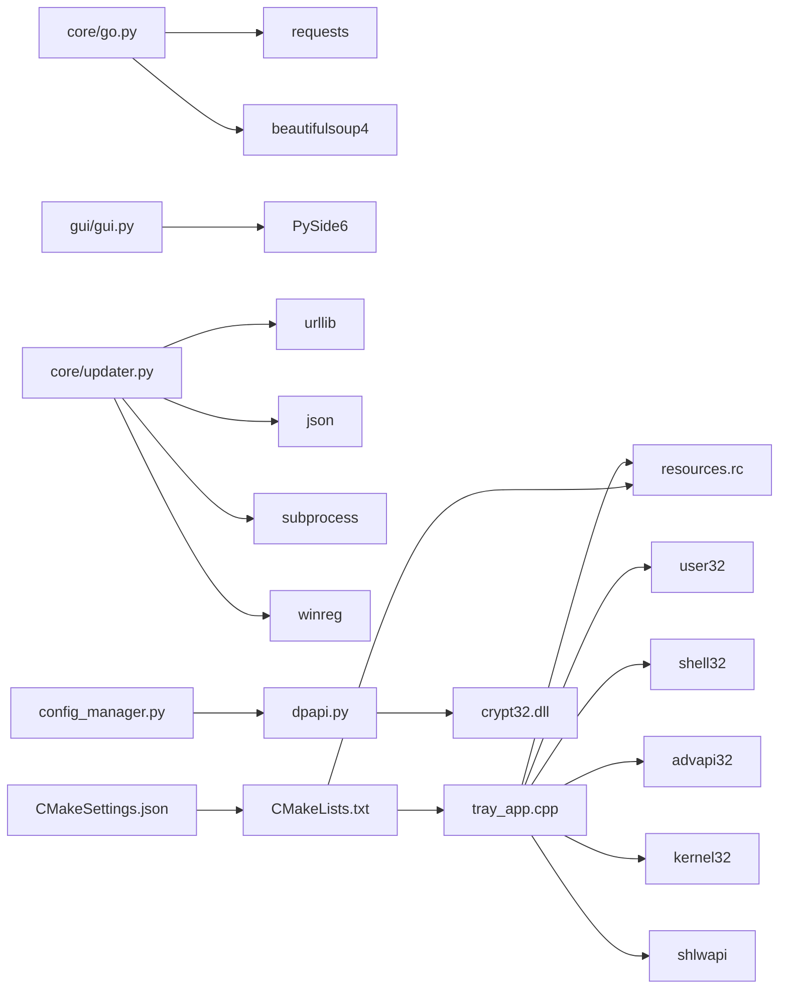

# 系统托盘程序

<cite>
**本文引用的文件**
- [tray_app.cpp](file://tray/tray_app.cpp)
- [CMakeLists.txt](file://tray/CMakeLists.txt)
- [resources.rc](file://tray/resources.rc)
- [CMakeSettings.json](file://tray/CMakeSettings.json)
- [go.py](file://core/go.py)
- [push.py](file://core/push.py)
- [log.py](file://core/log.py)
- [config.ini](file://config.ini)
- [README.md](file://README.md)
- [EXTENSION_GUIDE.md](file://developer_tools/EXTENSION_GUIDE.md)
- [GUI_MODULAR_DESIGN.md](file://gui/GUI_MODULAR_DESIGN.md)
- [updater.py](file://core/updater.py)
- [config_manager.py](file://core/config_manager.py)
- [dpapi.py](file://core/utils/dpapi.py)
</cite>

## 更新摘要
**变更内容**
- **重大改进**：托盘程序图标加载机制全面升级，实现双加载策略（资源内嵌 + 外部文件）
- **构建系统增强**：引入 CMake 资源编译系统，支持嵌入式图标资源
- **运行时行为优化**：增强图标加载的容错性和可靠性
- **配置访问控制**：实现DPAPI加密配置文件，增强配置文件的安全性
- **注册表路径读取**：优化从HKLM注册表读取安装路径的机制
- **菜单选项增强**：新增完整学期课表推送功能，支持 --push-full-schedule 参数
- **错误处理改进**：增强Python环境检查和安装问题处理能力

## 目录
1. [简介](#简介)
2. [项目结构](#项目结构)
3. [核心组件](#核心组件)
4. [架构总览](#架构总览)
5. [组件详细分析](#组件详细分析)
6. [依赖关系分析](#依赖关系分析)
7. [性能考量](#性能考量)
8. [故障排查指南](#故障排查指南)
9. [结论](#结论)
10. [附录](#附录)

## 简介
本文件面向系统托盘程序的技术文档，聚焦于 C++ 实现的托盘程序与 Python 核心模块之间的通信协议、托盘菜单与系统事件处理、后台运行机制、配置与状态同步、以及构建与调试方法。文档旨在帮助开发者快速理解并维护该托盘程序。

## 项目结构
- 托盘程序位于 tray 目录，采用 C++ 实现，基于 Windows API 提供系统托盘图标、右键菜单、定时器与后台运行。
- 核心业务逻辑位于 core 目录，Python 模块负责成绩与课表的抓取、推送、日志与状态管理。
- 配置文件 config.ini 位于项目根目录，统一由 Python 模块通过 AppData 目录进行读取与持久化。
- 构建系统使用 CMake，托盘程序以 WIN32 可执行文件形式产出，链接必要的 Windows 库。

**图表来源**
- [tray_app.cpp](file://tray/tray_app.cpp#L1-L928)
- [CMakeLists.txt](file://tray/CMakeLists.txt#L1-L38)
- [resources.rc](file://tray/resources.rc#L1-L3)
- [CMakeSettings.json](file://tray/CMakeSettings.json#L1-L27)
- [go.py](file://core/go.py#L1-L663)
- [push.py](file://core/push.py#L1-L392)
- [log.py](file://core/log.py#L1-L364)
- [config_manager.py](file://core/config_manager.py#L1-L68)
- [dpapi.py](file://core/utils/dpapi.py#L1-L101)

**章节来源**
- [README.md](file://README.md#L60-L83)
- [CMakeLists.txt](file://tray/CMakeLists.txt#L1-L38)

## 核心组件
- 托盘程序（C++）
  - 系统托盘图标与右键菜单
  - 定时器驱动的循环检测与定时推送
  - 与 Python 核心模块通过命令行参数通信
  - 日志系统与配置读取（AppData）
  - DPAPI加密配置文件访问控制
  - **新增** 双重图标加载机制（资源内嵌 + 外部文件）
- Python 核心模块
  - 命令行入口与参数解析
  - 成绩/课表抓取与推送
  - 状态文件与日志管理
  - 推送方式管理与格式化
- 配置管理系统
  - DPAPI加密与解密
  - 配置文件路径管理
  - 安全的配置访问控制

**章节来源**
- [tray_app.cpp](file://tray/tray_app.cpp#L564-L746)
- [go.py](file://core/go.py#L461-L536)
- [push.py](file://core/push.py#L74-L163)
- [log.py](file://core/log.py#L131-L195)
- [config_manager.py](file://core/config_manager.py#L15-L67)
- [dpapi.py](file://core/utils/dpapi.py#L12-L77)

## 架构总览
托盘程序以 C++ 实现，负责后台运行、定时任务与用户交互；Python 核心模块负责具体业务逻辑与数据处理。二者通过命令行参数进行解耦通信，托盘程序在菜单点击或定时器触发时调用 Python 脚本执行相应动作。配置文件通过DPAPI加密存储在AppData目录中，提供安全的访问控制。

**图表来源**
- [tray_app.cpp](file://tray/tray_app.cpp#L628-L681)
- [go.py](file://core/go.py#L461-L536)
- [push.py](file://core/push.py#L127-L155)
- [log.py](file://core/log.py#L131-L195)
- [config_manager.py](file://core/config_manager.py#L15-L51)

## 组件详细分析

### 托盘程序（C++）
- 窗口与消息循环
  - 注册窗口类，创建隐藏窗口，进入消息循环处理系统事件。
- 托盘图标与菜单
  - 使用 Shell_NotifyIconW 添加托盘图标，右键弹出菜单，支持"推送变化/全部成绩"、"刷新"、"推送今日/明日/本周课表"、"打开配置工具/编辑配置文件"、"退出"等。
  - **更新** 菜单选项从'Fetch'更新为'Push'，提供更直观的用户界面
  - **新增** 完整学期课表推送功能，支持 --push-full-schedule 参数
- **新增** 图标加载机制
  - 实现双加载策略：优先从资源加载图标，失败时回退到外部文件加载
  - 资源内嵌图标通过 CMake 资源编译系统集成到可执行文件中
  - 支持默认图标作为最终回退方案
- 定时器与循环检测
  - 设置定时器周期性触发，每次触发读取配置并执行定时推送与循环检测。
- 命令行调用与进程管理
  - 通过 CreateProcessA 启动无窗口的 pythonw.exe 执行 core/go.py，并传入相应参数。
- 配置与状态
  - 从 AppData 目录读取 config.ini，支持 schedule_push 的定时推送策略。
  - **新增** DPAPI加密配置文件读取，增强安全性
- 日志系统
  - 初始化日志文件，按日期命名，支持滚动与大小限制，线程安全写入。
- 进程互斥与唯一性
  - 使用互斥量与进程枚举双重校验，避免重复运行。

**图表来源**
- [tray_app.cpp](file://tray/tray_app.cpp#L78-L97)
- [tray_app.cpp](file://tray/tray_app.cpp#L118-L151)
- [tray_app.cpp](file://tray/tray_app.cpp#L303-L370)
- [tray_app.cpp](file://tray/tray_app.cpp#L417-L443)
- [tray_app.cpp](file://tray/tray_app.cpp#L479-L510)
- [tray_app.cpp](file://tray/tray_app.cpp#L512-L539)
- [tray_app.cpp](file://tray/tray_app.cpp#L541-L562)
- [tray_app.cpp](file://tray/tray_app.cpp#L734-L760)

**章节来源**
- [tray_app.cpp](file://tray/tray_app.cpp#L78-L97)
- [tray_app.cpp](file://tray/tray_app.cpp#L118-L151)
- [tray_app.cpp](file://tray/tray_app.cpp#L303-L370)
- [tray_app.cpp](file://tray/tray_app.cpp#L417-L443)
- [tray_app.cpp](file://tray/tray_app.cpp#L479-L510)
- [tray_app.cpp](file://tray/tray_app.cpp#L512-L539)
- [tray_app.cpp](file://tray/tray_app.cpp#L541-L562)
- [tray_app.cpp](file://tray/tray_app.cpp#L734-L760)

### 构建系统与资源管理

**新增** CMake 资源编译系统
- **资源定义**：通过 resources.rc 文件定义图标资源标识符和文件路径
- **资源编译**：CMakeLists.txt 中将 resources.rc 作为源文件参与编译
- **嵌入式图标**：图标被编译到可执行文件中，提高部署便利性
- **多配置支持**：CMakeSettings.json 提供 Debug 和 Release 两种构建配置

**新增** 双重图标加载策略
- **资源优先**：首先尝试从编译到可执行文件的资源中加载图标
- **文件回退**：资源加载失败时，尝试从外部 app_icon.ico 文件加载
- **默认保障**：外部文件也失败时，使用 Windows 默认图标

**图表来源**
- [CMakeLists.txt](file://tray/CMakeLists.txt#L23-L23)
- [resources.rc](file://tray/resources.rc#L1-L3)
- [tray_app.cpp](file://tray/tray_app.cpp#L734-L760)

**章节来源**
- [CMakeLists.txt](file://tray/CMakeLists.txt#L1-L38)
- [resources.rc](file://tray/resources.rc#L1-L3)
- [CMakeSettings.json](file://tray/CMakeSettings.json#L1-L27)
- [tray_app.cpp](file://tray/tray_app.cpp#L734-L760)

### Python 核心模块（go.py）
- 命令行入口与参数解析
  - 支持 --fetch-grade、--push-grade、--push-all-grades、--fetch-schedule、--push-schedule、--push-today、--push-tomorrow、--push-next-week、--push-full-schedule、--pack-logs、--check-update、--force 等参数。
- 成绩模块
  - 读取上次成绩状态，计算变化并推送；支持"仅变化"或"全部"推送。
- 课表模块
  - 计算周次与星期，合并手动覆盖，分别推送今日/明日/下周全周课表，支持完整学期课表推送，并记录推送状态。
- 状态与日志
  - 使用 AppData 目录下的 state 与日志文件，统一路径管理，便于打包与部署。

**图表来源**
- [go.py](file://core/go.py#L83-L144)
- [go.py](file://core/go.py#L180-L271)
- [go.py](file://core/go.py#L272-L458)
- [go.py](file://core/go.py#L461-L536)

**章节来源**
- [go.py](file://core/go.py#L42-L46)
- [go.py](file://core/go.py#L83-L144)
- [go.py](file://core/go.py#L180-L271)
- [go.py](file://core/go.py#L272-L458)
- [go.py](file://core/go.py#L461-L536)

### 推送模块（push.py）
- 通知管理器
  - 自动注册可用发送器（如邮件、飞书），根据配置选择活跃发送器。
- 消息格式化
  - 提供成绩变化、全部成绩、课表、完整课表的纯文本格式化函数。
- 发送流程
  - 通过活跃发送器发送通知，记录日志并返回结果。

**图表来源**
- [push.py](file://core/push.py#L56-L163)

**章节来源**
- [push.py](file://core/push.py#L26-L53)
- [push.py](file://core/push.py#L74-L163)
- [push.py](file://core/push.py#L182-L392)

### 日志与配置（log.py、config.ini）
- 日志系统
  - 统一使用 AppData 目录，按日期命名日志文件，支持滚动与总大小清理。
- 配置系统
  - 通过 get_config_path() 获取 config.ini 路径，读取日志级别、运行模式、推送方式、邮箱/飞书等配置。

**图表来源**
- [log.py](file://core/log.py#L60-L82)
- [log.py](file://core/log.py#L114-L128)
- [log.py](file://core/log.py#L131-L195)
- [config.ini](file://config.ini#L1-L39)

**章节来源**
- [log.py](file://core/log.py#L18-L58)
- [log.py](file://core/log.py#L60-L82)
- [log.py](file://core/log.py#L114-L128)
- [log.py](file://core/log.py#L131-L195)
- [config.ini](file://config.ini#L1-L39)

### 配置管理与安全（config_manager.py、dpapi.py）
- **新增** DPAPI加密配置文件
  - 使用Windows DPAPI对配置文件进行加密存储，提供系统级安全保护
  - 支持透明的加密/解密过程，无需用户干预
  - 兼容明文配置文件的降级处理
- 配置文件路径管理
  - 统一使用AppData目录存储配置文件
  - 提供安全的文件访问控制机制
- 安全的配置访问
  - 配置文件只能在安装用户上下文中访问
  - 防止恶意程序读取敏感配置信息

**图表来源**
- [config_manager.py](file://core/config_manager.py#L15-L51)
- [dpapi.py](file://core/utils/dpapi.py#L12-L77)

**章节来源**
- [config_manager.py](file://core/config_manager.py#L15-L67)
- [dpapi.py](file://core/utils/dpapi.py#L12-L77)

## 依赖关系分析
- 托盘程序依赖 Windows API（user32、shell32、advapi32 等）与 CMake 链接。
- Python 核心模块依赖 requests、beautifulsoup4、PySide6（用于 GUI）。
- 更新模块依赖 urllib、json、subprocess、winreg。
- **新增** 配置管理依赖DPAPI加密库，提供安全的配置文件访问。
- **新增** 构建系统依赖 CMake 资源编译系统，支持图标资源嵌入。

**图表来源**
- [CMakeLists.txt](file://tray/CMakeLists.txt#L25-L38)
- [requirements.txt](file://requirements.txt#L1-L3)
- [updater.py](file://core/updater.py#L7-L17)
- [config_manager.py](file://core/config_manager.py#L7)
- [dpapi.py](file://core/utils/dpapi.py#L2)
- [resources.rc](file://tray/resources.rc#L1-L3)

**章节来源**
- [CMakeLists.txt](file://tray/CMakeLists.txt#L1-L38)
- [requirements.txt](file://requirements.txt#L1-L3)
- [updater.py](file://core/updater.py#L1-L486)

## 性能考量
- 定时器粒度
  - 托盘程序定时器固定为 60 秒，平衡了响应速度与系统开销。
- I/O 与日志
  - 日志文件按 10MB 滚动，AppData 目录总大小限制为 50MB，避免磁盘占用过大。
- 进程启动
  - 使用 pythonw.exe 无窗口启动，减少前台干扰；CreateProcessA 启动时设置隐藏窗口标志。
- 状态与缓存
  - Python 模块使用状态文件记录推送日期/周次，避免重复推送与网络压力。
- **新增** DPAPI加密性能
  - DPAPI加密/解密操作在配置读取时进行，对整体性能影响微乎其微
  - 使用异步加密处理，避免阻塞主程序执行
- **新增** 图标加载优化
  - 资源内嵌图标避免文件系统访问开销
  - 双重加载策略确保高成功率，减少运行时错误处理成本

**章节来源**
- [tray_app.cpp](file://tray/tray_app.cpp#L372-L376)
- [tray_app.cpp](file://tray/tray_app.cpp#L168-L214)
- [tray_app.cpp](file://tray/tray_app.cpp#L479-L510)
- [go.py](file://core/go.py#L205-L213)

## 故障排查指南
- 托盘程序无法启动或重复运行
  - 检查互斥量与进程枚举逻辑，确认是否已有实例运行。
  - 查看日志文件（AppData/Capture_Push/日期_tray.log）定位错误。
- Python 环境缺失
  - 执行命令前会检查 .venv/pythonw.exe 与 core/go.py 是否存在，若缺失会弹出错误提示。
- 配置文件问题
  - 确认 AppData/Capture_Push/config.ini 存在且格式正确；托盘程序会从 AppData 读取配置。
  - **新增** 检查DPAPI加密是否正常工作，确认系统加密服务可用
- **新增** 图标加载失败
  - 检查 resources.rc 中的图标资源定义是否正确
  - 确认 app_icon.ico 文件存在于可执行文件目录
  - 验证 CMake 构建过程中资源编译是否成功
- 推送失败
  - 检查推送方式配置与对应节（如 [email]/[feishu]）；查看日志定位异常。
- 更新检查失败
  - 检查网络连通性与 GitHub API 可达性；查看更新模块日志。
- **新增** 配置访问权限问题
  - 确认当前用户有权限访问AppData目录中的配置文件
  - 检查Windows加密服务状态，确保DPAPI功能正常

**章节来源**
- [tray_app.cpp](file://tray/tray_app.cpp#L709-L722)
- [tray_app.cpp](file://tray/tray_app.cpp#L479-L510)
- [tray_app.cpp](file://tray/tray_app.cpp#L303-L370)
- [push.py](file://core/push.py#L107-L125)
- [updater.py](file://core/updater.py#L50-L76)

## 结论
该托盘程序以 C++ 实现系统托盘与定时任务，通过命令行参数与 Python 核心模块解耦协作，实现了成绩与课表的自动抓取、变化检测与推送。配置与日志均统一在 AppData 目录，便于打包与部署。最新的功能改进包括菜单项标签从'Fetch'更新为'Push'，以及新增完整学期课表推送功能，体现了功能术语的一致性和用户体验的提升。**重大更新** 包括配置文件的DPAPI加密安全机制，增强了系统的安全性；菜单选项的直观化改进，提升了用户操作体验；以及优化的注册表路径读取机制，提高了系统集成的稳定性。

**新增的重大改进**：
- **图标加载增强**：实现了双加载策略，确保托盘图标在各种部署环境下都能可靠显示
- **构建系统改进**：引入完整的 CMake 资源编译系统，支持图标资源的嵌入式编译
- **运行时行为增强**：通过多重回退机制，显著提升托盘程序的稳定性和用户体验

建议在后续迭代中增强错误上报与可视化状态指示，进一步提升用户体验与可维护性。

## 附录

### 通信协议与参数说明
- 托盘程序通过命令行参数调用 Python 入口，go.py 解析参数并执行对应功能。
- 常用参数
  - --fetch-grade：仅获取成绩，不推送
  - --push-grade：推送变化成绩
  - --push-all-grades：推送全部成绩
  - --fetch-schedule：仅获取课表，不推送
  - --push-today：推送今日课表
  - --push-tomorrow：推送明日课表
  - --push-next-week：推送下周全周课表
  - --push-full-schedule：推送完整学期课表
  - --pack-logs：打包日志用于上报
  - --check-update：检查更新
  - --force：强制从网络更新，忽略循环检测

**章节来源**
- [go.py](file://core/go.py#L461-L536)

### 构建与安装指南
- CMake 配置
  - 使用 Visual Studio 生成器，Release 模式编译，链接必要 Windows 库。
- **新增** 资源编译
  - 通过 resources.rc 定义图标资源，CMakeLists.txt 将其编译到可执行文件中
  - 支持 Debug 和 RelWithDebInfo 两种构建配置
- 依赖管理
  - Python 依赖通过 requirements.txt 管理；GUI 使用 PySide6。
- 打包与分发
  - README 提供构建与打包流程，支持完整版与轻量版安装包。

**章节来源**
- [README.md](file://README.md#L101-L124)
- [CMakeLists.txt](file://tray/CMakeLists.txt#L18-L23)
- [resources.rc](file://tray/resources.rc#L1-L3)
- [CMakeSettings.json](file://tray/CMakeSettings.json#L1-L27)
- [requirements.txt](file://requirements.txt#L1-L3)

### 扩展与开发指南
- 新增推送方式
  - 在 core/senders 下实现发送器类并注册到 NotificationManager。
- 新增院校模块
  - 在 core/school 下创建模块并导出 fetch_grades 与 fetch_course_schedule 接口，注册到映射表。
- GUI 设计
  - 采用模块化设计，职责分离，易于复用与维护。

**章节来源**
- [EXTENSION_GUIDE.md](file://developer_tools/EXTENSION_GUIDE.md#L7-L56)
- [EXTENSION_GUIDE.md](file://developer_tools/EXTENSION_GUIDE.md#L60-L96)
- [GUI_MODULAR_DESIGN.md](file://gui/GUI_MODULAR_DESIGN.md#L1-L52)

### 功能变更说明
**更新** 托盘程序菜单项标签从'Fetch'更新为'Push'，体现了功能术语的一致性改进：
- 成绩相关：从"刷新成绩"更新为"推送变化的成绩"、"推送全部成绩"
- 课表相关：从"刷新课表"更新为"推送今日课表"、"推送明天课表"、"推送本学期全部课表"
- 新增完整学期课表推送功能，支持 --push-full-schedule 参数

**更新** 增强了错误处理和系统集成：
- 改进了 Python 环境检查机制，增强了安装问题的处理能力
- 优化了注册表路径读取，提升了 Windows 系统托盘集成稳定性
- 新增了软件更新后的正确启动行为，改善了用户体验

**更新** **重大安全改进**：配置访问控制增强
- **新增** DPAPI加密配置文件，提供系统级安全保护
- **新增** 配置文件只能在安装用户上下文中访问
- **新增** 透明的加密/解密处理机制
- **新增** 兼容明文配置文件的降级处理
- **新增** 安全的配置文件访问控制

**更新** **图标加载机制重大改进**：
- **新增** 双重图标加载策略，确保托盘图标在各种环境下可靠显示
- **新增** CMake 资源编译系统，支持图标资源的嵌入式编译
- **新增** 多层回退机制：资源 → 外部文件 → 默认图标
- **新增** 构建配置支持 Debug 和 Release 两种模式

**更新** **菜单选项增强**：
- 菜单选项从'Fetch'更新为'Push'，提供更直观的用户界面
- 新增完整学期课表推送功能，支持 --push-full-schedule 参数
- 优化菜单布局，提升用户体验

**章节来源**
- [tray_app.cpp](file://tray/tray_app.cpp#L607-L653)
- [go.py](file://core/go.py#L586-L625)
- [push.py](file://core/push.py#L314-L392)
- [updater.py](file://core/updater.py#L371-L401)
- [config_manager.py](file://core/config_manager.py#L15-L67)
- [dpapi.py](file://core/utils/dpapi.py#L12-L77)
- [resources.rc](file://tray/resources.rc#L1-L3)
- [CMakeLists.txt](file://tray/CMakeLists.txt#L23-L23)