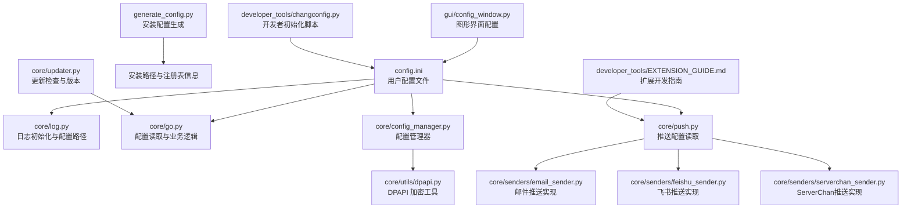
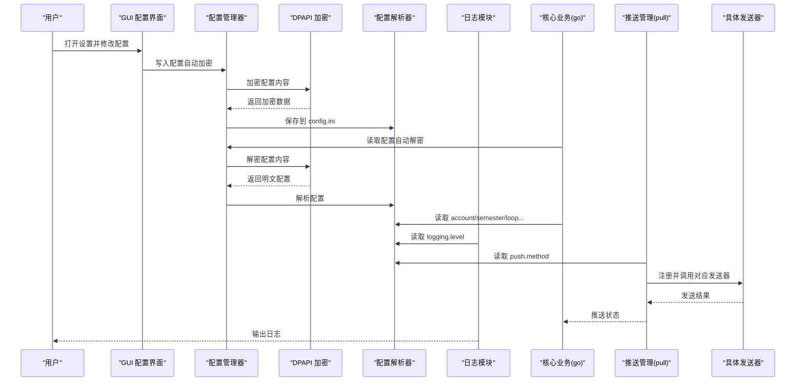
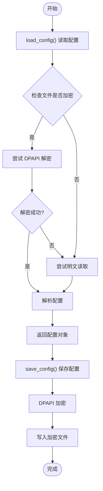
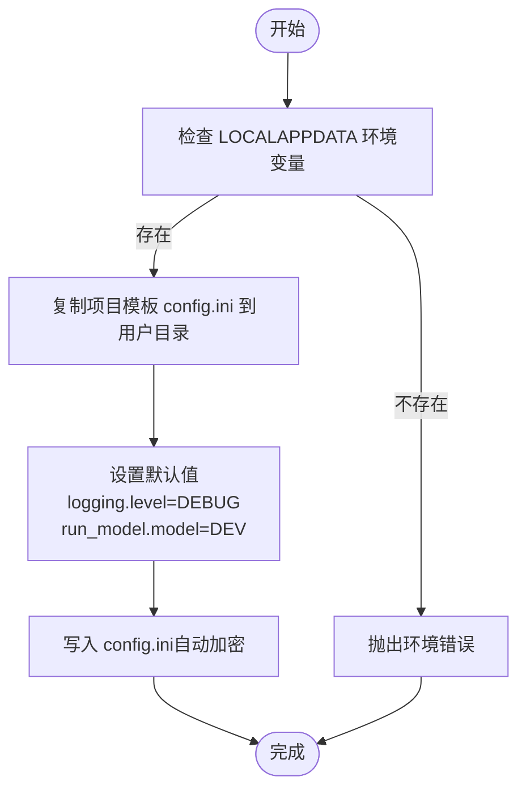
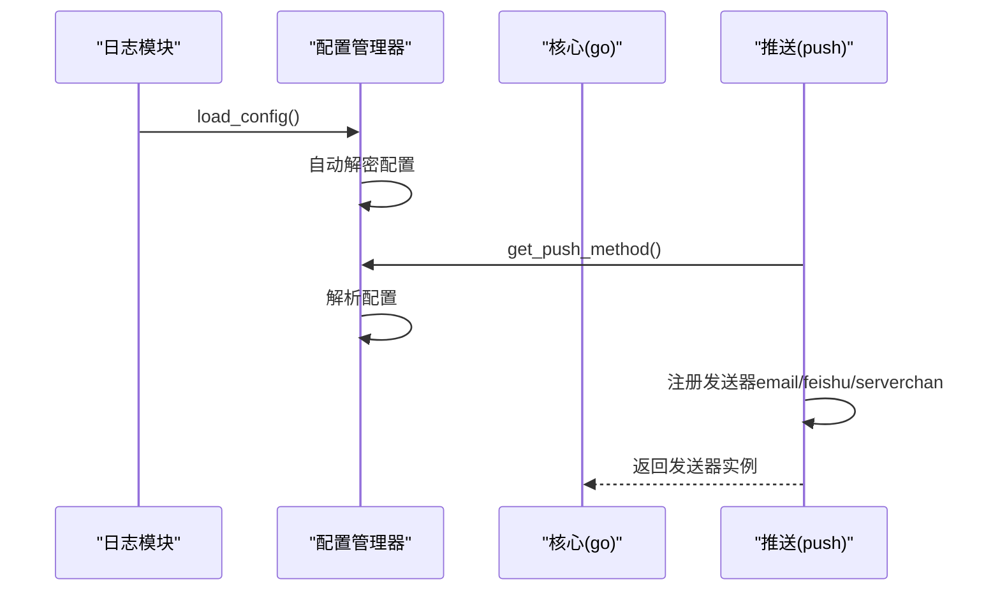
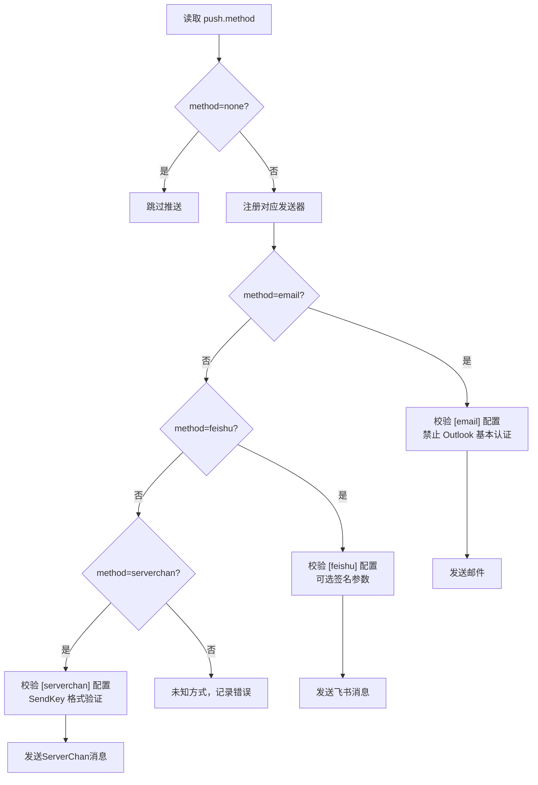
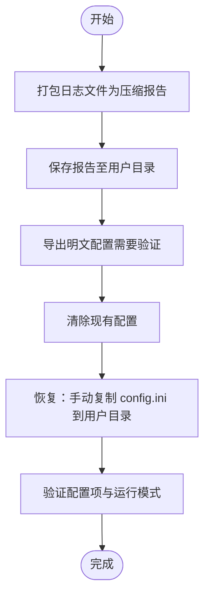

# 配置管理系统

<cite>
**本文引用的文件**
- [config.ini](file://config.ini)
- [config.md](file://config.md)
- [generate_config.py](file://generate_config.py)
- [developer_tools/changconfig.py](file://developer_tools/changconfig.py)
- [core/go.py](file://core/go.py)
- [core/log.py](file://core/log.py)
- [core/push.py](file://core/push.py)
- [core/updater.py](file://core/updater.py)
- [core/senders/email_sender.py](file://core/senders/email_sender.py)
- [core/senders/feishu_sender.py](file://core/senders/feishu_sender.py)
- [core/senders/serverchan_sender.py](file://core/senders/serverchan_sender.py)
- [core/config_manager.py](file://core/config_manager.py)
- [core/utils/dpapi.py](file://core/utils/dpapi.py)
- [gui/config_window.py](file://gui/config_window.py)
- [README.md](file://README.md)
- [requirements.txt](file://requirements.txt)
- [developer_tools/EXTENSION_GUIDE.md](file://developer_tools/EXTENSION_GUIDE.md)
</cite>

## 更新摘要
**变更内容**
- 新增 Windows DPAPI 加密配置管理功能，增强配置文件安全性
- 引入核心配置管理器 `core/config_manager.py` 和 DPAPI 工具模块 `core/utils/dpapi.py`
- 更新配置读取与保存机制，支持自动解密与加密
- 增强配置文件的机密性保护，防止敏感信息泄露
- 更新 GUI 配置界面以支持配置文件解码错误处理

## 目录
1. [简介](#简介)
2. [项目结构](#项目结构)
3. [核心组件](#核心组件)
4. [架构总览](#架构总览)
5. [详细组件分析](#详细组件分析)
6. [依赖关系分析](#依赖关系分析)
7. [性能考量](#性能考量)
8. [故障排除指南](#故障排除指南)
9. [结论](#结论)
10. [附录](#附录)

## 简介
本文件系统性地梳理并解释配置管理系统的结构与行为，重点围绕 config.ini 的节与键、默认值处理、运行模式（DEV/BUILD）、配置验证与错误处理、配置生成与迁移、备份与恢复等主题展开。文档同时提供面向用户的配置参考与故障排除指南，帮助用户正确配置与维护系统。

**更新** 本次更新新增了 Windows DPAPI 加密配置管理功能，显著增强了配置文件的安全性和可靠性，为敏感信息提供了更强的保护。

## 项目结构
配置系统涉及以下关键文件与模块：
- 配置文件：config.ini（用户配置）
- 配置说明：config.md（配置项详解）
- 配置生成：generate_config.py（安装配置生成）
- 配置初始化：developer_tools/changconfig.py（开发者初始化）
- 配置管理：core/config_manager.py（配置读取与保存）
- DPAPI 加密：core/utils/dpapi.py（Windows 加密工具）
- 配置读取与应用：core/go.py、core/log.py、core/push.py
- 推送实现：core/senders/email_sender.py、core/senders/feishu_sender.py、core/senders/serverchan_sender.py
- GUI 配置界面：gui/config_window.py
- 更新与版本：core/updater.py
- 依赖声明：requirements.txt
- 项目概览：README.md
- 扩展开发：developer_tools/EXTENSION_GUIDE.md

**图表来源**
- [config.ini](file://config.ini#L1-L39)
- [core/log.py](file://core/log.py#L60-L82)
- [core/go.py](file://core/go.py#L42-L45)
- [core/push.py](file://core/push.py#L83-L103)
- [core/config_manager.py](file://core/config_manager.py#L1-L68)
- [core/utils/dpapi.py](file://core/utils/dpapi.py#L1-L101)
- [core/senders/email_sender.py](file://core/senders/email_sender.py#L37-L44)
- [core/senders/feishu_sender.py](file://core/senders/feishu_sender.py#L42-L57)
- [core/senders/serverchan_sender.py](file://core/senders/serverchan_sender.py#L1-L129)
- [gui/config_window.py](file://gui/config_window.py#L215-L278)
- [developer_tools/changconfig.py](file://developer_tools/changconfig.py#L10-L49)
- [generate_config.py](file://generate_config.py#L18-L80)
- [core/updater.py](file://core/updater.py#L26-L28)
- [developer_tools/EXTENSION_GUIDE.md](file://developer_tools/EXTENSION_GUIDE.md#L1-L102)

**章节来源**
- [README.md](file://README.md#L60-L83)

## 核心组件
- 配置文件与默认值
  - 日志级别：logging.level（默认 DEBUG）
  - 运行模式：run_model.model（默认 BUILD）
  - 账户信息：account.school_code、username、password
  - 学期起始：semester.first_monday
  - 循环检测：loop_getCourseGrades.enabled/time、loop_getCourseSchedule.enabled/time
  - 推送方式：push.method（none/email/test1/wechat/dingtalk/telegram/serverchan）
  - 邮件配置：email.smtp/port/sender/receiver/auth
  - 飞书配置：feishu.webhook_url/secret
  - ServerChan 配置：serverchan.sendkey
- 配置管理与加密
  - DPAPI 加密：使用 Windows DPAPI 对配置文件进行加密存储
  - 自动解密：读取配置时自动尝试解密，支持明文与加密文件混合
  - 配置路径：统一管理 AppData 下的 config.ini
  - 错误处理：ConfigDecodingError 异常处理机制
- 配置读取与应用
  - 统一配置路径：AppData 下的 config.ini
  - 日志初始化：读取 logging.level 并设置日志级别
  - 业务逻辑：读取 account、semester、循环检测等配置
  - 推送管理：读取 push.method 并注册对应发送器
- 配置生成与初始化
  - 安装配置生成：generate_config.py 输出 install_config.txt
  - 开发者初始化：changconfig.py 将模板复制到用户目录并设置默认值
- GUI 配置界面
  - 读取/写入 config.ini，支持校验与保存
  - 配置解码错误处理：显示友好的错误提示
- 推送实现
  - 邮件：基于 SMTP/SSL 或 STARTTLS，支持 Outlook 禁止基本认证提示
  - 飞书：支持签名参数校验
  - ServerChan：支持 SendKey 验证和多种 URL 格式
- 更新与版本
  - 读取 VERSION 文件获取当前版本，比较远程版本并提供下载与安装

**章节来源**
- [config.ini](file://config.ini#L1-L39)
- [config.md](file://config.md#L1-L52)
- [core/log.py](file://core/log.py#L141-L152)
- [core/go.py](file://core/go.py#L42-L57)
- [core/push.py](file://core/push.py#L83-L103)
- [core/config_manager.py](file://core/config_manager.py#L1-L68)
- [core/utils/dpapi.py](file://core/utils/dpapi.py#L1-L101)
- [core/senders/email_sender.py](file://core/senders/email_sender.py#L66-L91)
- [core/senders/feishu_sender.py](file://core/senders/feishu_sender.py#L53-L61)
- [core/senders/serverchan_sender.py](file://core/senders/serverchan_sender.py#L38-L129)
- [gui/config_window.py](file://gui/config_window.py#L306-L350)
- [developer_tools/changconfig.py](file://developer_tools/changconfig.py#L36-L49)
- [generate_config.py](file://generate_config.py#L18-L80)
- [core/updater.py](file://core/updater.py#L29-L40)

## 架构总览
配置系统采用"集中式配置 + 分层读取 + DPAPI 加密"的架构：
- 配置文件位于用户 AppData 目录，统一由日志模块解析路径
- 核心业务模块按需读取配置，推送模块根据 method 动态注册发送器
- 配置管理器提供加密/解密功能，确保敏感信息安全
- GUI 提供可视化配置与校验，开发者脚本提供初始化与默认值设置
- 更新模块读取 VERSION 文件并与远程版本比较

**图表来源**
- [gui/config_window.py](file://gui/config_window.py#L351-L404)
- [core/log.py](file://core/log.py#L141-L152)
- [core/go.py](file://core/go.py#L42-L45)
- [core/push.py](file://core/push.py#L77-L125)
- [core/config_manager.py](file://core/config_manager.py#L15-L68)
- [core/utils/dpapi.py](file://core/utils/dpapi.py#L12-L77)
- [core/senders/email_sender.py](file://core/senders/email_sender.py#L50-L126)
- [core/senders/feishu_sender.py](file://core/senders/feishu_sender.py#L45-L109)
- [core/senders/serverchan_sender.py](file://core/senders/serverchan_sender.py#L79-L129)

## 详细组件分析

### 配置文件结构与默认值
- 节与键
  - [logging]：level（默认 DEBUG）
  - [run_model]：model（默认 BUILD）
  - [account]：school_code（默认 10546）、username、password
  - [semester]：first_monday（必填，否则课表推送跳过）
  - [loop_getCourseGrades]：enabled（默认 False）、time（默认 3600）
  - [loop_getCourseSchedule]：enabled（默认 False）、time（默认 3600）
  - [push]：method（默认 none）
  - [email]：smtp、port、sender、receiver、auth
  - [feishu]：webhook_url、secret
  - [serverchan]：sendkey（新增）
- 默认值处理
  - 日志级别 fallback 为 DEBUG
  - 运行模式 fallback 为 BUILD
  - 循环检测 fallback 为 False/3600
  - 课表推送依赖 first_monday，未设置则跳过推送
  - ServerChan sendkey 默认为空字符串
- 运行模式差异
  - DEV：开发模式，避免频繁拉取
  - BUILD：生产模式，正常拉取

**章节来源**
- [config.ini](file://config.ini#L1-L39)
- [config.md](file://config.md#L3-L52)
- [core/log.py](file://core/log.py#L149-L152)
- [core/go.py](file://core/go.py#L187-L190)
- [core/go.py](file://core/go.py#L367-L370)

### DPAPI 加密配置管理
**新增** Windows DPAPI 加密配置管理功能为系统提供了强大的安全保护。

- 加密机制
  - 使用 Windows DPAPI CryptProtectData/CryptUnprotectData API
  - 自动加密所有写入的配置文件
  - 自动解密读取的配置文件
  - 支持明文与加密文件的混合处理
- 配置管理器
  - `load_config()`：自动解密配置文件，支持多种错误处理
  - `save_config()`：加密保存配置文件
  - `ConfigDecodingError`：专门的配置解码错误类型
- DPAPI 工具模块
  - `encrypt(data)`：加密字符串数据
  - `decrypt(encrypted_data)`：解密数据
  - `encrypt_file(file_path)`：加密整个文件
  - `decrypt_file_to_str(file_path)`：解密文件内容
- 错误处理
  - 解密失败时自动尝试明文读取
  - 编码错误时抛出 `ConfigDecodingError`
  - 支持回退到默认配置

**图表来源**
- [core/config_manager.py](file://core/config_manager.py#L15-L68)
- [core/utils/dpapi.py](file://core/utils/dpapi.py#L12-L77)

**章节来源**
- [core/config_manager.py](file://core/config_manager.py#L1-L68)
- [core/utils/dpapi.py](file://core/utils/dpapi.py#L1-L101)

### 配置生成与初始化机制
- 安装配置生成
  - generate_config.py 生成 install_config.txt，记录安装路径、注册表项、虚拟环境、依赖与卸载说明
- 开发者初始化
  - changconfig.py 将项目根目录的 config.ini 复制到用户 AppData 目录，并设置 logging.level=DEBUG、run_model.model=DEV
- GUI 初始化
  - 读取现有配置并填充界面；保存时写回 config.ini
  - 支持配置解码错误的友好提示

**图表来源**
- [developer_tools/changconfig.py](file://developer_tools/changconfig.py#L4-L49)

**章节来源**
- [generate_config.py](file://generate_config.py#L18-L80)
- [developer_tools/changconfig.py](file://developer_tools/changconfig.py#L4-L49)
- [gui/config_window.py](file://gui/config_window.py#L306-L350)

### 配置读取与应用流程
- 日志初始化
  - 通过 get_config_path() 获取用户目录下的 config.ini
  - 读取 logging.level 并设置日志级别
  - 使用配置管理器自动处理加密/解密
- 核心业务读取
  - 读取 account.school_code、username、password
  - 读取 semester.first_monday 用于课表计算
  - 读取 loop_* 配置控制循环检测
- 推送配置
  - 读取 push.method 并注册对应发送器
  - 若 method=none，则跳过推送

**图表来源**
- [core/log.py](file://core/log.py#L141-L152)
- [core/go.py](file://core/go.py#L94-L96)
- [core/push.py](file://core/push.py#L77-L125)
- [core/config_manager.py](file://core/config_manager.py#L15-L51)

**章节来源**
- [core/log.py](file://core/log.py#L141-L152)
- [core/go.py](file://core/go.py#L94-L96)
- [core/push.py](file://core/push.py#L77-L125)
- [core/config_manager.py](file://core/config_manager.py#L15-L51)

### 推送配置与验证
- 推送方式
  - method 支持 none、email、test1、wechat、dingtalk、telegram、serverchan
  - 当 method=email 时，需配置 [email] 节
  - 当 method=feishu 时，需配置 [feishu] 节
  - 当 method=serverchan 时，需配置 [serverchan] 节
- 邮件验证
  - 禁止 Outlook/Hotmail 基本认证（OAuth2）
  - 校验 smtp/port/sender/receiver/auth 是否为空
  - 端口 465 使用 SMTP_SSL，其他端口使用 STARTTLS
- 飞书验证
  - 校验 webhook_url 是否为空
  - 若配置 secret，则附加时间戳与签名参数
- ServerChan 验证
  - 校验 sendkey 是否为空
  - 支持两种 URL 格式：标准 sctapi.ftqq.com 和 sctp 开头的自定义域名
  - 自动识别 sctp 格式的 SendKey 并构造相应 URL

**图表来源**
- [core/push.py](file://core/push.py#L26-L43)
- [core/push.py](file://core/push.py#L77-L125)
- [core/senders/email_sender.py](file://core/senders/email_sender.py#L66-L91)
- [core/senders/feishu_sender.py](file://core/senders/feishu_sender.py#L53-L61)
- [core/senders/serverchan_sender.py](file://core/senders/serverchan_sender.py#L38-L129)

**章节来源**
- [config.md](file://config.md#L19-L52)
- [core/push.py](file://core/push.py#L26-L43)
- [core/senders/email_sender.py](file://core/senders/email_sender.py#L66-L91)
- [core/senders/feishu_sender.py](file://core/senders/feishu_sender.py#L53-L61)
- [core/senders/serverchan_sender.py](file://core/senders/serverchan_sender.py#L38-L129)

### 配置迁移与备份恢复
- 迁移策略
  - 使用 GUI 配置界面读取/写入 config.ini，确保 UTF-8 编码
  - 开发者初始化脚本将模板复制到用户目录并设置默认值
  - DPAPI 加密确保迁移过程中的数据安全
- 备份与恢复
  - 通过 pack_logs() 将日志目录打包为文本文件，便于崩溃上报
  - 安装配置生成器生成 install_config.txt，记录安装路径、注册表项与卸载说明
  - 支持导出明文配置文件（需要身份验证）

**图表来源**
- [core/log.py](file://core/log.py#L18-L57)
- [generate_config.py](file://generate_config.py#L18-L80)
- [gui/config_window.py](file://gui/config_window.py#L698-L783)

**章节来源**
- [core/log.py](file://core/log.py#L18-L57)
- [generate_config.py](file://generate_config.py#L18-L80)
- [gui/config_window.py](file://gui/config_window.py#L698-L783)

### ServerChan 配置详解
**新增** ServerChan 是一个基于 Server酱的推送服务，支持多种 URL 格式和自动识别机制。

- 配置节与参数
  - [serverchan]：ServerChan 推送配置节
  - sendkey：ServerChan 的 SendKey（必填）
- URL 格式支持
  - 标准格式：https://sctapi.ftqq.com/{sendkey}.send
  - 自定义域名格式：https://{num}.push.ft07.com/send/{sendkey}.send
  - 自动识别：以 sctp 开头的 SendKey 自动构造自定义域名 URL
- 发送流程
  - 读取配置文件中的 sendkey
  - 验证 sendkey 是否为空
  - 根据 sendkey 格式构造相应的 API URL
  - 发送 JSON 格式的消息（title、desp）
  - 解析 API 返回结果并记录日志

**章节来源**
- [config.ini](file://config.ini#L37-L39)
- [core/senders/serverchan_sender.py](file://core/senders/serverchan_sender.py#L38-L129)
- [gui/config_window.py](file://gui/config_window.py#L266-L272)

## 依赖关系分析
- 配置文件依赖
  - core/log.py 依赖 config.ini 的 [logging] 节设置日志级别
  - core/go.py 依赖 [account]/[semester]/[loop_*] 节进行业务逻辑
  - core/push.py 依赖 [push] 节决定发送器注册
  - core/senders/* 依赖 [email]/[feishu]/[serverchan] 节进行发送
  - core/config_manager.py 依赖 core/utils/dpapi.py 进行加密/解密
- 外部依赖
  - requests、beautifulsoup4、PySide6（用于网络请求、解析与 GUI）
  - Windows DPAPI（用于配置文件加密）

```mermaid
graph LR
CFG["config.ini"] --> LOG["core/log.py"]
CFG --> GO["core/go.py"]
CFG --> PUSH["core/push.py"]
CFG --> CM["core/config_manager.py"]
CM --> DPAPI["core/utils/dpapi.py"]
PUSH --> EMAIL["core/senders/email_sender.py"]
PUSH --> FEISHU["core/senders/feishu_sender.py"]
PUSH --> SERVERCHAN["core/senders/serverchan_sender.py"]
REQ["requirements.txt"] --> EMAIL
REQ --> FEISHU
REQ --> SERVERCHAN
WIN["Windows DPAPI"] --> DPAPI
```

**图表来源**
- [core/log.py](file://core/log.py#L141-L152)
- [core/go.py](file://core/go.py#L42-L45)
- [core/push.py](file://core/push.py#L83-L103)
- [core/config_manager.py](file://core/config_manager.py#L1-L8)
- [core/utils/dpapi.py](file://core/utils/dpapi.py#L1-L101)
- [core/senders/email_sender.py](file://core/senders/email_sender.py#L37-L44)
- [core/senders/feishu_sender.py](file://core/senders/feishu_sender.py#L42-L57)
- [core/senders/serverchan_sender.py](file://core/senders/serverchan_sender.py#L1-L129)
- [requirements.txt](file://requirements.txt#L1-L3)

**章节来源**
- [requirements.txt](file://requirements.txt#L1-L3)

## 性能考量
- 日志轮转与清理
  - 日志文件大小上限 10MB，保留多个备份；总大小超过阈值时自动清理旧日志
- 循环检测间隔
  - 成绩/课表循环检测默认间隔 3600 秒，可根据需求调整
- 推送频率
  - 避免频繁推送，合理设置循环间隔与定时推送开关
- ServerChan API 调用
  - 单次 API 调用，响应时间取决于网络状况
  - 建议合理设置推送频率，避免 API 限流
- DPAPI 加密性能
  - 加密/解密操作对性能影响较小
  - 使用缓存机制减少重复解密操作

**章节来源**
- [core/log.py](file://core/log.py#L85-L112)
- [config.ini](file://config.ini#L15-L21)
- [core/senders/serverchan_sender.py](file://core/senders/serverchan_sender.py#L74-L76)
- [core/config_manager.py](file://core/config_manager.py#L15-L68)

## 故障排除指南
- 配置文件不存在
  - get_config_path() 在用户目录找不到 config.ini 时抛出异常
- DPAPI 加密错误
  - ConfigDecodingError：配置文件解码失败，检查文件完整性
  - 解密失败：尝试重新配置或使用导出功能
- Outlook/Hotmail 基本认证失败
  - 系统明确禁止 Outlook/Hotmail 基本认证，需更换邮箱或使用应用密码
- 邮件端口与加密
  - 端口 465 使用 SSL，其他端口使用 STARTTLS；若认证失败，检查应用密码与服务器设置
- 飞书签名参数
  - 若配置 secret，需确保时间戳与签名参数正确拼接到 URL
- ServerChan 配置问题
  - SendKey 为空：检查 [serverchan] 节的 sendkey 配置
  - URL 格式错误：确认 SendKey 格式是否正确（sctp 开头或标准格式）
  - API 调用失败：检查网络连接和 ServerChan 服务状态
- 日志级别与输出
  - 通过 logging.level 调整日志详细程度；必要时使用 pack_logs() 生成崩溃报告
- 运行模式
  - DEV 模式避免频繁拉取；BUILD 模式正常拉取
- 配置文件损坏
  - 使用 GUI 的"清除现有配置"功能重建配置文件
  - 导出明文配置进行备份和恢复

**章节来源**
- [core/log.py](file://core/log.py#L71-L82)
- [core/config_manager.py](file://core/config_manager.py#L10-L12)
- [core/senders/email_sender.py](file://core/senders/email_sender.py#L78-L91)
- [core/senders/email_sender.py](file://core/senders/email_sender.py#L127-L139)
- [core/senders/feishu_sender.py](file://core/senders/feishu_sender.py#L78-L88)
- [core/senders/serverchan_sender.py](file://core/senders/serverchan_sender.py#L100-L129)
- [core/log.py](file://core/log.py#L18-L57)
- [config.md](file://config.md#L11-L17)
- [gui/config_window.py](file://gui/config_window.py#L751-L783)

## 结论
配置管理系统通过集中式 config.ini 与分层读取机制，实现了灵活的运行模式、推送方式与循环检测配置。结合 GUI 配置界面、开发者初始化脚本与安装配置生成器，系统提供了完善的配置生成、迁移与备份能力。通过严格的配置验证与错误处理，系统在保证易用性的同时提升了稳定性与可维护性。

**更新** 新增的 Windows DPAPI 加密配置管理功能显著增强了系统的安全性，为敏感信息提供了强有力的保护。ServerChan 配置支持进一步丰富了通知渠道的选择，为用户提供了更多样化的消息推送方式。

## 附录

### 配置参考手册
- [logging]
  - level：DEBUG/INFO/WARNING/ERROR/CRITICAL
- [run_model]
  - model：DEV/BUILD
- [account]
  - school_code：院校编号（默认 10546）
  - username/password：教务系统账号凭据
- [semester]
  - first_monday：第一周周一（YYYY-MM-DD）
- [loop_getCourseGrades]
  - enabled：是否启用（True/False）
  - time：循环间隔（秒）
- [loop_getCourseSchedule]
  - enabled：是否启用（True/False）
  - time：循环间隔（秒）
- [push]
  - method：none/email/test1/wechat/dingtalk/telegram/serverchan
- [email]
  - smtp/port/sender/receiver/auth：SMTP 服务器、端口、发件/收件邮箱与授权码
- [feishu]
  - webhook_url/secret：飞书机器人 Webhook 与可选密钥
- [serverchan]
  - sendkey：ServerChan 的 SendKey（必填）

**章节来源**
- [config.ini](file://config.ini#L1-L39)
- [config.md](file://config.md#L1-L52)

### DPAPI 加密配置详细说明
**新增** Windows DPAPI 加密配置管理功能为系统提供了强大的安全保护。

- 加密原理
  - 使用 Windows DPAPI CryptProtectData API 对配置文件进行加密
  - 加密数据与当前用户账户绑定，确保只有该用户可以解密
  - 支持熵参数增加额外的安全性
- 配置管理流程
  - 保存配置：自动加密并写入 config.ini
  - 读取配置：自动解密并解析
  - 错误处理：解密失败时尝试明文读取
- 安全特性
  - 用户级加密：只有当前 Windows 用户可以访问配置
  - 系统级保护：Windows 系统负责密钥管理和安全存储
  - 透明使用：对应用程序完全透明，无需额外代码修改
- 兼容性
  - 仅支持 Windows 系统
  - 支持明文与加密配置文件的混合处理
  - 回退机制确保兼容性

**章节来源**
- [core/config_manager.py](file://core/config_manager.py#L1-L68)
- [core/utils/dpapi.py](file://core/utils/dpapi.py#L1-L101)

### ServerChan 配置详细说明
**新增** ServerChan 是基于 Server酱的推送服务，支持多种 URL 格式和自动识别机制。

- SendKey 类型
  - 标准格式：普通的 ServerChan SendKey
  - sctp 格式：以 sctp 开头的 SendKey，系统会自动识别并构造自定义域名 URL
- URL 构造规则
  - 标准格式：https://sctapi.ftqq.com/{sendkey}.send
  - sctp 格式：从 SendKey 中提取数字部分构造 https://{num}.push.ft07.com/send/{sendkey}.send
- 配置要求
  - 必须在 [serverchan] 节下配置 sendkey 参数
  - SendKey 不能为空
  - 支持中文内容和 HTML 格式
- 错误处理
  - SendKey 为空：记录错误并返回 False
  - URL 格式错误：抛出 ValueError 异常
  - API 调用异常：记录错误并返回 False
  - API 返回错误：记录错误并返回 False

**章节来源**
- [core/senders/serverchan_sender.py](file://core/senders/serverchan_sender.py#L38-L129)
- [gui/config_window.py](file://gui/config_window.py#L266-L272)