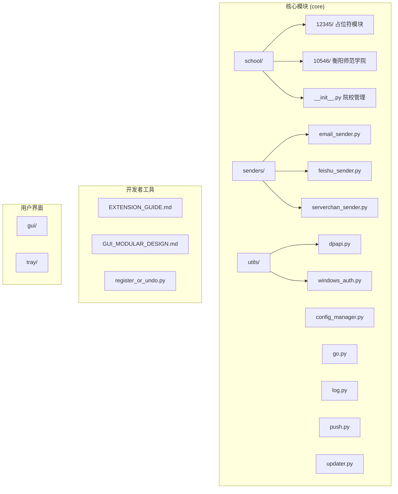
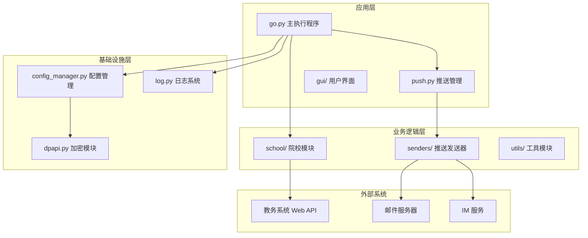
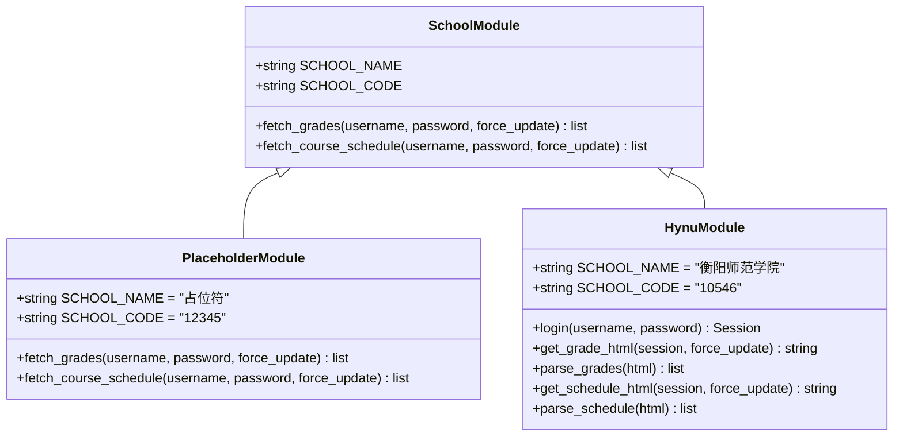
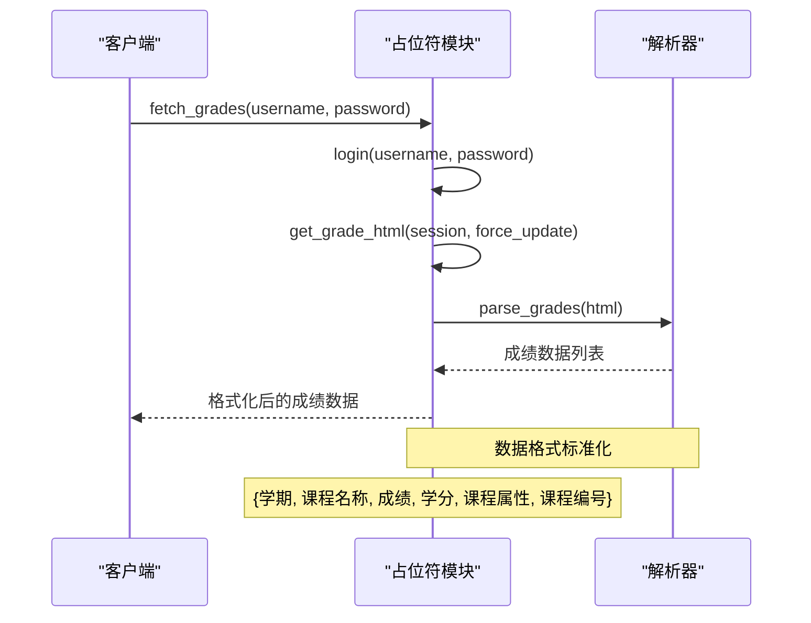
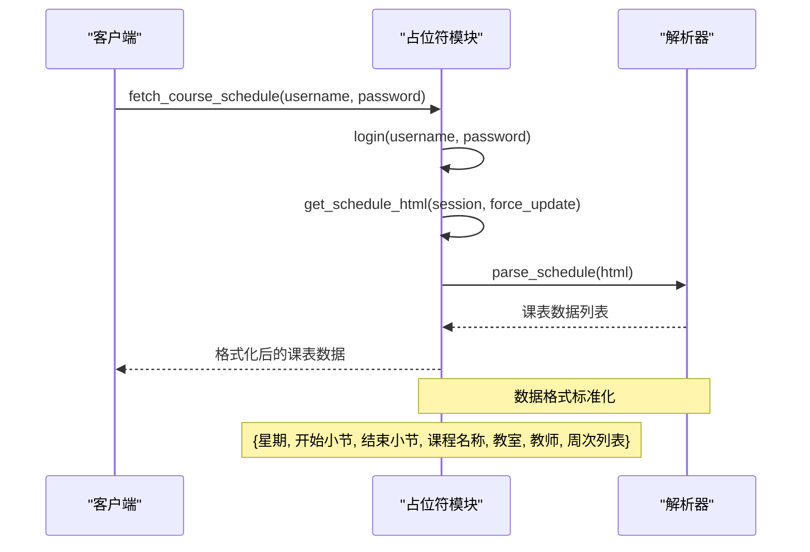
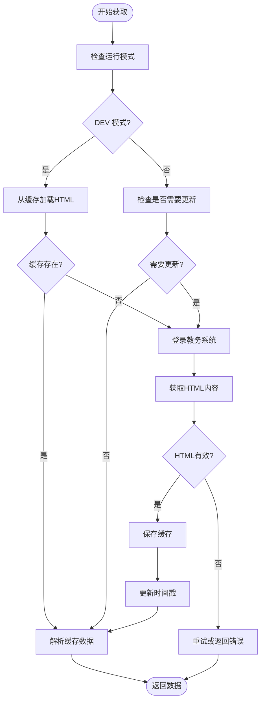
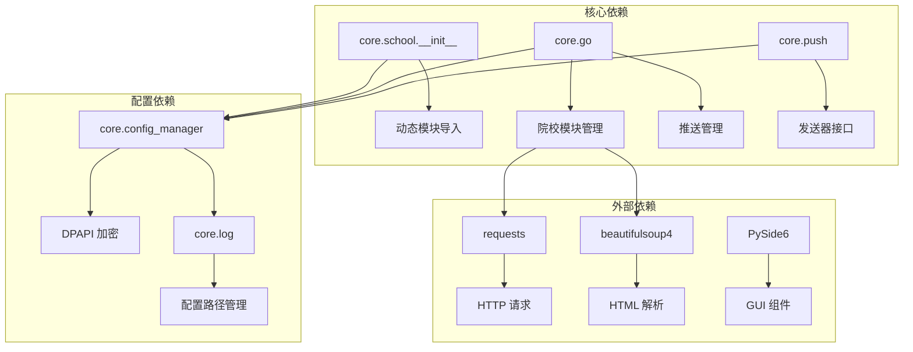

# 占位符学校模块

<cite>
**本文档引用的文件**
- [core/school/__init__.py](file://core/school/__init__.py)
- [core/school/12345/__init__.py](file://core/school/12345/__init__.py)
- [core/school/10546/__init__.py](file://core/school/10546/__init__.py)
- [core/school/12345/getCourseGrades.py](file://core/school/12345/getCourseGrades.py)
- [core/school/12345/getCourseSchedule.py](file://core/school/12345/getCourseSchedule.py)
- [core/school/10546/getCourseGrades.py](file://core/school/10546/getCourseGrades.py)
- [core/school/10546/getCourseSchedule.py](file://core/school/10546/getCourseSchedule.py)
- [core/go.py](file://core/go.py)
- [core/push.py](file://core/push.py)
- [core/log.py](file://core/log.py)
- [core/config_manager.py](file://core/config_manager.py)
- [config.ini](file://config.ini)
- [README.md](file://README.md)
- [developer_tools/EXTENSION_GUIDE.md](file://developer_tools/EXTENSION_GUIDE.md)
- [developer_tools/register_or_undo.py](file://developer_tools/register_or_undo.py)
</cite>

## 目录
1. [简介](#简介)
2. [项目结构](#项目结构)
3. [核心组件](#核心组件)
4. [架构概览](#架构概览)
5. [详细组件分析](#详细组件分析)
6. [依赖关系分析](#依赖关系分析)
7. [性能考虑](#性能考虑)
8. [故障排除指南](#故障排除指南)
9. [结论](#结论)

## 简介

占位符学校模块是 Capture_Push 项目中的一个示例性院校模块，用于演示如何为新的教育机构创建自定义的课程成绩和课表抓取模块。该模块采用占位符设计，为开发者提供了一个完整的模板，可以快速适配到任何支持Web接口的教务系统。

该项目是一个课程成绩和课表自动追踪推送系统，能够自动获取学生课程成绩和课表信息，并通过邮件等方式推送更新通知。系统支持多院校扩展，每个院校的抓取逻辑独立封装，遵循统一的API接口标准。

## 项目结构

项目采用模块化的架构设计，核心功能集中在 `core` 目录下，按照功能域进行组织：

**图表来源**
- [core/school/__init__.py](file://core/school/__init__.py#L1-L43)
- [core/school/12345/__init__.py](file://core/school/12345/__init__.py#L1-L6)
- [core/school/10546/__init__.py](file://core/school/10546/__init__.py#L1-L7)

**章节来源**
- [README.md](file://README.md#L70-L118)

## 核心组件

### 院校模块管理系统

院校模块管理系统是整个系统的核心，负责动态加载和管理不同院校的模块。它提供了以下关键功能：

- **动态模块加载**：通过 `get_school_module()` 函数实现
- **院校列表管理**：通过 `get_available_schools()` 函数实现
- **模块映射表**：维护 `SCHOOL_MODULES` 字典，映射院校代码到模块路径

### 占位符学校模块 (12345)

占位符学校模块是系统中的示例模块，展示了标准的模块结构和接口实现：

- **模块接口**：提供 `fetch_grades()` 和 `fetch_course_schedule()` 函数
- **配置信息**：定义 `SCHOOL_NAME` 和 `SCHOOL_CODE` 常量
- **数据格式**：标准化的成绩和课表数据结构

### 衡阳师范学院模块 (10546)

衡阳师范学院模块是实际部署的生产模块，展示了完整的Web抓取实现：

- **完整的登录流程**：处理认证和会话管理
- **循环检测机制**：支持配置化的更新间隔
- **缓存管理**：本地缓存HTML内容以减少网络请求
- **错误处理**：完善的异常捕获和日志记录

**章节来源**
- [core/school/__init__.py](file://core/school/__init__.py#L7-L43)
- [core/school/12345/__init__.py](file://core/school/12345/__init__.py#L1-L6)
- [core/school/10546/__init__.py](file://core/school/10546/__init__.py#L1-L7)

## 架构概览

系统采用分层架构设计，各层职责清晰分离：

**图表来源**
- [core/go.py](file://core/go.py#L15-L24)
- [core/push.py](file://core/push.py#L74-L171)
- [core/config_manager.py](file://core/config_manager.py#L15-L68)

## 详细组件分析

### 院校模块接口设计

每个院校模块都必须实现统一的接口规范：

**图表来源**
- [core/school/12345/__init__.py](file://core/school/12345/__init__.py#L1-L6)
- [core/school/10546/__init__.py](file://core/school/10546/__init__.py#L1-L7)

### 成绩获取流程

占位符模块的成绩获取流程展示了标准的数据抓取模式：

**图表来源**
- [core/school/12345/getCourseGrades.py](file://core/school/12345/getCourseGrades.py#L1-L51)

### 课表获取流程

占位符模块的课表获取流程同样遵循标准模式：

**图表来源**
- [core/school/12345/getCourseSchedule.py](file://core/school/12345/getCourseSchedule.py#L1-L51)

### 循环检测机制

衡阳师范学院模块实现了复杂的循环检测机制：

**图表来源**
- [core/school/10546/getCourseGrades.py](file://core/school/10546/getCourseGrades.py#L116-L156)
- [core/school/10546/getCourseSchedule.py](file://core/school/10546/getCourseSchedule.py#L117-L157)

**章节来源**
- [core/school/12345/getCourseGrades.py](file://core/school/12345/getCourseGrades.py#L1-L51)
- [core/school/12345/getCourseSchedule.py](file://core/school/12345/getCourseSchedule.py#L1-L51)
- [core/school/10546/getCourseGrades.py](file://core/school/10546/getCourseGrades.py#L169-L229)
- [core/school/10546/getCourseSchedule.py](file://core/school/10546/getCourseSchedule.py#L169-L229)

## 依赖关系分析

系统采用松耦合的设计，各模块之间的依赖关系清晰：

**图表来源**
- [core/school/__init__.py](file://core/school/__init__.py#L2-L4)
- [core/go.py](file://core/go.py#L15-L17)
- [core/config_manager.py](file://core/config_manager.py#L6-L7)

**章节来源**
- [requirements.txt](file://requirements.txt#L1-L3)
- [core/school/__init__.py](file://core/school/__init__.py#L1-L43)

## 性能考虑

系统在设计时充分考虑了性能优化：

### 缓存策略
- **本地缓存**：使用 AppData 目录存储 HTML 文件和时间戳
- **循环检测**：可配置的更新间隔，避免频繁网络请求
- **智能更新**：DEV 模式下从缓存读取，提高开发效率

### 网络优化
- **连接池**：使用 requests.Session() 复用连接
- **超时控制**：设置合理的请求超时时间
- **IPv4 适配器**：解决 DNS 解析问题

### 内存管理
- **增量处理**：逐条处理课程数据，避免内存溢出
- **文件流**：使用流式处理大型 HTML 文件
- **资源清理**：及时关闭文件句柄和网络连接

## 故障排除指南

### 常见问题及解决方案

#### 1. 院校模块加载失败
**症状**：系统无法找到指定的院校模块
**解决方案**：
- 检查 `SCHOOL_MODULES` 映射表配置
- 确认模块路径正确无误
- 验证模块文件完整性

#### 2. 登录认证失败
**症状**：无法登录到教务系统
**解决方案**：
- 检查用户名和密码配置
- 验证网络连接稳定性
- 查看登录失败的 HTML 响应

#### 3. 数据解析错误
**症状**：课表或成绩数据解析失败
**解决方案**：
- 检查 HTML 结构变化
- 更新解析规则
- 查看解析日志输出

#### 4. 缓存问题
**症状**：缓存文件损坏或过期
**解决方案**：
- 删除损坏的缓存文件
- 检查磁盘空间
- 验证文件权限

**章节来源**
- [core/school/10546/getCourseGrades.py](file://core/school/10546/getCourseGrades.py#L96-L99)
- [core/school/10546/getCourseSchedule.py](file://core/school/10546/getCourseSchedule.py#L225-L229)

## 结论

占位符学校模块为 Capture_Push 项目提供了一个完整的示例，展示了如何为新的教育机构创建自定义的模块。该模块具有以下特点：

1. **标准化接口**：所有院校模块遵循统一的 API 规范
2. **模块化设计**：支持动态加载和扩展
3. **健壮性**：完善的错误处理和日志记录
4. **性能优化**：智能缓存和循环检测机制
5. **易于扩展**：提供完整的开发指南和工具

通过占位符模块，开发者可以快速理解和实现新的院校模块，为系统添加更多的教育机构支持。这种设计模式确保了系统的可维护性和可扩展性，为未来的功能扩展奠定了坚实的基础。