# 扩展开发指南

<cite>
**本文档引用的文件**
- [README.md](file://README.md)
- [EXTENSION_GUIDE.md](file://developer_tools/EXTENSION_GUIDE.md)
- [go.py](file://core/go.py)
- [push.py](file://core/push.py)
- [log.py](file://core/log.py)
- [school/__init__.py](file://core/school/__init__.py)
- [10546/__init__.py](file://core/school/10546/__init__.py)
- [10546/getCourseGrades.py](file://core/school/10546/getCourseGrades.py)
- [10546/getCourseSchedule.py](file://core/school/10546/getCourseSchedule.py)
- [email_sender.py](file://core/senders/email_sender.py)
- [feishu_sender.py](file://core/senders/feishu_sender.py)
- [config.ini](file://config.ini)
- [register_or_undo.py](file://developer_tools/register_or_undo.py)
- [requirements.txt](file://requirements.txt)
</cite>

## 目录
1. [简介](#简介)
2. [项目结构](#项目结构)
3. [核心组件](#核心组件)
4. [架构概览](#架构概览)
5. [详细组件分析](#详细组件分析)
6. [开发新院校模块](#开发新院校模块)
7. [开发新推送模块](#开发新推送模块)
8. [测试验证流程](#测试验证流程)
9. [调试方法](#调试方法)
10. [常见问题解决](#常见问题解决)
11. [性能考虑](#性能考虑)
12. [故障排除指南](#故障排除指南)
13. [结论](#结论)

## 简介

Capture_Push 是一个课程成绩和课表自动追踪推送系统，能够自动获取学生课程成绩和课表信息，并通过邮件等方式推送更新通知。该系统采用模块化设计，支持多院校扩展，每个院校的抓取逻辑独立封装，通过统一的API接口标准进行交互。

## 项目结构

项目采用清晰的模块化架构，主要分为以下几个核心部分：

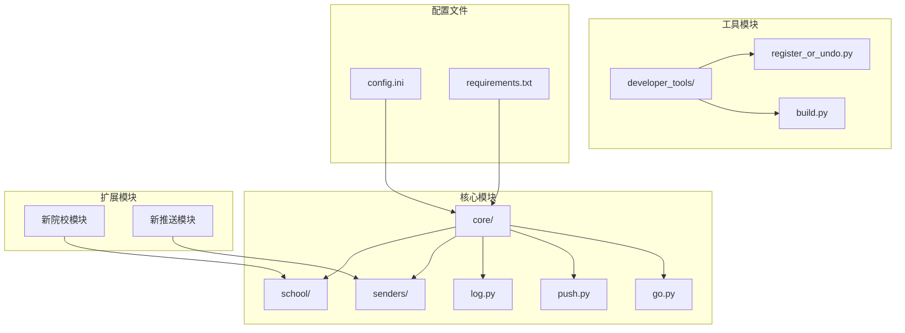

**图表来源**
- [README.md](file://README.md#L60-L83)
- [core/go.py](file://core/go.py#L1-L50)

**章节来源**
- [README.md](file://README.md#L60-L83)
- [core/go.py](file://core/go.py#L1-L50)

## 核心组件

### 1. 院校模块系统

院校模块系统是整个系统的核心扩展点，采用动态模块加载机制：

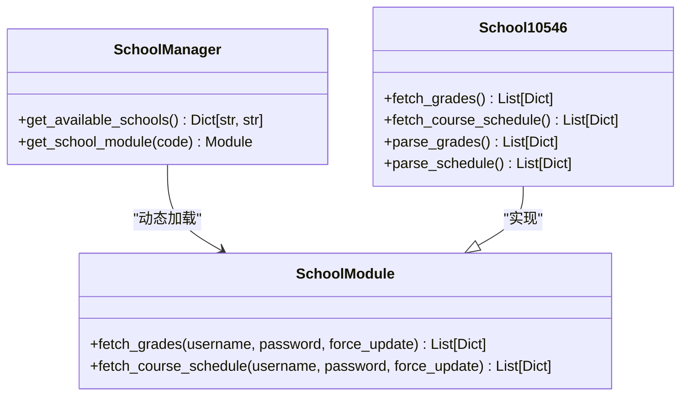

**图表来源**
- [school/__init__.py](file://core/school/__init__.py#L6-L28)
- [10546/__init__.py](file://core/school/10546/__init__.py#L1-L7)

### 2. 推送系统架构

推送系统采用插件化设计，支持多种推送方式：

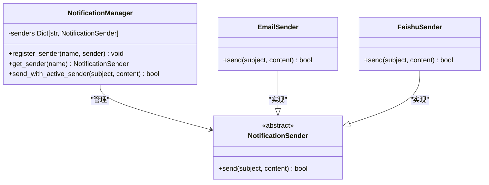

**图表来源**
- [push.py](file://core/push.py#L56-L160)
- [email_sender.py](file://core/senders/email_sender.py#L47-L144)
- [feishu_sender.py](file://core/senders/feishu_sender.py#L42-L110)

**章节来源**
- [push.py](file://core/push.py#L1-L319)
- [school/__init__.py](file://core/school/__init__.py#L1-L28)

## 架构概览

系统采用分层架构设计，各层职责清晰分离：

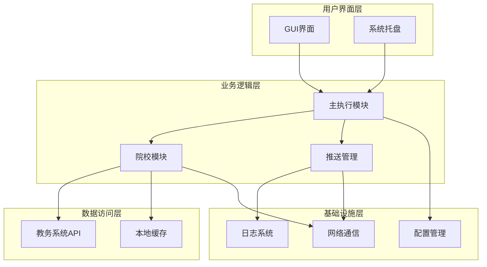

**图表来源**
- [core/go.py](file://core/go.py#L42-L536)
- [core/push.py](file://core/push.py#L1-L319)

## 详细组件分析

### 主执行模块 (go.py)

主执行模块是系统的协调中心，负责：
- 配置文件加载和管理
- 院校模块动态加载
- 成绩和课表获取流程控制
- 推送逻辑调度

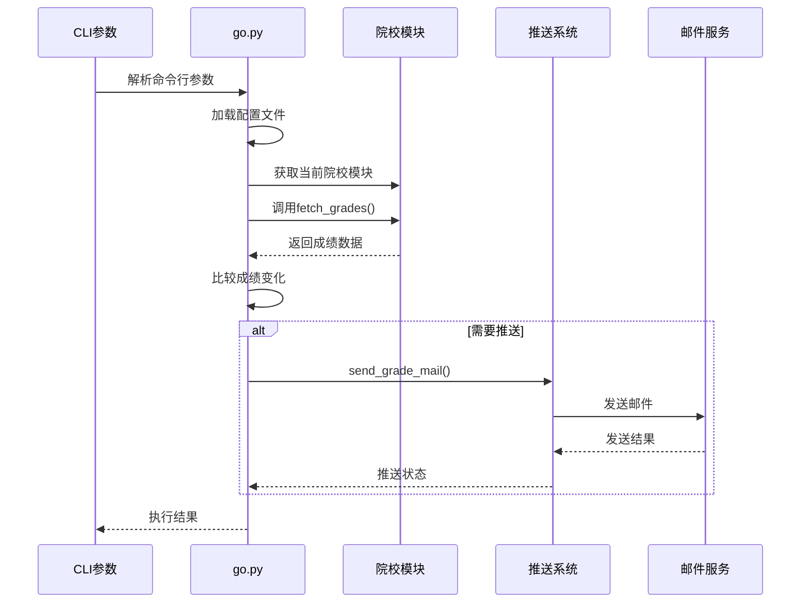

**图表来源**
- [core/go.py](file://core/go.py#L83-L144)
- [core/push.py](file://core/push.py#L291-L319)

**章节来源**
- [core/go.py](file://core/go.py#L1-L536)

### 日志管理系统

统一的日志管理确保了跨模块的一致性：

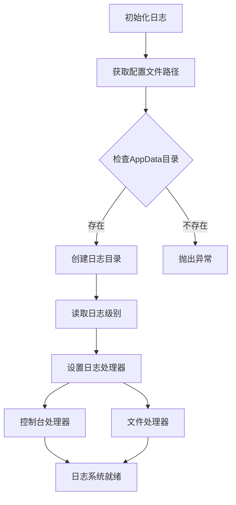

**图表来源**
- [core/log.py](file://core/log.py#L131-L195)

**章节来源**
- [core/log.py](file://core/log.py#L1-L211)

## 开发新院校模块

### 目录结构规范

每个新院校模块必须遵循以下目录结构：

```
core/school/
└── [院校代码]/
    ├── __init__.py          # 模块导出
    ├── getCourseGrades.py   # 成绩获取实现
    └── getCourseSchedule.py # 课表获取实现
```

### 必须实现的接口函数

#### 成绩获取接口

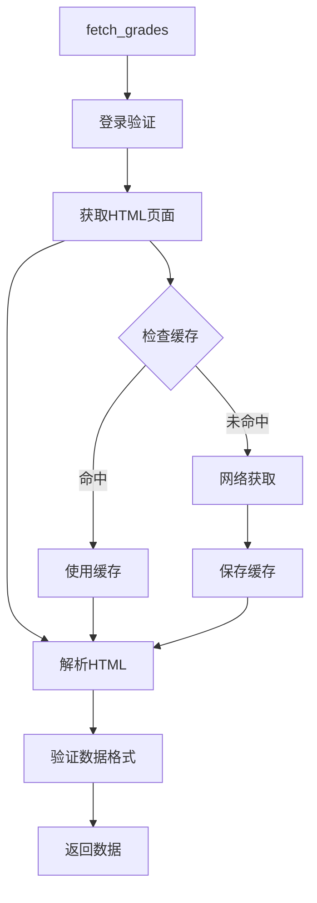

**图表来源**
- [10546/getCourseGrades.py](file://core/school/10546/getCourseGrades.py#L278-L296)

#### 课表获取接口

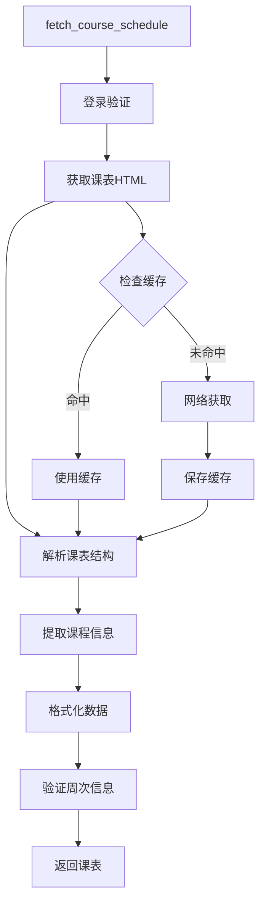

**图表来源**
- [10546/getCourseSchedule.py](file://core/school/10546/getCourseSchedule.py#L354-L372)

### 数据格式要求

#### 成绩数据格式规范

| 字段名称 | 类型 | 必填 | 描述 |
|---------|------|------|------|
| 课程名称 | String | 是 | 课程的完整名称 |
| 成绩 | String | 是 | 学生获得的成绩 |
| 学分 | String | 是 | 课程学分 |
| 课程属性 | String | 是 | 课程类型（必修/选修等） |
| 学期 | String | 是 | 成绩所属学期 |

#### 课表数据格式规范

| 字段名称 | 类型 | 必填 | 描述 |
|---------|------|------|------|
| 星期 | Integer | 是 | 1-7表示周一到周日 |
| 开始小节 | Integer | 是 | 课程开始的节次 |
| 结束小节 | Integer | 是 | 课程结束的节次 |
| 课程名称 | String | 是 | 课程名称 |
| 教室 | String | 是 | 上课教室 |
| 教师 | String | 是 | 授课教师 |
| 周次列表 | List[Int] | 是 | 课程安排的周次列表 |

### 实现步骤详解

#### 步骤1：创建模块目录

```bash
mkdir core/school/[院校代码]
touch core/school/[院校代码]/__init__.py
touch core/school/[院校代码]/getCourseGrades.py
touch core/school/[院校代码]/getCourseSchedule.py
```

#### 步骤2：实现成绩获取模块

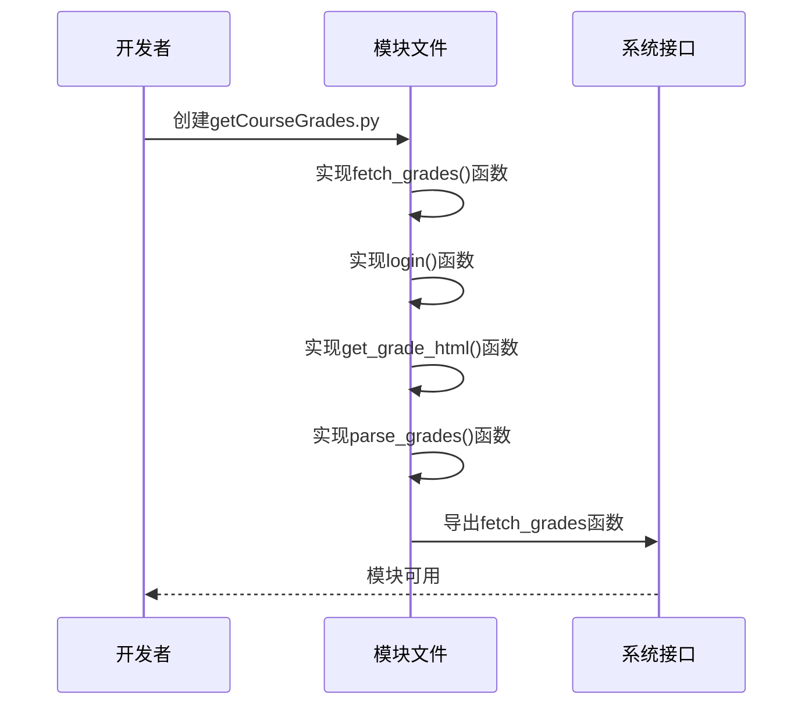

**图表来源**
- [10546/getCourseGrades.py](file://core/school/10546/getCourseGrades.py#L278-L296)

#### 步骤3：实现课表获取模块

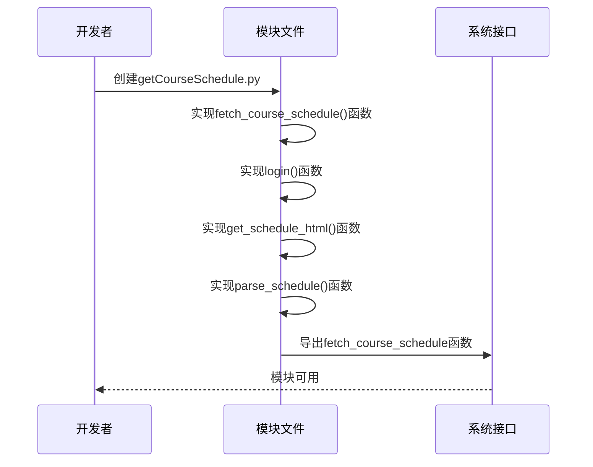

**图表来源**
- [10546/getCourseSchedule.py](file://core/school/10546/getCourseSchedule.py#L354-L372)

#### 步骤4：模块导出配置

在模块的 `__init__.py` 文件中导出必要的函数：

```python
from .getCourseGrades import fetch_grades, parse_grades
from .getCourseSchedule import fetch_course_schedule, parse_schedule
```

#### 步骤5：模块注册

使用以下方式之一进行模块注册：

1. **自动注册**：通过 `core/school/__init__.py` 的动态加载机制
2. **手动注册**：在 `SCHOOL_MODULES` 映射表中添加

### 开发模板

#### 成绩获取模块模板

```python
# -*- coding: utf-8 -*-
from core.log import init_logger
import requests
from bs4 import BeautifulSoup

logger = init_logger('getCourseGrades')

def fetch_grades(username, password, force_update=False):
    """
    获取成绩数据
    
    Args:
        username: 学号
        password: 密码
        force_update: 是否强制从网络更新
    
    Returns:
        List[Dict]: 成绩数据列表
    """
    # 实现登录逻辑
    # 获取HTML页面
    # 解析并验证数据格式
    # 返回标准化的数据格式
    pass

def parse_grades(html):
    """
    解析成绩HTML为结构化数据
    
    Args:
        html: HTML内容
    
    Returns:
        List[Dict]: 解析后的成绩数据
    """
    # 实现HTML解析逻辑
    # 验证必需字段
    # 返回标准化格式
    pass
```

#### 课表获取模块模板

```python
# -*- coding: utf-8 -*-
from core.log import init_logger
import requests
from bs4 import BeautifulSoup
import re

logger = init_logger('getCourseSchedule')

def fetch_course_schedule(username, password, force_update=False):
    """
    获取课表数据
    
    Args:
        username: 学号
        password: 密码
        force_update: 是否强制从网络更新
    
    Returns:
        List[Dict]: 课表数据列表
    """
    # 实现登录逻辑
    # 获取HTML页面
    # 解析并验证数据格式
    # 返回标准化的数据格式
    pass

def parse_schedule(html):
    """
    解析课表HTML为结构化数据
    
    Args:
        html: HTML内容
    
    Returns:
        List[Dict]: 解析后的课表数据
    """
    # 实现HTML解析逻辑
    # 提取课程信息
    # 验证周次信息
    # 返回标准化格式
    pass
```

**章节来源**
- [EXTENSION_GUIDE.md](file://developer_tools/EXTENSION_GUIDE.md#L60-L102)
- [10546/getCourseGrades.py](file://core/school/10546/getCourseGrades.py#L1-L329)
- [10546/getCourseSchedule.py](file://core/school/10546/getCourseSchedule.py#L1-L405)

## 开发新推送模块

### 推送模块接口规范

所有推送模块必须实现 `NotificationSender` 抽象基类：

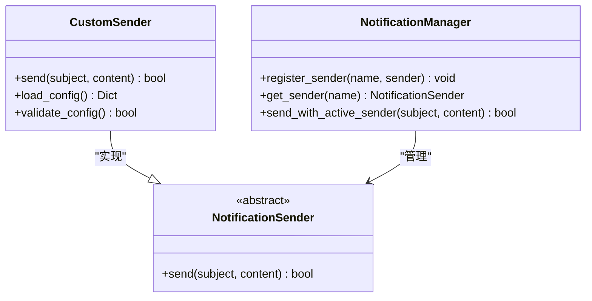

**图表来源**
- [push.py](file://core/push.py#L56-L160)

### 实现步骤

#### 步骤1：创建发送器文件

在 `core/senders/` 目录下创建新的Python文件：

```python
# core/senders/custom_sender.py
from core.push import NotificationSender
from core.log import init_logger
import configparser

logger = init_logger('custom_sender')

class CustomSender(NotificationSender):
    def send(self, subject, content):
        """
        发送通知
        
        Args:
            subject: 消息主题
            content: 消息内容
            
        Returns:
            bool: 发送是否成功
        """
        # 1. 加载配置
        cfg = configparser.ConfigParser()
        cfg.read(str(get_config_path()), encoding='utf-8')
        
        # 2. 执行发送逻辑
        try:
            # 实现具体的发送逻辑
            return True
        except Exception as e:
            logger.error(f"发送失败: {e}")
            return False
```

#### 步骤2：在推送管理器中注册

修改 `core/push.py` 中的 `_register_available_senders()` 方法：

```python
def _register_available_senders(self):
    # ... 其他注册代码
    try:
        from core.senders.custom_sender import CustomSender
        self.register_sender("custom", CustomSender())
    except Exception as e:
        logger.warning(f"注册自定义发送器失败: {e}")
```

#### 步骤3：更新配置文件和GUI

在 `config.ini` 中添加对应的配置节：

```ini
[custom]
api_key = your_api_key
endpoint = https://api.example.com/send
```

在 `gui/gui.py` 中添加对应的UI选项。

**章节来源**
- [EXTENSION_GUIDE.md](file://developer_tools/EXTENSION_GUIDE.md#L7-L57)
- [push.py](file://core/push.py#L83-L97)

## 测试验证流程

### 单元测试策略

#### 成绩获取测试

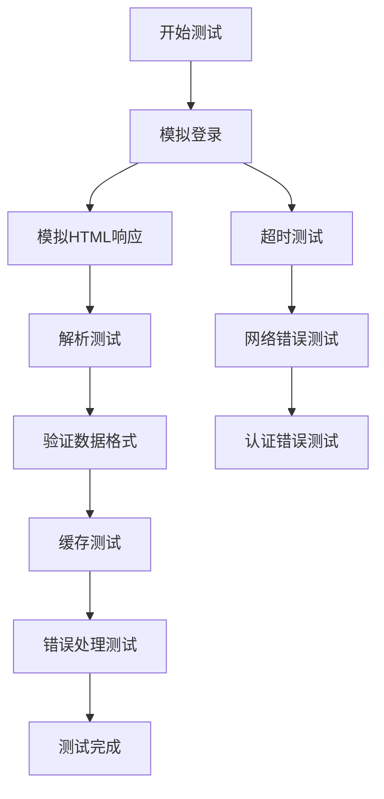

#### 课表获取测试

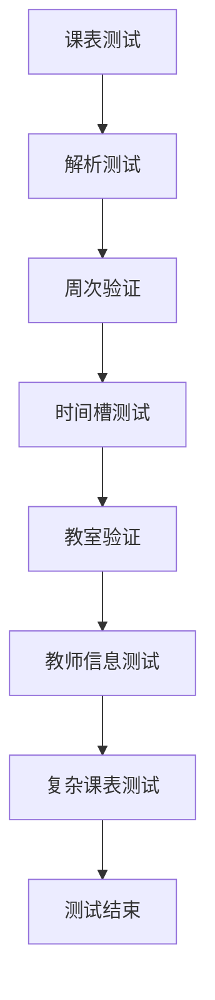

### 集成测试流程

#### 端到端测试

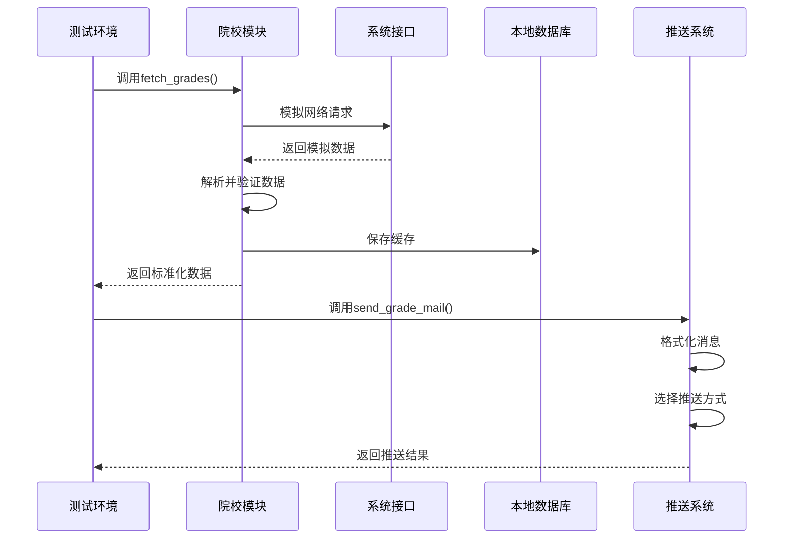

### 测试数据准备

#### 模拟数据模板

```python
# 成绩模拟数据
mock_grades_data = [
    {
        "课程名称": "高等数学",
        "成绩": "85",
        "学分": "4.0",
        "课程属性": "必修",
        "学期": "2023-2024-1"
    },
    {
        "课程名称": "大学英语",
        "成绩": "78",
        "学分": "3.0",
        "课程属性": "必修",
        "学期": "2023-2024-1"
    }
]

# 课表模拟数据
mock_schedule_data = [
    {
        "星期": 1,
        "开始小节": 1,
        "结束小节": 2,
        "课程名称": "高等数学",
        "教室": "教学楼A101",
        "教师": "张教授",
        "周次列表": [1, 2, 3, 4, 5]
    }
]
```

**章节来源**
- [10546/getCourseGrades.py](file://core/school/10546/getCourseGrades.py#L232-L262)
- [10546/getCourseSchedule.py](file://core/school/10546/getCourseSchedule.py#L233-L315)

## 调试方法

### 日志调试技巧

#### 关键日志点

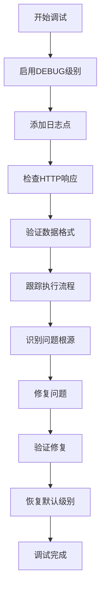

#### 常用调试命令

```bash
# 查看详细日志
python core/go.py --fetch-grade --force

# 检查配置文件
python -c "from core.log import get_config_path; print(get_config_path())"

# 测试推送功能
python -c "from core.push import send_grade_mail; send_grade_mail({'数学': '新成绩：95'})"
```

### 错误诊断流程

#### 常见问题诊断

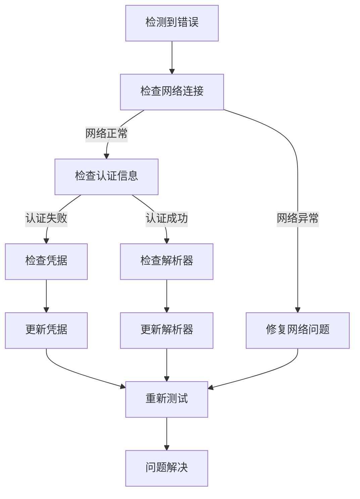

**章节来源**
- [core/log.py](file://core/log.py#L131-L195)
- [core/go.py](file://core/go.py#L141-L143)

## 常见问题解决

### 院校模块相关问题

#### 登录失败问题

**问题症状**：
- 登录页面出现验证码
- 用户名或密码错误提示
- 网络超时错误

**解决方案**：
1. 检查目标服务器是否可达
2. 验证账号密码格式
3. 处理验证码机制
4. 实现重试机制

#### 数据解析失败

**问题症状**：
- HTML结构发生变化
- 字段名称不匹配
- 编码问题导致乱码

**解决方案**：
1. 更新HTML解析规则
2. 实施健壮的错误处理
3. 添加数据验证逻辑
4. 实现降级解析策略

### 推送模块相关问题

#### 邮件发送失败

**问题症状**：
- SMTP认证失败
- Outlook邮箱不支持
- 端口连接问题

**解决方案**：
1. 检查SMTP配置
2. 更换邮箱服务商
3. 使用应用密码
4. 配置正确的TLS设置

#### 飞书推送失败

**问题症状**：
- Webhook地址无效
- 签名验证失败
- 请求超时

**解决方案**：
1. 验证Webhook URL格式
2. 检查签名密钥配置
3. 实施重试机制
4. 添加详细的错误日志

**章节来源**
- [email_sender.py](file://core/senders/email_sender.py#L78-L143)
- [feishu_sender.py](file://core/senders/feishu_sender.py#L59-L110)

## 性能考虑

### 缓存策略

系统实现了多层次的缓存机制来优化性能：

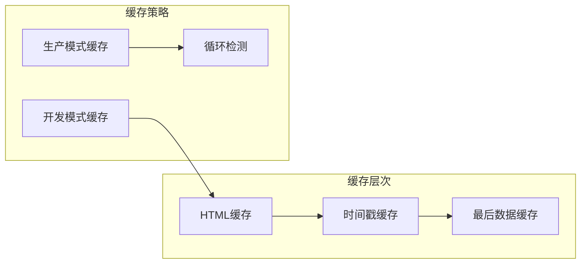

### 性能优化建议

1. **网络请求优化**：实现连接池复用
2. **解析性能**：使用高效的HTML解析库
3. **内存管理**：及时释放大对象引用
4. **并发处理**：合理使用异步I/O

## 故障排除指南

### 系统级故障

#### 注册表操作

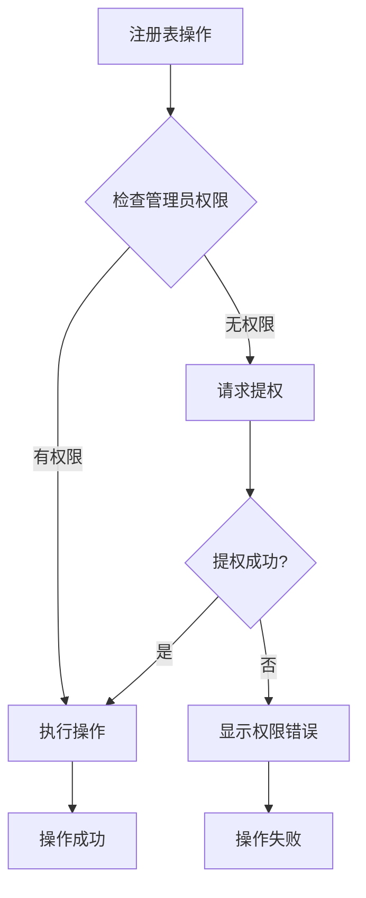

#### 配置文件问题

**常见配置问题**：
1. 配置文件路径错误
2. 编码格式不正确
3. 权限不足
4. 文件损坏

**解决方案**：
1. 使用统一的配置路径管理
2. 实施配置文件验证
3. 提供配置文件模板
4. 实现配置文件自动修复

### 模块加载问题

#### 动态模块加载失败

**问题诊断**：
1. 检查模块路径是否正确
2. 验证模块导入语法
3. 确认依赖库版本兼容
4. 检查模块导出函数

**解决方案**：
1. 实施模块加载日志
2. 提供模块加载状态反馈
3. 实现模块热重载机制
4. 添加模块兼容性检查

**章节来源**
- [register_or_undo.py](file://developer_tools/register_or_undo.py#L1-L115)
- [core/school/__init__.py](file://core/school/__init__.py#L22-L28)

## 结论

Capture_Push 系统提供了完善的扩展开发框架，支持灵活的模块化设计和插件化架构。通过遵循本文档的开发规范和最佳实践，开发者可以快速创建新的院校模块和推送模块，为不同教育机构提供定制化的课程信息追踪服务。

### 关键要点总结

1. **模块化设计**：清晰的接口规范和数据格式要求
2. **扩展性**：支持动态模块加载和插件化架构
3. **可靠性**：完善的错误处理和日志系统
4. **易用性**：简化的开发流程和丰富的工具支持

### 未来发展方向

1. **更多院校支持**：持续扩展支持的教育机构数量
2. **推送方式扩展**：增加更多推送渠道和平台
3. **性能优化**：提升大规模部署的性能表现
4. **用户体验**：改善用户界面和交互体验

通过遵循本指南的开发规范，开发者可以为Capture_Push生态系统贡献高质量的扩展模块，推动系统的持续发展和完善。