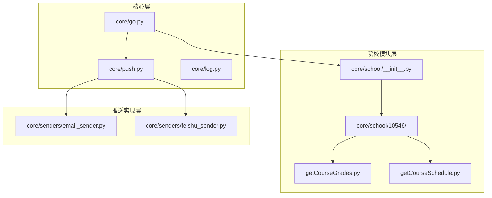
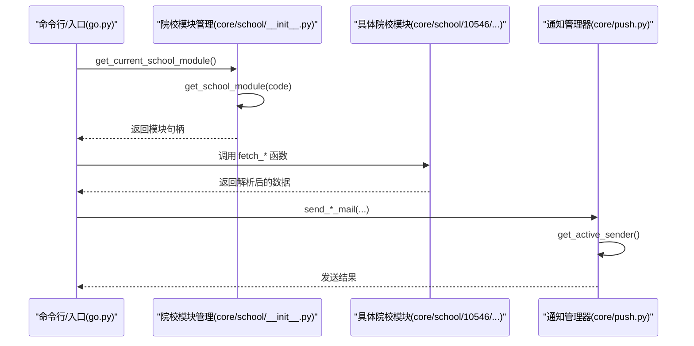
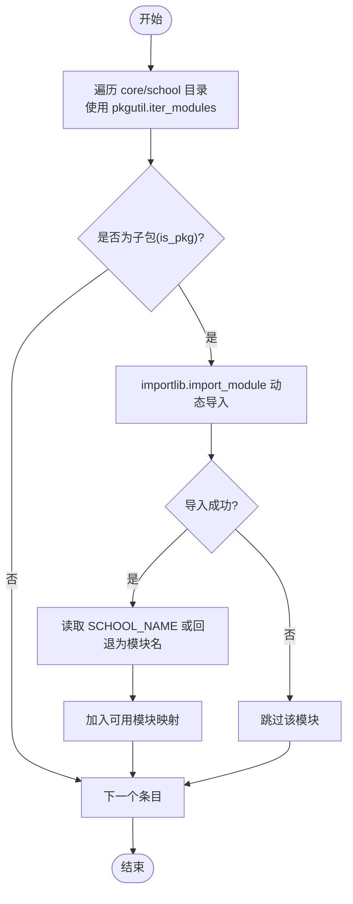
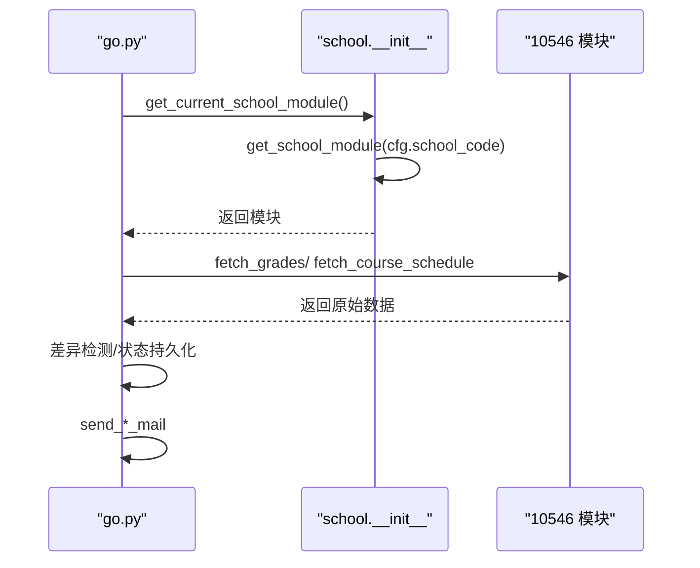
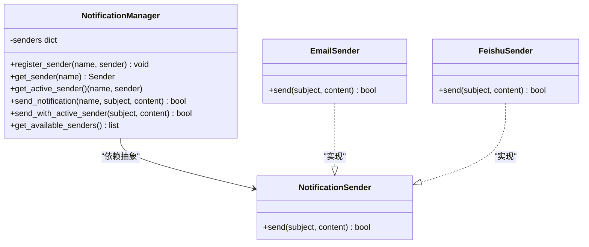
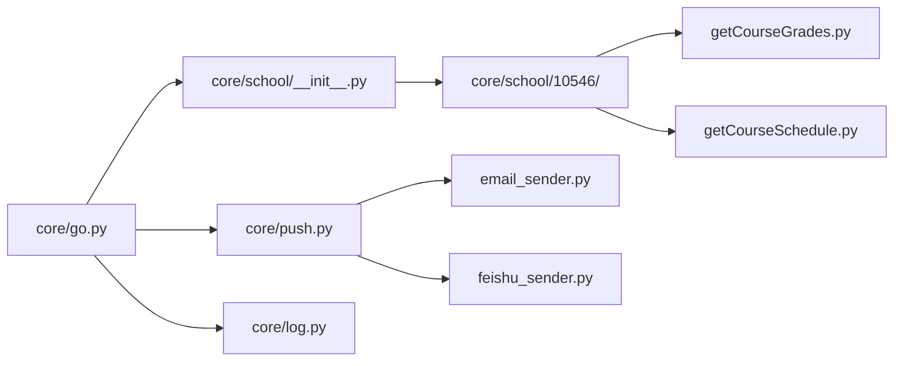

# 模块化设计原理

<cite>
**本文引用的文件**
- [core/school/__init__.py](file://core/school/__init__.py)
- [core/go.py](file://core/go.py)
- [core/push.py](file://core/push.py)
- [core/school/10546/__init__.py](file://core/school/10546/__init__.py)
- [core/school/10546/getCourseGrades.py](file://core/school/10546/getCourseGrades.py)
- [core/school/10546/getCourseSchedule.py](file://core/school/10546/getCourseSchedule.py)
- [core/senders/email_sender.py](file://core/senders/email_sender.py)
- [core/senders/feishu_sender.py](file://core/senders/feishu_sender.py)
- [core/log.py](file://core/log.py)
- [README.md](file://README.md)
- [developer_tools/GUI_MODULAR_DESIGN.md](file://developer_tools/GUI_MODULAR_DESIGN.md)
- [gui/GUI_MODULAR_DESIGN.md](file://gui/GUI_MODULAR_DESIGN.md)
</cite>

## 目录
1. [引言](#引言)
2. [项目结构](#项目结构)
3. [核心组件](#核心组件)
4. [架构总览](#架构总览)
5. [详细组件分析](#详细组件分析)
6. [依赖关系分析](#依赖关系分析)
7. [性能考量](#性能考量)
8. [故障排查指南](#故障排查指南)
9. [结论](#结论)
10. [附录](#附录)

## 引言
本文件围绕“模块化设计原理”展开，结合仓库中的院校模块系统，系统阐述动态模块加载机制、模块发现机制与统一接口规范；深入分析 get_available_schools() 与 get_school_module() 的实现原理，说明如何通过 importlib 与 pkgutil 实现动态导入；总结模块化架构在可扩展性、可维护性与可测试性方面的优势，并给出模块接口设计的最佳实践与设计模式应用建议。

## 项目结构
项目采用“核心功能 + 多模块”的分层组织方式：
- 核心层：go.py 作为主执行入口，负责配置加载、状态管理与业务流程编排；push.py 提供统一的通知发送与格式化能力；log.py 提供统一的日志路径与初始化。
- 院校模块层：core/school 下以子包形式组织各院校模块，每个模块封装该校特有的抓取与解析逻辑；通过 core/school/__init__.py 提供动态发现与加载能力。
- 推送实现层：core/senders 下提供多种具体发送器（如邮件、飞书），统一由 push.py 的通知管理器进行注册与调度。
- GUI 与开发者工具：gui 与 developer_tools 提供模块化 UI 设计与扩展指南。

图表来源
- [core/go.py](file://core/go.py#L1-L536)
- [core/push.py](file://core/push.py#L1-L319)
- [core/school/__init__.py](file://core/school/__init__.py#L1-L28)
- [core/school/10546/getCourseGrades.py](file://core/school/10546/getCourseGrades.py#L1-L329)
- [core/school/10546/getCourseSchedule.py](file://core/school/10546/getCourseSchedule.py#L1-L405)
- [core/senders/email_sender.py](file://core/senders/email_sender.py#L1-L144)
- [core/senders/feishu_sender.py](file://core/senders/feishu_sender.py#L1-L110)

章节来源
- [README.md](file://README.md#L60-L83)

## 核心组件
- 院校模块发现与加载：通过 pkgutil 遍历 core/school 目录，importlib 动态导入子包，实现“按需加载、自动发现”的模块化架构。
- 统一接口规范：各院校模块导出统一的函数（如 fetch_grades、fetch_course_schedule、parse_grades、parse_schedule），GO 层通过模块句柄调用，屏蔽差异。
- 通知管理与多实现：push.py 定义抽象发送器与通知管理器，自动注册多种发送器（邮件、飞书），支持配置驱动的动态切换。
- 日志与配置：log.py 统一 AppData 路径下的配置与日志文件管理，保证跨平台与可部署性。

章节来源
- [core/school/__init__.py](file://core/school/__init__.py#L6-L28)
- [core/school/10546/__init__.py](file://core/school/10546/__init__.py#L1-L7)
- [core/push.py](file://core/push.py#L56-L160)
- [core/log.py](file://core/log.py#L60-L211)

## 架构总览
整体架构以“动态模块加载 + 统一接口 + 管理器调度”为核心，形成高内聚、低耦合的模块化体系。GO 层负责业务编排与状态持久化；push 层负责消息格式化与发送；school 层负责各校差异化抓取与解析；senders 层提供可插拔的发送实现。

图表来源
- [core/go.py](file://core/go.py#L49-L57)
- [core/school/__init__.py](file://core/school/__init__.py#L22-L28)
- [core/push.py](file://core/push.py#L107-L155)

## 详细组件分析

### 动态模块加载与发现机制
- 模块发现：通过 pkgutil.iter_modules 遍历 core/school 目录，过滤出子包（is_pkg=True），从而发现所有可用的院校模块。
- 动态导入：使用 importlib.import_module 动态导入对应模块，避免硬编码依赖，实现“按需加载”。
- 错误容错：在导入过程中捕获异常并跳过无效模块，保证系统稳定性。
- 统一命名：模块可通过导出 SCHOOL_NAME 提供人类可读的名称，否则回退为模块名。

图表来源
- [core/school/__init__.py](file://core/school/__init__.py#L6-L20)

章节来源
- [core/school/__init__.py](file://core/school/__init__.py#L6-L28)

### get_available_schools() 与 get_school_module() 实现原理
- get_available_schools()
  - 遍历核心包路径，收集所有子包；
  - 动态导入子包，读取模块级 SCHOOL_NAME，若不存在则使用模块名；
  - 返回“模块名 -> 学校名称”的字典。
- get_school_module(school_code)
  - 直接动态导入指定模块，异常时返回 None，便于上层做降级处理（如回退到默认模块）。

章节来源
- [core/school/__init__.py](file://core/school/__init__.py#L6-L28)

### 统一接口规范与调用链
- 院校模块统一导出：
  - 成绩模块：fetch_grades(username, password, force_update)、parse_grades(html)
  - 课表模块：fetch_course_schedule(username, password, force_update)、parse_schedule(html)
- GO 层通过 get_current_school_module() 获取模块句柄，再调用上述函数，屏蔽各校差异。
- 成功获取数据后，GO 层进行差异检测、状态持久化与推送调度。

图表来源
- [core/go.py](file://core/go.py#L49-L57)
- [core/school/10546/__init__.py](file://core/school/10546/__init__.py#L1-L7)

章节来源
- [core/go.py](file://core/go.py#L83-L144)
- [core/school/10546/getCourseGrades.py](file://core/school/10546/getCourseGrades.py#L278-L296)
- [core/school/10546/getCourseSchedule.py](file://core/school/10546/getCourseSchedule.py#L354-L372)

### 通知管理器与多实现模式
- 抽象基类：NotificationSender 定义统一 send(subject, content) 接口。
- 管理器：NotificationManager 自动注册可用发送器（如邮件、飞书），根据配置选择活跃发送器。
- 配置驱动：通过配置文件读取当前启用的推送方式，实现“无侵入式”切换。
- 发送流程：push.py 提供便捷函数（如 send_grade_mail、send_schedule_mail），内部委托管理器完成实际发送。

图表来源
- [core/push.py](file://core/push.py#L56-L160)
- [core/senders/email_sender.py](file://core/senders/email_sender.py#L47-L144)
- [core/senders/feishu_sender.py](file://core/senders/feishu_sender.py#L42-L110)

章节来源
- [core/push.py](file://core/push.py#L26-L160)
- [core/senders/email_sender.py](file://core/senders/email_sender.py#L37-L144)
- [core/senders/feishu_sender.py](file://core/senders/feishu_sender.py#L42-L110)

### 日志与配置的统一管理
- 统一日志：log.py 提供 get_config_path、get_log_file_path、init_logger 等统一入口，确保所有模块使用 AppData 目录下的配置与日志文件。
- 配置驱动：go.py 与 push.py 均通过 get_config_path 获取配置路径，实现一致的配置读取体验。
- 日志策略：按日期命名日志文件，支持滚动与清理，避免无限增长。

章节来源
- [core/log.py](file://core/log.py#L60-L211)
- [core/go.py](file://core/go.py#L18-L34)
- [core/push.py](file://core/push.py#L10-L24)

### GUI 模块化设计（概念性说明）
- 功能独立：每个 GUI 模块负责单一功能领域（如配置窗口、成绩窗口、课表窗口）。
- 职责分离：UI 层、业务逻辑层、数据访问层分离，组件可在不同窗口间复用。
- 扩展指南：新增功能遵循“新窗口/新对话框/新组件”的模块化添加流程，跨模块交互通过函数调用或信号槽机制实现。

章节来源
- [developer_tools/GUI_MODULAR_DESIGN.md](file://developer_tools/GUI_MODULAR_DESIGN.md#L1-L52)
- [gui/GUI_MODULAR_DESIGN.md](file://gui/GUI_MODULAR_DESIGN.md#L1-L52)

## 依赖关系分析
- GO 层依赖：
  - core.school：动态加载当前院校模块；
  - core.push：统一消息格式化与发送；
  - core.log：统一配置与日志路径。
- 院校模块依赖：
  - requests、BeautifulSoup 等第三方库；
  - core.log：统一日志初始化与 AppData 路径。
- 推送实现依赖：
  - email、smtplib、requests 等标准库与第三方库；
  - core.log：统一日志初始化。

图表来源
- [core/go.py](file://core/go.py#L15-L22)
- [core/school/__init__.py](file://core/school/__init__.py#L1-L5)
- [core/push.py](file://core/push.py#L16-L24)

章节来源
- [core/go.py](file://core/go.py#L15-L22)
- [core/push.py](file://core/push.py#L16-L24)

## 性能考量
- 动态导入开销：pkgutil 遍历与 importlib 导入在启动阶段执行一次，通常可接受；若模块数量增长，可考虑缓存可用模块列表。
- I/O 与网络：成绩/课表抓取涉及网络请求与本地缓存读写，应合理设置超时与重试策略；循环检测间隔需平衡实时性与资源消耗。
- 日志滚动：统一日志文件按大小滚动，避免磁盘占用过大；清理策略可进一步优化为 LRU 或按时间阈值。

## 故障排查指南
- 院校模块加载失败：
  - 检查 core/school 下是否存在对应子包与 __init__.py；
  - 确认模块内导出统一函数（如 fetch_*、parse_*）；
  - 若导入异常，get_school_module 返回 None，GO 层应具备降级逻辑（如回退默认模块）。
- 推送失败：
  - 检查配置文件中推送方式与凭据是否正确；
  - 邮件发送器对 Outlook/Hotmail 等邮箱有特殊限制，需使用应用密码或更换邮箱；
  - 飞书发送器需确认 webhook_url 与 secret 配置。
- 日志定位：
  - 使用 log.pack_logs() 打包 AppData/Capture_Push 下的日志文件，便于问题诊断。

章节来源
- [core/school/__init__.py](file://core/school/__init__.py#L22-L28)
- [core/go.py](file://core/go.py#L49-L57)
- [core/senders/email_sender.py](file://core/senders/email_sender.py#L78-L91)
- [core/senders/feishu_sender.py](file://core/senders/feishu_sender.py#L52-L61)
- [core/log.py](file://core/log.py#L18-L57)

## 结论
该模块化设计通过“动态发现 + 统一接口 + 管理器调度”的组合，实现了高扩展性（新增院校无需改动核心）、高可维护性（职责清晰、边界明确）与高可测试性（可替换实现、配置驱动）。配合统一日志与配置管理，系统在部署与运维层面也具备良好可操作性。建议在后续扩展中持续遵循统一接口规范与最佳实践，确保模块间解耦与演进的稳定性。

## 附录
- 最佳实践与设计模式应用
  - 接口契约：统一导出函数签名（如 fetch_*、parse_*），确保调用方无需感知实现细节。
  - 策略模式：通过配置选择不同发送器（邮件/飞书），实现运行时策略切换。
  - 工厂模式：通知管理器自动注册发送器，简化客户端使用。
  - 插件化：动态模块加载使新增院校模块无需修改核心代码。
  - 配置驱动：将可变行为（推送方式、循环检测间隔、运行模式）集中到配置文件，降低硬编码风险。