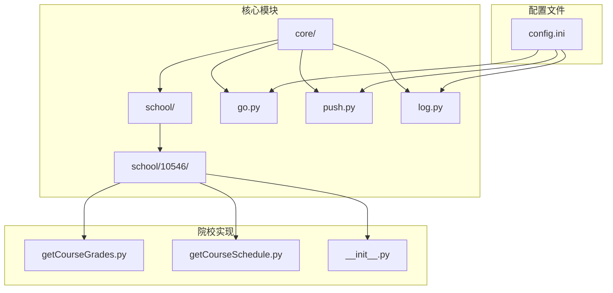
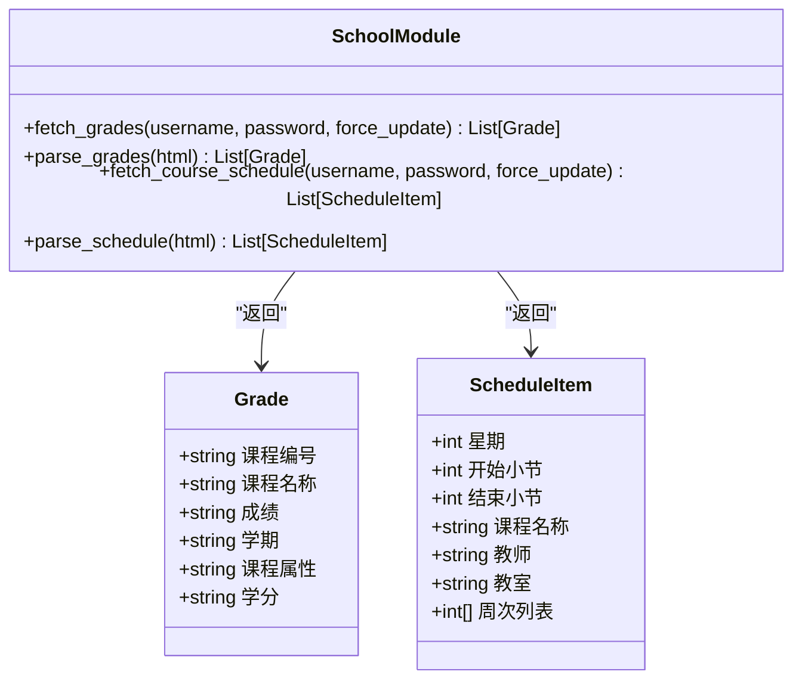
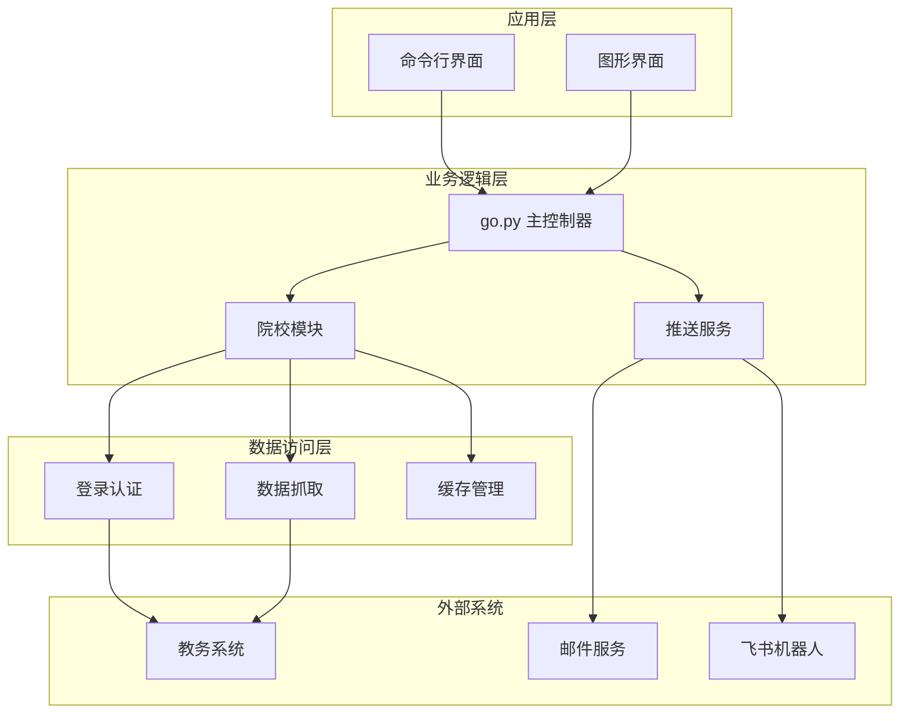
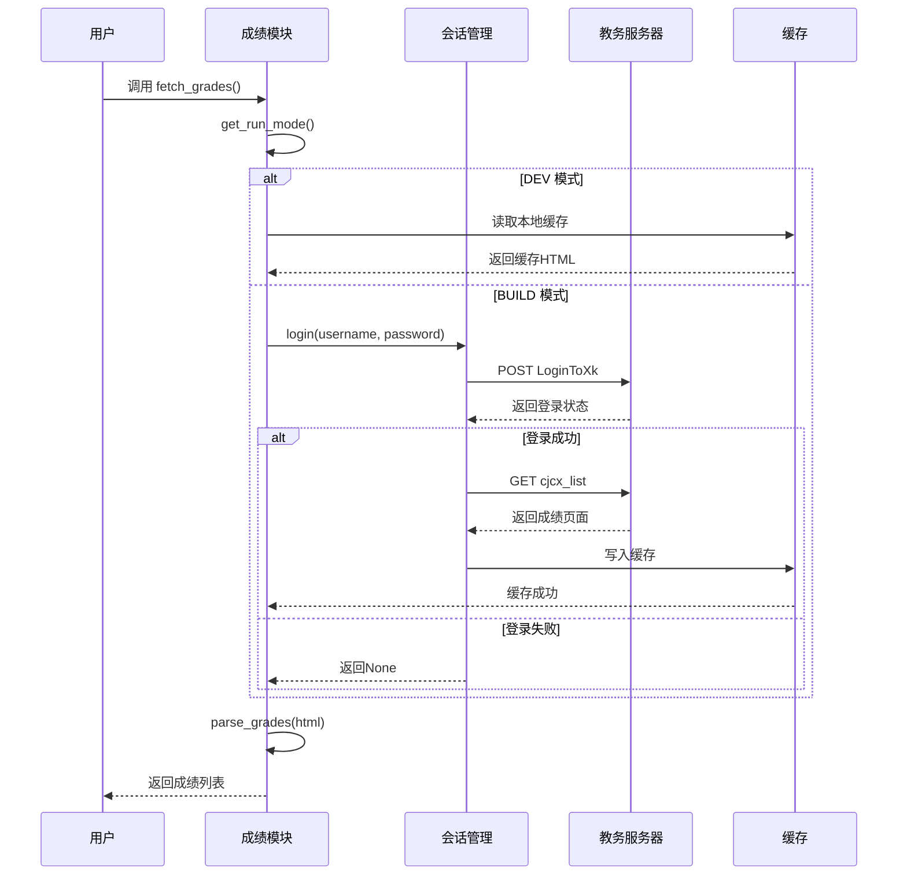
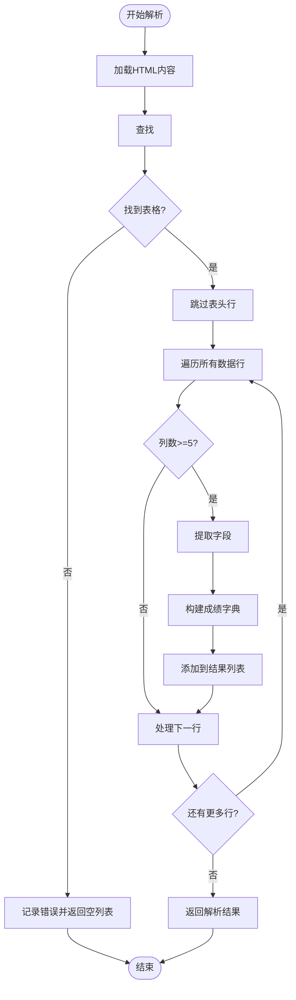
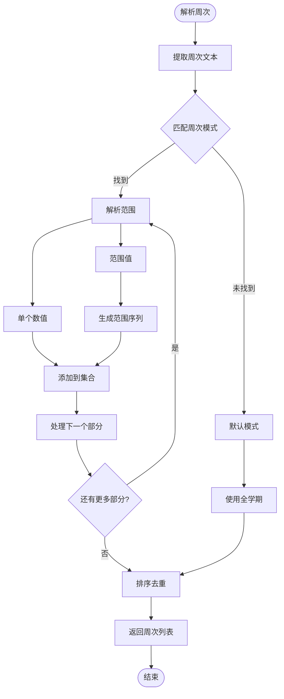
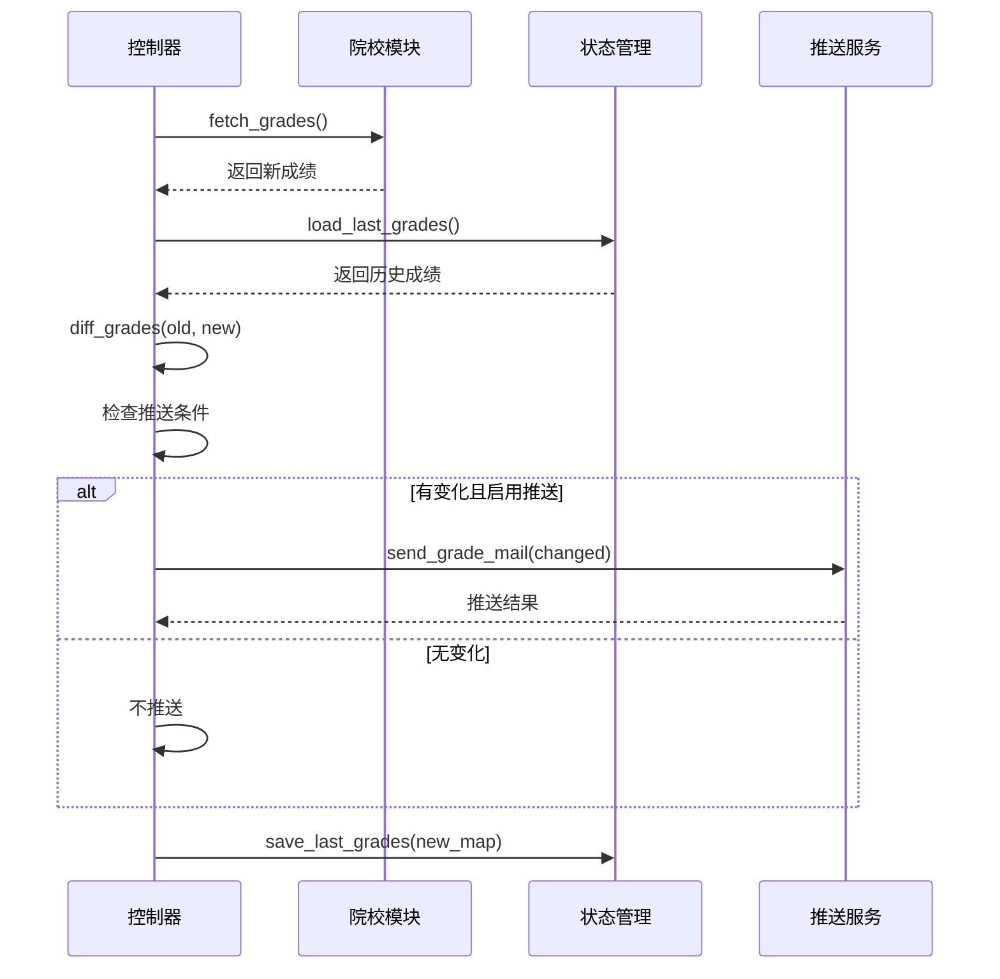
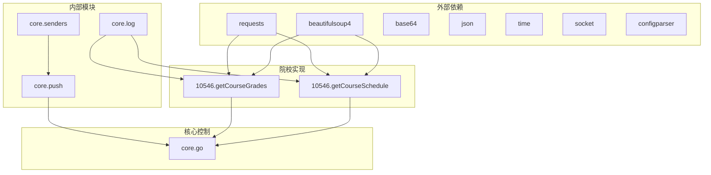

# 现有院校实现分析

<cite>
**本文引用的文件**
- [getCourseGrades.py](file://core/school/10546/getCourseGrades.py)
- [getCourseSchedule.py](file://core/school/10546/getCourseSchedule.py)
- [__init__.py](file://core/school/10546/__init__.py)
- [go.py](file://core/go.py)
- [push.py](file://core/push.py)
- [log.py](file://core/log.py)
- [config.ini](file://config.ini)
</cite>

## 目录
1. [引言](#引言)
2. [项目结构](#项目结构)
3. [核心组件](#核心组件)
4. [架构概览](#架构概览)
5. [详细组件分析](#详细组件分析)
6. [依赖关系分析](#依赖关系分析)
7. [性能考虑](#性能考虑)
8. [故障排除指南](#故障排除指南)
9. [结论](#结论)

## 引言

本文档对衡阳师范学院(10546)的现有院校实现进行全面分析，重点研究成绩获取(getCourseGrades)和课表获取(getCourseSchedule)两个核心功能模块。通过对代码结构、数据抓取算法、HTML解析逻辑、数据清洗和转换过程的深入分析，为开发者提供完整的实现指南和技术参考。

## 项目结构

项目采用模块化设计，按照功能层次组织代码结构：



**图表来源**
- [getCourseGrades.py](file://core/school/10546/getCourseGrades.py#L1-L329)
- [getCourseSchedule.py](file://core/school/10546/getCourseSchedule.py#L1-L405)
- [go.py](file://core/go.py#L1-L536)

**章节来源**
- [getCourseGrades.py](file://core/school/10546/getCourseGrades.py#L1-L50)
- [getCourseSchedule.py](file://core/school/10546/getCourseSchedule.py#L1-L52)
- [config.ini](file://config.ini#L1-L36)

## 核心组件

### 院校模块接口

衡阳师范学院实现了标准化的接口规范，提供统一的获取方法：



**图表来源**
- [getCourseGrades.py](file://core/school/10546/getCourseGrades.py#L248-L256)
- [getCourseSchedule.py](file://core/school/10546/getCourseSchedule.py#L300-L309)

### 数据结构定义

#### 成绩数据结构
| 字段名 | 类型 | 描述 | 示例 |
|--------|------|------|------|
| 课程编号 | string | 课程唯一标识符 | "CS101" |
| 课程名称 | string | 课程全称 | "计算机科学导论" |
| 成绩 | string | 学生成绩 | "85" |
| 学期 | string | 学期标识 | "2023-2024-1" |
| 课程属性 | string | 课程性质 | "必修" |
| 学分 | string | 课程学分 | "3.0" |

#### 课表数据结构
| 字段名 | 类型 | 描述 | 示例 |
|--------|------|------|------|
| 星期 | int | 星期几 (1-7) | 3 |
| 开始小节 | int | 开始节数 | 5 |
| 结束小节 | int | 结束节数 | 6 |
| 课程名称 | string | 课程名称 | "高等数学" |
| 教师 | string | 授课教师 | "张教授" |
| 教室 | string | 上课教室 | "教学楼A101" |
| 周次列表 | List[int] | 上课周次 | [1,2,3,4,5,6,7,8,9,10,11,12] |

**章节来源**
- [getCourseGrades.py](file://core/school/10546/getCourseGrades.py#L248-L256)
- [getCourseSchedule.py](file://core/school/10546/getCourseSchedule.py#L300-L309)

## 架构概览

系统采用分层架构设计，各层职责清晰分离：



**图表来源**
- [go.py](file://core/go.py#L83-L144)
- [push.py](file://core/push.py#L162-L164)

## 详细组件分析

### 成绩获取模块 (getCourseGrades)

#### 登录认证流程



**图表来源**
- [getCourseGrades.py](file://core/school/10546/getCourseGrades.py#L59-L101)
- [getCourseGrades.py](file://core/school/10546/getCourseGrades.py#L169-L229)

#### HTML解析算法

成绩页面解析采用精确的选择器匹配策略：



**图表来源**
- [getCourseGrades.py](file://core/school/10546/getCourseGrades.py#L232-L262)

#### 缓存策略

系统实现了智能缓存机制，支持循环检测和强制更新：

| 配置项 | 默认值 | 描述 |
|--------|--------|------|
| loop_getCourseGrades.enabled | False | 是否启用循环检测 |
| loop_getCourseGrades.time | 3600 | 缓存更新间隔(秒) |
| run_model.model | BUILD | 运行模式(DEV/BUILD) |

**章节来源**
- [getCourseGrades.py](file://core/school/10546/getCourseGrades.py#L103-L156)
- [getCourseGrades.py](file://core/school/10546/getCourseGrades.py#L169-L229)

### 课表获取模块 (getCourseSchedule)

#### 课表解析算法

课表解析针对青果系统的特殊结构进行了优化：

```mermaid
flowchart TD
Start([开始解析]) --> LoadHTML[加载HTML内容]
LoadHTML --> FindTable[查找 <table id='timetable'>]
FindTable --> TableFound{"找到表格?"}
TableFound --> |否| Error["记录错误并返回空列表"]
TableFound --> |是| GetRows[获取所有行]
GetRows --> LoopRows[遍历行(时间段)]
LoopRows --> LoopDays[遍历列(星期)]
LoopDays --> CheckCell[检查单元格]
CheckCell --> HasContent{"有课程内容?"}
HasContent --> |否| NextDay[下一个星期]
HasContent --> |是| ParseContent[解析课程内容]
ParseContent --> SplitBlocks[分割课程块]
SplitBlocks --> ExtractInfo[提取课程信息]
ExtractInfo --> BuildItem[构建课表项]
BuildItem --> AddToList[添加到结果列表]
AddToList --> NextDay
NextDay --> MoreDays{"还有更多星期?"}
MoreDays --> |是| LoopDays
MoreDays --> |否| NextRow
NextRow --> MoreRows{"还有更多行?"}
MoreRows --> |是| LoopRows
MoreRows --> |否| ReturnResults[返回解析结果]
Error --> End([结束])
ReturnResults --> End
```

**图表来源**
- [getCourseSchedule.py](file://core/school/10546/getCourseSchedule.py#L233-L315)

#### 周次解析逻辑

系统能够智能解析复杂的周次表达式：



**图表来源**
- [getCourseSchedule.py](file://core/school/10546/getCourseSchedule.py#L282-L299)

**章节来源**
- [getCourseSchedule.py](file://core/school/10546/getCourseSchedule.py#L233-L315)
- [getCourseSchedule.py](file://core/school/10546/getCourseSchedule.py#L282-L299)

### 主控制器 (go.py)

#### 成绩变化检测

主控制器实现了智能的变化检测机制：



**图表来源**
- [go.py](file://core/go.py#L83-L144)
- [go.py](file://core/go.py#L73-L81)

**章节来源**
- [go.py](file://core/go.py#L83-L144)
- [go.py](file://core/go.py#L73-L81)

## 依赖关系分析

### 模块依赖图



**图表来源**
- [getCourseGrades.py](file://core/school/10546/getCourseGrades.py#L1-L12)
- [getCourseSchedule.py](file://core/school/10546/getCourseSchedule.py#L1-L12)
- [go.py](file://core/go.py#L15-L16)

### 配置依赖

系统配置采用集中管理模式：

| 配置类别 | 关键配置项 | 默认值 | 作用域 |
|----------|------------|--------|--------|
| 运行模式 | run_model.model | BUILD | 全局 |
| 成绩缓存 | loop_getCourseGrades.enabled | False | 成绩模块 |
| 课表缓存 | loop_getCourseSchedule.enabled | False | 课表模块 |
| 推送方式 | push.method | none | 推送模块 |
| SMTP配置 | email.smtp/port/sender/receiver | 示例值 | 邮件推送 |

**章节来源**
- [config.ini](file://config.ini#L4-L36)
- [log.py](file://core/log.py#L60-L82)

## 性能考虑

### 网络请求优化

1. **连接池复用**: 使用自定义HTTPAdapter确保IPv4连接
2. **超时控制**: 所有网络请求设置10秒超时
3. **缓存策略**: 智能缓存减少重复请求
4. **会话管理**: 复用登录会话避免重复认证

### 内存使用优化

1. **增量解析**: HTML解析采用流式处理
2. **及时释放**: 大对象使用后及时释放
3. **缓存清理**: 定期清理过期缓存文件

### 并发处理

系统支持多线程安全的缓存操作，但网络请求仍采用同步模式以保证稳定性。

## 故障排除指南

### 常见问题及解决方案

#### 登录失败
- **症状**: "用户名或密码错误"
- **原因**: 凭证错误或验证码拦截
- **解决**: 检查config.ini中的账号密码配置

#### 网络超时
- **症状**: "登录请求异常"或"成绩请求异常"
- **原因**: 网络不稳定或服务器繁忙
- **解决**: 增加超时时间或稍后重试

#### 解析失败
- **症状**: "未找到 <table id='dataList'>"或"未识别到有效内容"
- **原因**: 教务系统页面结构调整
- **解决**: 更新选择器或检查页面结构

#### 缓存问题
- **症状**: 缓存文件损坏或过期
- **原因**: 系统异常退出导致文件不完整
- **解决**: 删除缓存文件后重新获取

### 调试技巧

1. **启用详细日志**: 在config.ini中设置logging.level=DEBUG
2. **强制更新模式**: 使用--force参数绕过缓存
3. **查看缓存文件**: 检查AppData目录下的HTML缓存
4. **网络抓包**: 使用浏览器开发者工具分析请求

**章节来源**
- [getCourseGrades.py](file://core/school/10546/getCourseGrades.py#L87-L100)
- [getCourseSchedule.py](file://core/school/10546/getCourseSchedule.py#L217-L230)
- [log.py](file://core/log.py#L131-L195)

## 结论

衡阳师范学院(10546)的实现展现了良好的工程实践：

1. **模块化设计**: 清晰的接口分离和职责划分
2. **健壮性**: 完善的错误处理和异常恢复机制
3. **可维护性**: 标准化的代码结构和详细的日志记录
4. **扩展性**: 支持多种运行模式和配置选项

该实现为其他院校的接入提供了优秀的参考模板，其设计原则和最佳实践值得在类似项目中推广使用。