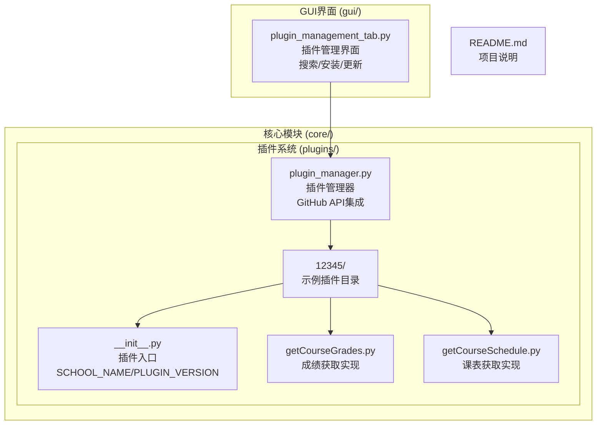
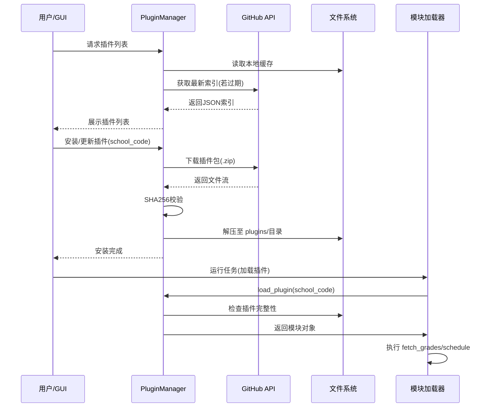

# 院校模块系统

<cite>
**本文档引用的文件**
- [core/plugins/plugin_manager.py](file://core/plugins/plugin_manager.py)
- [core/plugins/12345/__init__.py](file://core/plugins/12345/__init__.py)
- [core/plugins/12345/getCourseGrades.py](file://core/plugins/12345/getCourseGrades.py)
- [core/plugins/12345/getCourseSchedule.py](file://core/plugins/12345/getCourseSchedule.py)
- [gui/tabs/plugin_management_tab.py](file://gui/tabs/plugin_management_tab.py)
- [README.md](file://README.md)
</cite>

## 更新摘要
**所做的更改**
- 系统架构从内置模块完全迁移到插件化架构
- 移除了原有的core/school/目录结构
- 新增了完整的插件管理器和GUI插件管理界面
- 更新了模块加载机制，支持GitHub自动更新

## 目录
1. [简介](#简介)
2. [项目结构](#项目结构)
3. [核心组件](#核心组件)
4. [架构概览](#架构概览)
5. [详细组件分析](#详细组件分析)
6. [依赖关系分析](#依赖关系分析)
7. [性能考虑](#性能考虑)
8. [故障排除指南](#故障排除指南)
9. [结论](#结论)
10. [附录](#附录)

## 简介

Capture_Push 是一个模块化的院校管理系统，专门设计用于自动获取和推送学生课程成绩和课表信息。该系统采用全新的插件化架构，通过独立的院校插件实现对多所大学的支持。

**重大更新** 系统已完成从内置模块到插件化架构的完全迁移，移除了原有的core/school/目录结构，引入了完整的插件管理体系

系统的核心设计理念是：
- **插件化设计**：每个院校的抓取逻辑独立封装为插件，便于维护和扩展
- **动态加载**：通过GitHub API自动下载和更新插件，支持版本管理和安全验证
- **统一接口**：所有院校插件遵循统一的API接口标准
- **智能管理**：集成GUI界面支持插件的搜索、安装、更新和卸载
- **安全验证**：插件下载时进行SHA256校验和验证，确保完整性
- **离线缓存**：插件索引文件本地缓存，提高加载速度和可靠性

## 项目结构

项目采用全新的插件化架构，核心目录结构如下：

**图表来源**
- [core/plugins/plugin_manager.py](file://core/plugins/plugin_manager.py)
- [core/plugins/12345/__init__.py](file://core/plugins/12345/__init__.py)
- [gui/tabs/plugin_management_tab.py](file://gui/tabs/plugin_management_tab.py)

## 核心组件

### 插件管理器 (PluginManager)
负责所有与插件生命周期相关的操作：
- **初始化**：设置插件目录、数据目录和日志
- **获取插件列表**：从本地或远程获取可用插件
- **下载与安装**：从GitHub Releases下载插件包，校验并解压
- **加载插件**：动态导入Python模块，提供给核心系统调用
- **版本控制**：比较本地与远程版本，提示更新

### 插件结构规范
每个院校插件必须包含以下文件：
- `__init__.py`: 导出模块入口，定义 `SCHOOL_NAME` 和 `PLUGIN_VERSION`
- `getCourseGrades.py`: 实现 `fetch_grades` 函数
- `getCourseSchedule.py`: 实现 `fetch_course_schedule` 函数

### GUI 管理界面
位于 `gui/tabs/plugin_management_tab.py`，提供用户友好的操作界面：
- 显示当前已安装插件及其版本
- 列出可安装的远程插件
- 提供一键安装/更新/卸载功能

## 架构概览

## 依赖关系分析
- **External**: `requests` (网络请求), `urllib` (下载), `zipfile` (解压)
- **Internal**: `core.log` (日志), `core.config_manager` (配置)

## 性能考虑
- **索引缓存**：避免每次操作都请求GitHub API
- **流式下载**：大文件下载时减少内存占用
- **按需加载**：仅在运行时加载指定的院校插件

## 故障排除指南
- **下载失败**：检查网络连接，尝试配置代理
- **校验失败**：文件可能损坏，建议删除缓存后重试
- **加载错误**：确认插件依赖是否满足，查看日志详情

## 结论
新的插件化架构极大地提升了系统的灵活性，使得院校适配层的开发与核心功能的维护解耦，为社区贡献提供了更好的基础。

## 附录
暂无。
