# 院校模块系统

<cite>
**本文档引用的文件**
- [core/plugins/plugin_manager.py](file://core/plugins/plugin_manager.py)
- [core/plugins/12345/__init__.py](file://core/plugins/12345/__init__.py)
- [core/plugins/12345/getCourseGrades.py](file://core/plugins/12345/getCourseGrades.py)
- [core/plugins/12345/getCourseSchedule.py](file://core/plugins/12345/getCourseSchedule.py)
- [gui/tabs/plugin_management_tab.py](file://gui/tabs/plugin_management_tab.py)
- [plugins_index.json](file://plugins_index.json)
- [developer_tools/build_plugin.py](file://developer_tools/build_plugin.py)
- [developer_tools/EXTENSION_GUIDE.md](file://developer_tools/EXTENSION_GUIDE.md)
- [README.md](file://README.md)
- [developer_space/10546/__init__.py](file://developer_space/10546/__init__.py)
- [developer_space/10546/getCourseGrades.py](file://developer_space/10546/getCourseGrades.py)
</cite>

## 更新摘要
**所做的更改**
- 系统架构从内置模块完全迁移到插件化架构
- 移除了原有的core/school/目录结构
- 新增了完整的插件管理器和GUI插件管理界面
- 更新了模块加载机制，支持GitHub自动更新
- 新增了插件构建和发布的完整流程

## 目录
1. [简介](#简介)
2. [项目结构](#项目结构)
3. [核心组件](#核心组件)
4. [架构概览](#架构概览)
5. [详细组件分析](#详细组件分析)
6. [依赖关系分析](#依赖关系分析)
7. [性能考虑](#性能考虑)
8. [故障排除指南](#故障排除指南)
9. [结论](#结论)
10. [附录](#附录)

## 简介

Capture_Push 是一个模块化的院校管理系统，专门设计用于自动获取和推送学生课程成绩和课表信息。该系统采用全新的插件化架构，通过独立的院校插件实现对多所大学的支持，目前主要支持衡阳师范学院（代码10546）。

**重大更新** 系统已完成从内置模块到插件化架构的完全迁移，移除了原有的core/school/目录结构，引入了完整的插件管理体系

系统的核心设计理念是：
- **插件化设计**：每个院校的抓取逻辑独立封装为插件，便于维护和扩展
- **动态加载**：通过GitHub API自动下载和更新插件，支持版本管理和安全验证
- **统一接口**：所有院校插件遵循统一的API接口标准
- **智能管理**：集成GUI界面支持插件的搜索、安装、更新和卸载
- **安全验证**：插件下载时进行SHA256校验和验证，确保完整性
- **离线缓存**：插件索引文件本地缓存，提高加载速度和可靠性

## 项目结构

项目采用全新的插件化架构，核心目录结构如下：

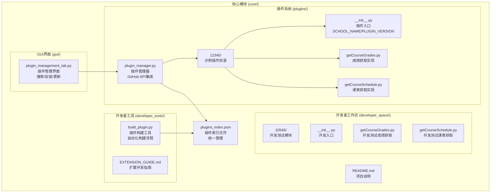

**图表来源**
- [core/plugins/plugin_manager.py](file://core/plugins/plugin_manager.py#L26-L70)
- [core/plugins/12345/__init__.py](file://core/plugins/12345/__init__.py#L1-L14)
- [gui/tabs/plugin_management_tab.py](file://gui/tabs/plugin_management_tab.py#L17-L26)
- [plugins_index.json](file://plugins_index.json#L1-L13)

**章节来源**
- [README.md](file://README.md#L83-L156)

## 核心组件

### 插件管理器

**重大更新** 新增完整的插件管理器，支持GitHub API集成和智能版本管理

插件管理器是整个插件系统的核心，负责插件的下载、验证、安装和管理。它集成了GitHub API，支持自动更新和版本控制。

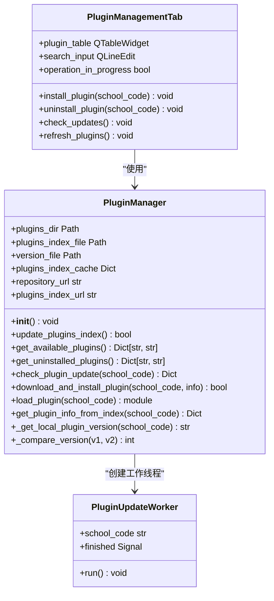

**图表来源**
- [core/plugins/plugin_manager.py](file://core/plugins/plugin_manager.py#L26-L1245)
- [gui/tabs/plugin_management_tab.py](file://gui/tabs/plugin_management_tab.py#L616-L646)

### 插件加载机制

**重大更新** 完全重构的插件加载机制，支持动态导入和版本管理

插件加载机制经过全新设计，支持从GitHub自动下载插件，本地缓存管理，以及智能版本比较：

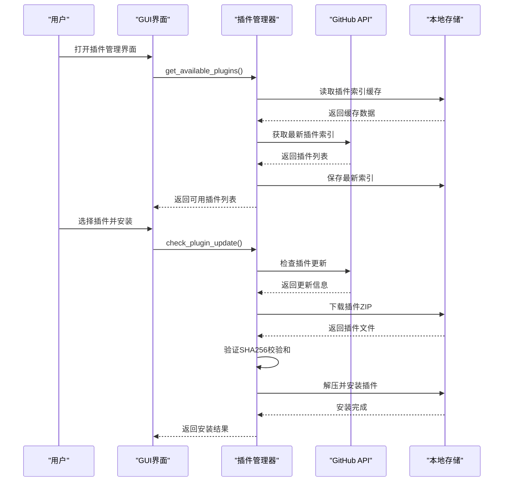

**图表来源**
- [core/plugins/plugin_manager.py](file://core/plugins/plugin_manager.py#L109-L181)
- [core/plugins/plugin_manager.py](file://core/plugins/plugin_manager.py#L1117-L1187)

### 推送系统架构

推送系统保持原有架构，继续支持多种推送方式的动态注册和管理。

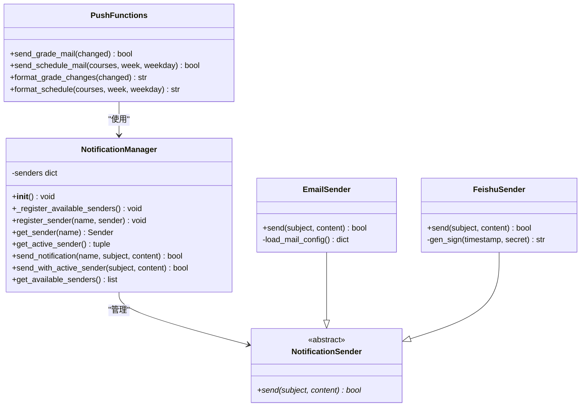

**图表来源**
- [core/push.py](file://core/push.py#L56-L163)
- [core/senders/email_sender.py](file://core/senders/email_sender.py#L47-L144)
- [core/senders/feishu_sender.py](file://core/senders/feishu_sender.py#L42-L110)

**章节来源**
- [core/plugins/plugin_manager.py](file://core/plugins/plugin_manager.py#L26-L1245)
- [gui/tabs/plugin_management_tab.py](file://gui/tabs/plugin_management_tab.py#L17-L646)

## 架构概览

**重大更新** 全新的插件化架构，完全移除了内置模块依赖

系统采用全新的插件化架构设计，完全移除了原有的内置模块结构，所有院校模块都以插件形式提供和管理。

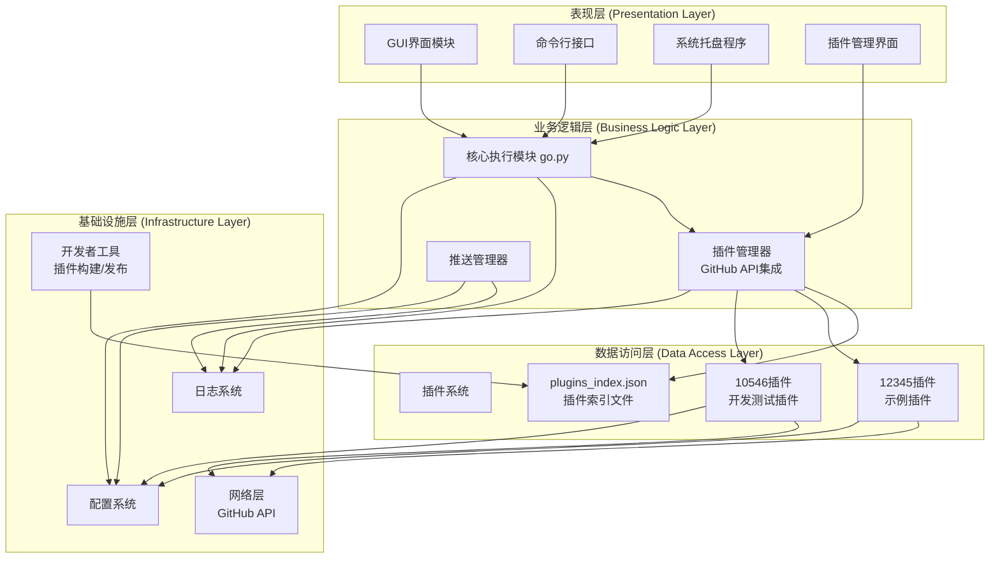

**图表来源**
- [core/plugins/plugin_manager.py](file://core/plugins/plugin_manager.py#L33-L70)
- [gui/tabs/plugin_management_tab.py](file://gui/tabs/plugin_management_tab.py#L18-L26)

## 详细组件分析

### 插件管理器详细分析

**重大更新** 全新的插件管理器实现，支持完整的生命周期管理

插件管理器是系统的核心组件，实现了完整的插件生命周期管理：

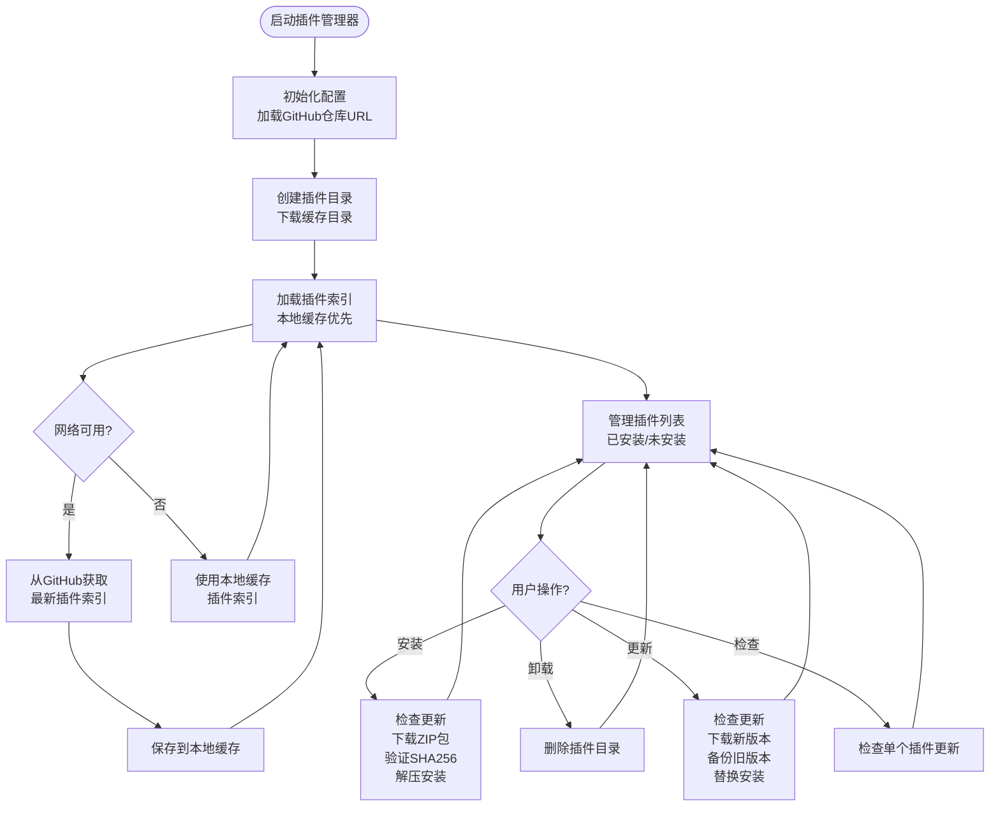

**图表来源**
- [core/plugins/plugin_manager.py](file://core/plugins/plugin_manager.py#L109-L181)
- [core/plugins/plugin_manager.py](file://core/plugins/plugin_manager.py#L1117-L1187)

#### 插件索引管理

**重大更新** 新增插件索引文件管理，支持统一的插件发现机制

插件索引文件是插件系统的重要组成部分，提供了统一的插件发现和版本管理机制：

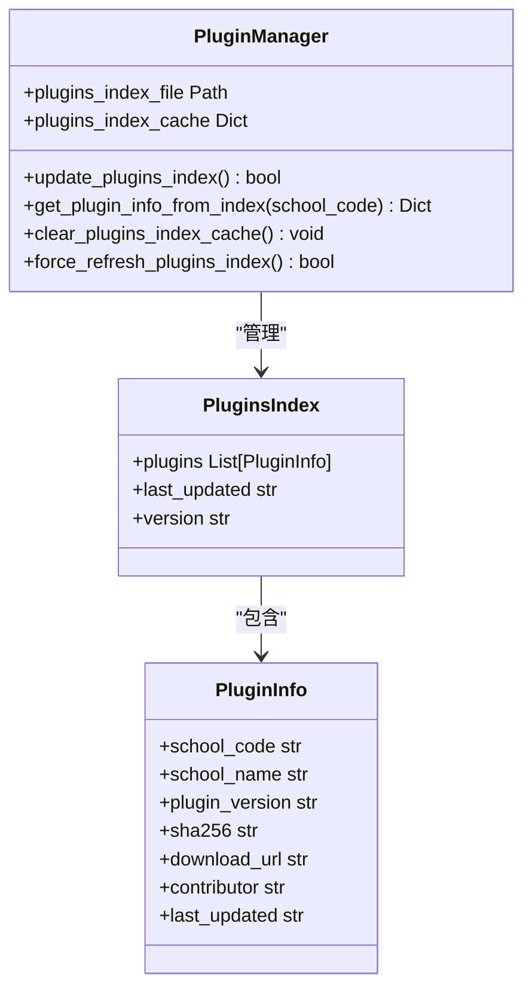

**图表来源**
- [plugins_index.json](file://plugins_index.json#L1-L13)
- [core/plugins/plugin_manager.py](file://core/plugins/plugin_manager.py#L566-L760)

**章节来源**
- [core/plugins/plugin_manager.py](file://core/plugins/plugin_manager.py#L26-L1245)
- [plugins_index.json](file://plugins_index.json#L1-L13)

### 衡阳师范学院插件实现

**重大更新** 开发测试插件位于developer_space/10546/目录，用于开发和测试

衡阳师范学院插件是系统的核心实现，包含了完整的成绩获取和课表获取功能，位于developer_space目录中用于开发测试。

#### 成绩获取模块分析

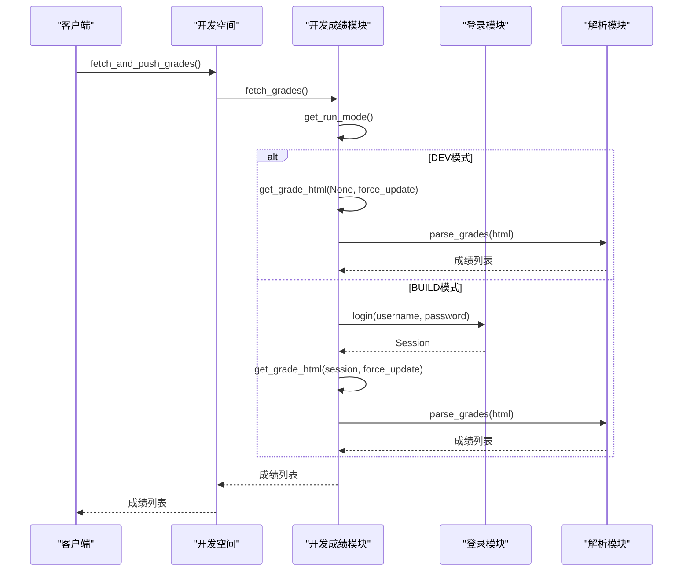

**图表来源**
- [developer_space/10546/getCourseGrades.py](file://developer_space/10546/getCourseGrades.py#L277-L294)

##### 登录认证流程

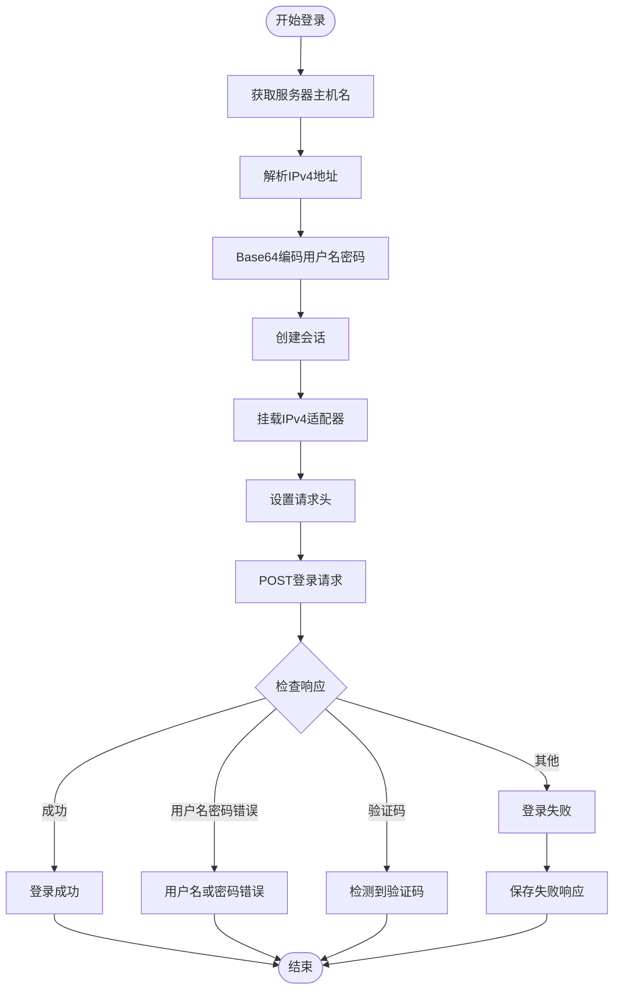

**图表来源**
- [developer_space/10546/getCourseGrades.py](file://developer_space/10546/getCourseGrades.py#L59-L100)

##### 成绩数据解析算法

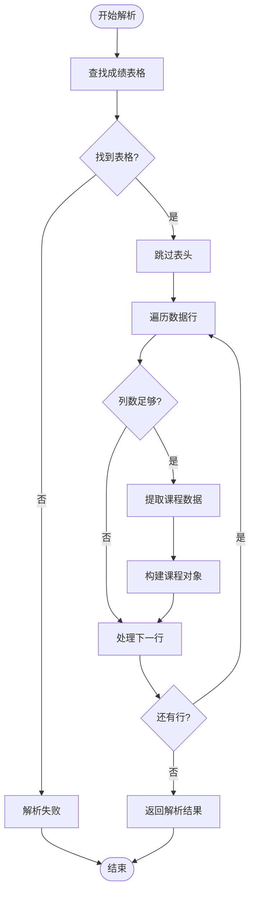

**图表来源**
- [developer_space/10546/getCourseGrades.py](file://developer_space/10546/getCourseGrades.py#L231-L261)

#### 课表获取模块分析

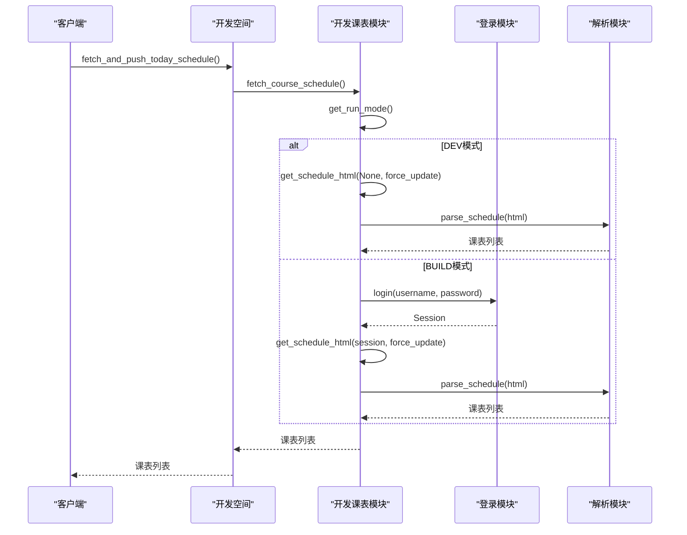

**图表来源**
- [developer_space/10546/getCourseSchedule.py](file://developer_space/10546/getCourseSchedule.py#L367-L384)

##### 课表解析算法

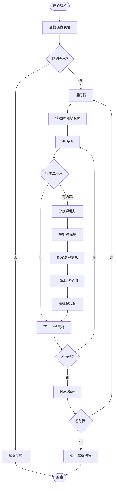

**图表来源**
- [developer_space/10546/getCourseSchedule.py](file://developer_space/10546/getCourseSchedule.py#L232-L328)

**章节来源**
- [developer_space/10546/getCourseGrades.py](file://developer_space/10546/getCourseGrades.py#L1-L327)
- [developer_space/10546/getCourseSchedule.py](file://developer_space/10546/getCourseSchedule.py#L1-L417)

### 核心执行模块分析

核心执行模块保持原有功能，继续协调各个组件的工作流程。

#### 成绩变化检测机制

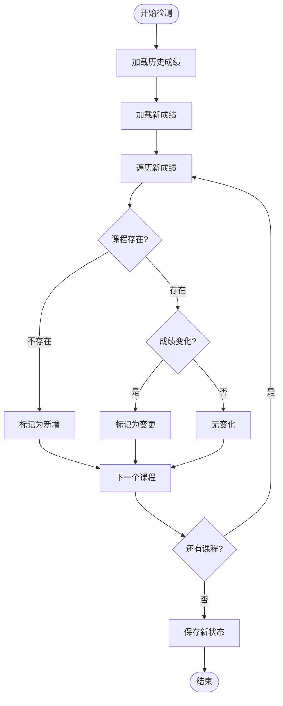

**图表来源**
- [core/go.py](file://core/go.py#L67-L74)

#### 课表推送流程

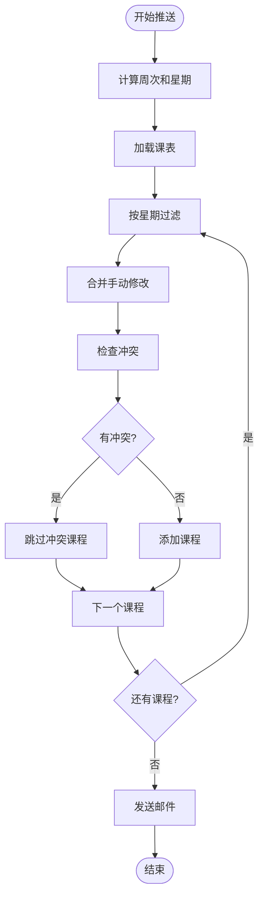

**图表来源**
- [core/go.py](file://core/go.py#L174-L200)

**章节来源**
- [core/go.py](file://core/go.py#L1-L663)

## 依赖关系分析

**重大更新** 完全重构的依赖关系，移除了对内置模块的依赖

系统采用全新的插件化依赖关系，所有模块都通过插件管理器进行管理：

```mermaid
graph TB
subgraph "外部依赖"
Requests[requests<br/>HTTP客户端]
BeautifulSoup[beautifulsoup4<br/>HTML解析]
ConfigParser[configparser<br/>配置解析]
Socket[socket<br/>网络连接]
Json[json<br/>数据序列化]
Time[time<br/>时间处理]
ZipFile[zipfile<br/>ZIP文件处理]
Hashlib[hashlib<br/>SHA256校验]
PathLib[pathlib<br/>路径处理]
Importlib[importlib<br/>动态导入]
Tempfile[tempfile<br/>临时文件]
Urllib[urllib<br/>URL处理]
End
subgraph "核心模块依赖"
PluginManager --> Requests
PluginManager --> Json
PluginManager --> Time
PluginManager --> ZipFile
PluginManager --> Hashlib
PluginManager --> PathLib
PluginManager --> Importlib
PluginManager --> Tempfile
PluginManager --> Urllib
PluginTab --> PluginManager
PluginTab --> QTableWidget
PluginTab --> QPushButton
PluginTab --> QThread
BuildPlugin --> Json
BuildPlugin --> ZipFile
BuildPlugin --> Hashlib
BuildPlugin --> DateTime
DevGrades --> Requests
DevGrades --> BeautifulSoup
DevGrades --> Socket
DevGrades --> ConfigParser
DevGrades --> Json
DevGrades --> Time
DevGrades --> PathLib
DevSchedule --> Requests
DevSchedule --> BeautifulSoup
DevSchedule --> Socket
DevSchedule --> ConfigParser
DevSchedule --> Re
DevSchedule --> Json
DevSchedule --> Time
DevSchedule --> PathLib
End
```

**图表来源**
- [core/plugins/plugin_manager.py](file://core/plugins/plugin_manager.py#L7-L16)
- [gui/tabs/plugin_management_tab.py](file://gui/tabs/plugin_management_tab.py#L5-L12)
- [developer_tools/build_plugin.py](file://developer_tools/build_plugin.py#L8-L14)
- [developer_space/10546/getCourseGrades.py](file://developer_space/10546/getCourseGrades.py#L2-L11)
- [developer_space/10546/getCourseSchedule.py](file://developer_space/10546/getCourseSchedule.py#L2-L12)

### 模块耦合度分析

**重大更新** 插件化架构显著降低了模块间的耦合度

系统在全新的插件化架构下实现了更好的模块内聚和更低的耦合度：

- **高内聚性**：每个插件专注于单一功能领域
- **低耦合性**：插件通过统一的接口和索引文件间接交互
- **可替换性**：插件可以独立替换，不影响其他组件
- **可扩展性**：新的功能插件可以通过索引文件轻松添加
- **可维护性**：插件的生命周期由管理器统一管理
- **安全性**：插件下载时进行SHA256校验和验证

**章节来源**
- [core/plugins/plugin_manager.py](file://core/plugins/plugin_manager.py#L26-L1245)
- [gui/tabs/plugin_management_tab.py](file://gui/tabs/plugin_management_tab.py#L17-L646)

## 性能考虑

### 缓存策略

**重大更新** 新增插件索引缓存机制，提升系统性能

系统实现了多层次的缓存机制来优化插件化架构的性能：

1. **插件索引缓存**：GitHub插件索引文件的本地缓存
2. **插件文件缓存**：已下载插件的本地缓存
3. **版本信息缓存**：插件版本信息的内存缓存
4. **网络请求缓存**：GitHub API响应的短期缓存

### 网络优化

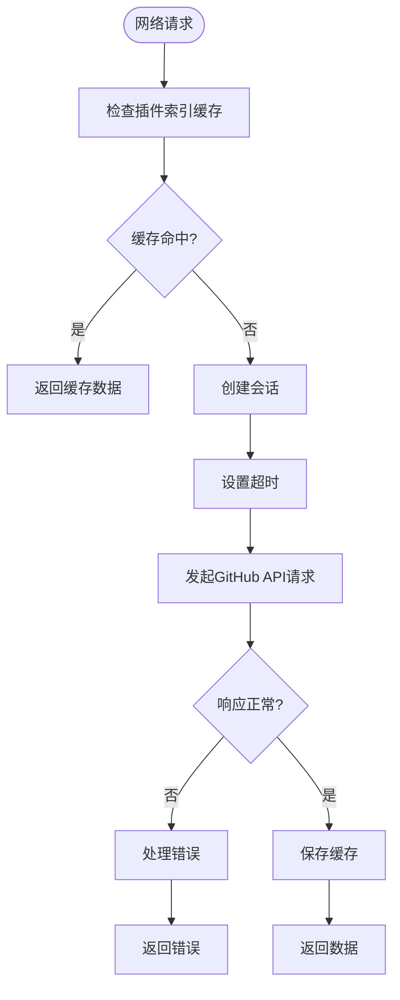

**图表来源**
- [core/plugins/plugin_manager.py](file://core/plugins/plugin_manager.py#L109-L181)
- [core/plugins/plugin_manager.py](file://core/plugins/plugin_manager.py#L566-L760)

### 内存管理

**重大更新** 新增插件生命周期管理，优化内存使用

系统采用了插件化的内存管理策略：

- **延迟加载**：插件按需加载，减少内存占用
- **版本隔离**：不同版本的插件文件相互隔离
- **缓存管理**：插件索引和版本信息的智能缓存
- **工作线程**：插件更新操作在独立线程中执行
- **资源清理**：插件卸载时自动清理相关资源

## 故障排除指南

### 常见问题及解决方案

#### 插件管理问题

**重大更新** 新增插件管理相关的故障排除指南

| 问题类型 | 症状 | 解决方案 |
|---------|------|----------|
| 插件下载失败 | "插件下载失败" | 检查网络连接和GitHub访问权限 |
| SHA256校验失败 | "校验和验证失败" | 删除损坏的插件文件重新下载 |
| 插件安装失败 | "插件安装失败" | 检查磁盘空间和文件权限 |
| 插件版本冲突 | "版本冲突" | 卸载旧版本插件后重新安装 |
| 插件索引加载失败 | "插件索引加载失败" | 清除缓存文件重新获取 |

#### 登录认证问题

| 问题类型 | 症状 | 解决方案 |
|---------|------|----------|
| 用户名密码错误 | "用户名或密码错误" | 检查账号密码是否正确 |
| 验证码拦截 | "检测到验证码" | 系统无法处理验证码，需人工处理 |
| 服务器连接失败 | 连接超时或失败 | 检查网络连接和服务器状态 |
| IPv6解析问题 | 连接缓慢或失败 | 系统已使用IPv4适配器 |

#### 成绩获取问题

| 问题类型 | 症状 | 解决方案 |
|---------|------|----------|
| 未识别到成绩内容 | "未识别到有效成绩内容" | 检查教务系统页面结构变化 |
| 缓存文件损坏 | 读取缓存失败 | 删除缓存文件重新获取 |
| 配置文件缺失 | 无法读取配置 | 检查config.ini文件是否存在 |

#### 课表解析问题

| 问题类型 | 症状 | 解决方案 |
|---------|------|----------|
| 课表表格未找到 | "未找到 <table id='timetable'>" | 检查课表页面结构 |
| 周次解析错误 | 周次范围不正确 | 检查周次字符串格式 |
| 时间段映射错误 | 课程时间冲突 | 检查时间段映射配置 |

#### 推送问题

| 问题类型 | 症状 | 解决方案 |
|---------|------|----------|
| 邮件发送失败 | SMTP认证错误 | 检查邮箱配置和权限 |
| 飞书推送失败 | Webhook调用异常 | 检查Webhook URL和签名 |
| 推送配置错误 | 未启用推送 | 检查推送方式配置 |

#### 开发测试问题

**重大更新** 新增开发测试相关的故障排除指南

| 问题类型 | 症状 | 解决方案 |
|---------|------|----------|
| 开发插件加载失败 | "无法加载开发插件" | 检查developer_space目录结构 |
| 模拟数据获取失败 | "模拟数据获取失败" | 检查DEV模式配置 |
| 版本号格式错误 | "版本号格式不正确" | 使用build_plugin.py生成正确格式 |
| 插件构建失败 | "插件构建失败" | 检查required_files完整性 |

### 调试和日志

系统提供了完善的日志记录机制，支持插件化架构的调试：

1. **日志级别**：支持DEBUG、INFO、WARNING、ERROR四个级别
2. **插件专用日志**：每个插件都有独立的日志文件
3. **GitHub API日志**：详细的网络请求和响应日志
4. **缓存管理日志**：插件索引和文件缓存的详细记录
5. **错误追踪**：完整的异常堆栈跟踪和错误报告

**章节来源**
- [core/plugins/plugin_manager.py](file://core/plugins/plugin_manager.py#L21-L23)
- [core/log.py](file://core/log.py#L18-L57)

## 结论

**重大更新** 系统已完成从内置模块到插件化架构的完全迁移

Capture_Push系统通过全新的插件化架构，成功实现了对多所大学的统一支持。经过重大更新后，系统的主要优势包括：

### 设计优势

1. **插件化架构**：完全移除了内置模块依赖，所有功能通过插件提供
2. **动态更新**：支持GitHub API自动下载和更新插件，无需重启应用
3. **统一管理**：通过plugins_index.json统一管理所有可用插件
4. **智能验证**：插件下载时进行SHA256校验和验证，确保安全性
5. **GUI管理**：集成的插件管理界面支持搜索、安装、更新和卸载
6. **版本控制**：每个插件包含版本信息，支持智能版本比较和回滚

### 技术特色

1. **GitHub集成**：深度集成GitHub API，支持自动更新和版本管理
2. **离线缓存**：插件索引文件本地缓存，提高加载速度和可靠性
3. **安全验证**：完整的SHA256校验和验证机制
4. **工作线程**：插件更新操作在独立线程中执行，不影响主界面
5. **开发测试**：developer_space目录提供完整的开发测试环境
6. **自动化构建**：build_plugin.py工具支持自动化插件构建和发布

### 扩展性

**重大更新** 插件化架构为系统扩展提供了前所未有的灵活性

系统为未来的扩展预留了充足的空间：
- 新的院校插件可以快速集成，无需修改核心代码
- 插件的生命周期由管理器统一管理，操作简便
- 开发测试插件位于developer_space目录，便于功能开发
- 插件索引文件支持统一的插件发现和版本管理
- GUI界面提供完整的插件管理功能
- 开发工具链支持插件的构建、测试和发布

## 附录

### 开发新院校插件指南

**重大更新** 全新的插件开发流程，基于插件化架构

#### 插件结构规范

每个院校插件必须实现以下标准结构：

```python
# 插件目录结构
school_[code]/
├── __init__.py              # 插件入口文件，导出必要接口
├── getCourseGrades.py       # 成绩获取模块
├── getCourseSchedule.py     # 课表获取模块
└── version.txt              # 插件版本文件（可选）
```

#### 接口定义规范

**重大更新** 插件接口与原有模块接口保持一致

每个插件必须实现以下接口：

```python
# 必须导出的函数
def fetch_grades(username, password, force_update=False):
    """
    获取成绩数据
    
    Args:
        username: 学号
        password: 密码
        force_update: 是否强制更新
    
    Returns:
        list: 成绩列表，每项包含课程名称、成绩等信息
    """

def fetch_course_schedule(username, password, force_update=False):
    """
    获取课表数据
    
    Args:
        username: 学号
        password: 密码
        force_update: 是否强制更新
    
    Returns:
        list: 课表列表，每项包含课程名称、时间、地点等信息
    """
```

#### 数据结构规范

**成绩数据结构**：
```json
{
    "课程编号": "string",
    "课程名称": "string", 
    "成绩": "string",
    "学期": "string",
    "课程属性": "string",
    "学分": "string"
}
```

**课表数据结构**：
```json
{
    "星期": 1-7,
    "开始小节": int,
    "结束小节": int,
    "课程名称": "string",
    "教师": "string",
    "教室": "string",
    "周次列表": [int, ...]
}
```

#### 开发流程

**重大更新** 全新的插件开发和发布流程

1. **创建开发环境**：在developer_space/[code]/目录下创建新插件
2. **实现核心功能**：编写成绩和课表获取逻辑
3. **实现登录认证**：处理用户身份验证
4. **实现数据解析**：解析HTML页面数据
5. **添加插件导出**：在__init__.py中导出接口
6. **测试验证**：在developer_space环境中测试插件功能
7. **构建插件包**：使用build_plugin.py工具构建插件
8. **发布插件**：将插件包上传到GitHub Release
9. **更新索引**：更新plugins_index.json文件
10. **安装测试**：通过GUI界面安装和测试插件

#### 最佳实践建议

**重大更新** 插件化架构的最佳实践建议

1. **错误处理**：实现完善的异常处理机制
2. **日志记录**：使用统一的日志接口记录关键信息
3. **配置管理**：使用统一的配置文件管理方式
4. **缓存策略**：合理使用缓存提高性能
5. **安全性**：保护用户凭据和敏感信息
6. **兼容性**：考虑不同浏览器和设备的兼容性
7. **版本控制**：使用时间戳格式的版本号
8. **测试覆盖**：确保插件的完整测试覆盖
9. **文档同步**：及时更新相关技术文档
10. **GitHub规范**：遵循GitHub Release的发布规范

#### 插件管理界面使用指南

**重大更新** GUI插件管理界面的详细操作指南

1. **打开插件管理界面**：在主界面切换到"插件管理"标签页
2. **搜索插件**：在搜索框中输入院校代码或名称进行搜索
3. **检查更新**：点击"检查更新"按钮获取最新插件列表
4. **安装插件**：右键未安装的插件选择"安装插件"
5. **卸载插件**：右键已安装的插件选择"卸载插件"
6. **更新插件**：右键已安装的插件选择"检查此插件更新"
7. **查看详情**：查看插件的详细信息和版本历史

#### 插件构建和发布工具

**重大更新** 完整的插件构建和发布工具链

1. **build_plugin.py**：自动化插件构建工具
   - 支持从developer_space目录构建插件
   - 自动生成SHA256校验和
   - 更新plugins_index.json文件
   - 支持自定义输出目录

2. **EXTENSION_GUIDE.md**：详细的开发指南
   - 插件结构规范
   - 接口定义要求
   - 开发测试流程
   - 发布部署指南

3. **GUI插件管理界面**：用户友好的管理工具
   - 搜索和过滤功能
   - 批量操作支持
   - 实时状态显示
   - 错误处理和提示

**章节来源**
- [developer_tools/EXTENSION_GUIDE.md](file://developer_tools/EXTENSION_GUIDE.md#L122-L339)
- [developer_tools/build_plugin.py](file://developer_tools/build_plugin.py#L27-L174)
- [gui/tabs/plugin_management_tab.py](file://gui/tabs/plugin_management_tab.py#L17-L646)
- [plugins_index.json](file://plugins_index.json#L1-L13)