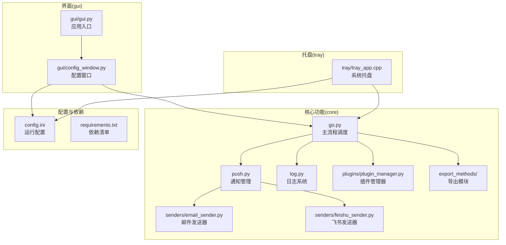
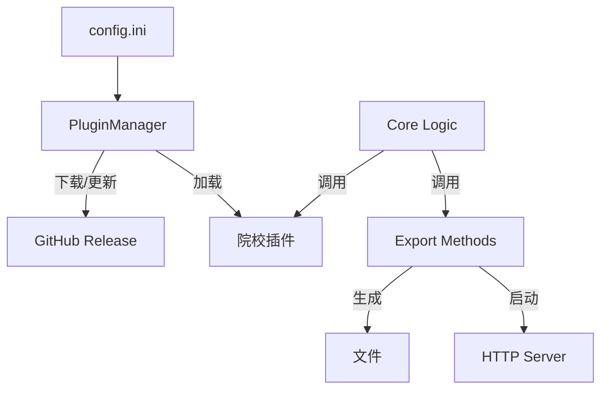

# 项目概述

<cite>
**本文引用的文件**
- [README.md](file://README.md)
- [requirements.txt](file://requirements.txt)
- [pyproject.toml](file://pyproject.toml)
- [config.ini](file://config.ini)
- [core/go.py](file://core/go.py)
- [core/push.py](file://core/push.py)
- [core/log.py](file://core/log.py)
- [core/plugins/__init__.py](file://core/plugins/__init__.py)
- [core/plugins/plugin_manager.py](file://core/plugins/plugin_manager.py)
- [core/export_methods/file_exporter.py](file://core/export_methods/file_exporter.py)
- [core/export_methods/network_server.py](file://core/export_methods/network_server.py)
- [core/senders/email_sender.py](file://core/senders/email_sender.py)
- [core/senders/feishu_sender.py](file://core/senders/feishu_sender.py)
- [gui/gui.py](file://gui/gui.py)
- [gui/config_window.py](file://gui/config_window.py)
- [tray/tray_app.cpp](file://tray/tray_app.cpp)
</cite>

## 目录
1. [引言](#引言)
2. [项目结构](#项目结构)
3. [核心组件](#核心组件)
4. [架构总览](#架构总览)
5. [详细组件分析](#详细组件分析)
6. [依赖关系分析](#依赖关系分析)
7. [性能考虑](#性能考虑)
8. [故障排查指南](#故障排查指南)
9. [结论](#结论)
10. [附录](#附录)

## 引言
Capture_Push 是一个面向大学生的课程成绩与课表自动追踪与推送系统。它通过对接各高校教务系统，周期性抓取最新成绩与课表数据，智能检测变化并在第一时间通过邮件或即时通讯机器人等方式推送通知。系统采用插件化架构设计，支持从 GitHub 动态加载院校模块，并提供多样化的数据导出方式（文件、网络服务、二维码）。

## 项目结构
项目采用“核心功能 + 插件扩展 + 平台层”的组织方式：
- 核心功能层：负责调度、推送、日志以及通用工具
- 插件层：通过 PluginManager 动态管理院校适配模块
- 导出层：提供文件导出、HTTP 服务及二维码生成
- 平台层：GUI 配置界面与系统托盘程序

图表来源
- [core/go.py](file://core/go.py)
- [core/plugins/plugin_manager.py](file://core/plugins/plugin_manager.py)

## 核心组件
- **主执行与调度**：负责加载配置、通过插件管理器加载院校模块、执行抓取与推送。
- **插件系统**：基于 GitHub Release 的动态插件更新与加载机制，实现院校适配代码与核心逻辑解耦。
- **通知管理**：统一管理多种推送方式（邮件、飞书），支持按配置选择发送器。
- **导出服务**：支持将课表/成绩导出为文件（Excel/ICS/JSON）、启动本地 HTTP 服务或生成二维码供手机端获取。
- **GUI 配置**：提供可视化配置界面，支持插件管理、参数设置及数据预览。

## 架构总览
系统采用“核心 + 插件”的强扩展设计：
- **插件化**：院校模块不再硬编码在项目中，而是通过 `PluginManager` 从云端按需下载和更新。
- **服务化**：除了被动推送，还通过 `export_methods` 提供主动获取数据的接口（HTTP Server）。
- **配置驱动**：所有行为均由 `config.ini` 控制，包括插件源、推送通道、导出选项等。

## 详细组件分析

### 主执行与调度（go.py）
核心调度器，负责串联整个流程：
1. 初始化日志与配置。
2. 调用 `PluginManager` 获取当前配置的院校模块。
3. 执行 `fetch_grades` 和 `fetch_course_schedule`。
4. 调用 `push.py` 进行变化检测与通知推送。
5. 根据配置调用 `export_methods` 进行数据导出或服务启动。

### 插件系统（core/plugins）
取代了旧版的 `core/school` 静态目录结构。
- **PluginManager**：
  - 检查本地插件版本。
  - 从 GitHub (或镜像) 下载最新插件包。
  - 解压并动态加载 Python 模块。
  - 提供统一的接口供 `go.py` 调用。

### 导出与服务（core/export_methods）
新增的模块，用于数据的二次利用：
- `file_exporter.py`: 导出 Excel, ICS 日历, JSON 数据。
- `network_server.py` / `simple_network_server.py`: 启动轻量级 HTTP 服务器，提供 JSON API。
- `qrcode_generator.py`: 将服务器地址或数据生成二维码，便于移动端扫码。

### 通知管理（push.py）
保持了原有的多通道设计，支持邮件（SMTP）和飞书（Webhook）。

## 依赖关系分析
新增了对插件下载解压的支持，可能依赖 `urllib` (标准库) 和 `zipfile` (标准库)。
核心依赖依然是 `requests`, `beautifulsoup4` (用于爬虫), `PySide6` (GUI).
二维码生成依赖 `qrcode` 和 `pillow`。

## 结论
Capture_Push 现已进化为一个支持动态插件扩展的现代化工具。通过引入 PluginManager，解决了院校适配代码更新滞后的问题；通过增加 Export Methods，极大地丰富了数据的使用场景。

## 附录
- 插件开发：请参考 [扩展开发指南](file://.wiki/zh/content/开发者工具/扩展开发指南/扩展开发指南.md)
