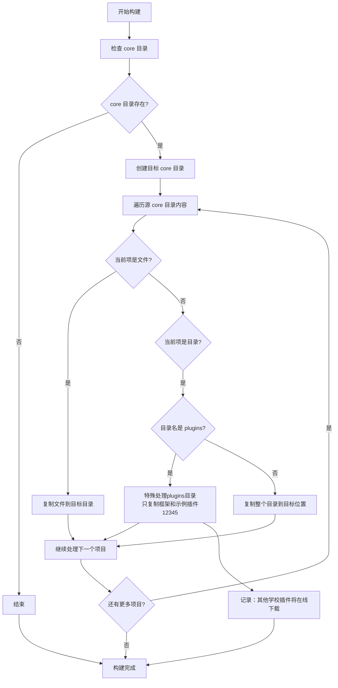

# Core目录构建流程

## 流程说明

在构建过程中，build.py 对core目录的处理遵循以下原则：

1. 复制core目录下的所有文件
2. 复制core目录下的所有子目录
3. 对plugins目录特殊处理，只保留示例插件（12345）
4. 其他学校插件通过插件管理器在线下载

## 构建流程图

## 设计理念

- **完整复制**：复制core目录下的所有文件和子目录
- **插件化管理**：plugins目录只包含框架和示例插件
- **按需下载**：实际使用时通过插件管理器下载对应的学校插件
- **易于扩展**：新的学校插件可以通过插件管理器动态添加