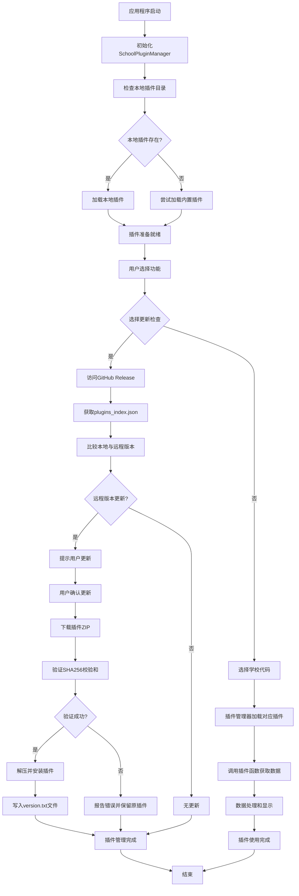

# 本地插件运作流程图

## 流程说明

1. **初始化阶段**：应用程序启动时初始化插件管理器，检查本地插件目录
2. **插件加载**：优先加载本地插件，如果不存在则加载内置插件
3. **更新检查**：用户可以选择检查插件更新，系统会从GitHub Release获取最新的插件索引
4. **插件安装**：如果发现新版本，系统会下载、验证并安装插件，同时写入version.txt文件
5. **插件使用**：用户选择学校代码后，系统加载对应插件并调用相应功能

## 版本管理

插件系统使用时间戳格式的版本号（YYYYMMDD_HHMMSS），存储在两个位置：
- `plugins_index.json` 中的 `plugin_version` 字段
- 插件ZIP包内的 `version.txt` 文件

本地版本检查通过读取插件目录下的 `version.txt` 文件进行比较。

## 插件管理UI操作

- **刷新插件列表**：清除缓存并从GitHub Release获取最新的 `plugins_index.json`，更新UI显示的插件列表
- **检查更新**：比较本地插件版本与远程版本，标识出哪些插件有可用更新
- **右键菜单**：
  - 已安装插件：提供"卸载插件"和"检查此插件更新"选项
  - 未安装插件：提供"安装插件"选项
- **版本显示**：当前版本列为"未安装"表示插件在JSON中存在但未安装